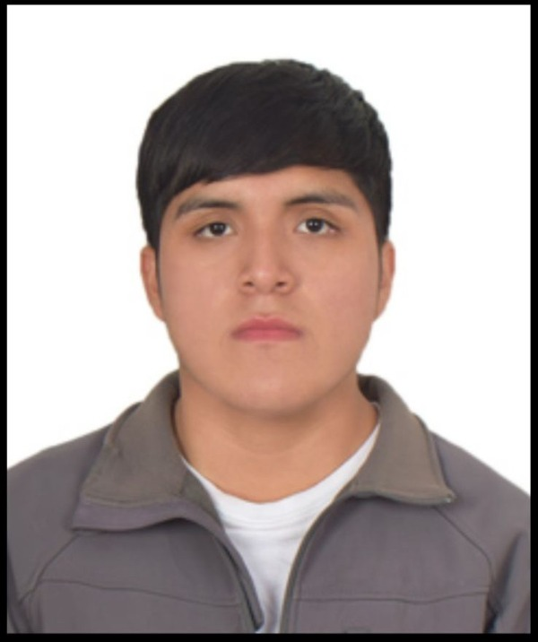
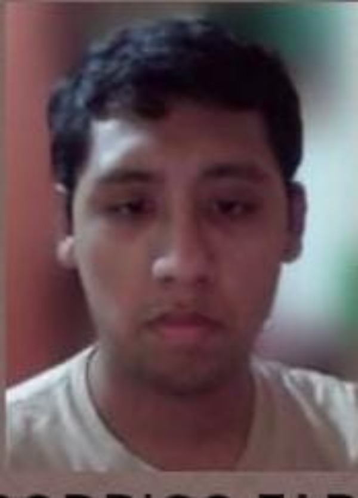
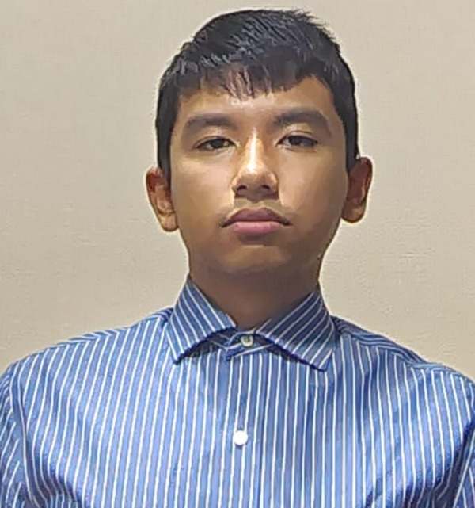
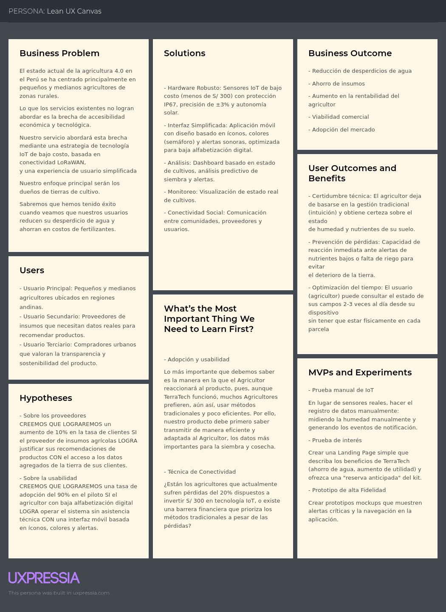

# Chapter I: Introduction

## 1.1. Startup Profile

### 1.1.1 Descripción de la Startup

NovaTech es una startup dedicada a transformar la vida de nuestros clientes mediante soluciones tecnológicas, eficientes y escalables en distintos sectores. Actualmente, tras detectar los desafíos críticos en el sector agricola, hemos creado TerraTech : una solución web que conectará la tecnología con la tierra. Mediante sensores de humedad y nutrientes, ofrecemos un control total a los sembríos en tiempo real. Asimismo, la aplicación analizará los datos entregados para generar recomendaciones y obtención de las zonas más fertiles para asegurar la obtención de las mejores cosechas en el futuro.

**Misión:**

Buscamos el desarrollo de tecnológia innovadora y eficiente que transformen la calidad de trabajo en diversos sectores laborales, optimizando el uso de recursos y máximizando utilidades para mejorar la calidad de vida de nuestros clientes.

**Visión:**

Ser la líder en la integración tecnológica multisectorial, reconocida por soluciones efectivas sostenibles y de alta eficiencia a nivel internacional.

### 1.1.2 Perfiles de integrantes del equipo

<table border="1" cellspacing="0" cellpadding="2">
<thead>
<tr>

<th>
Foto
</th>
<th>
Apellido y nombre
</th>
<th>
Carrera
</th>
<th>
Acerca de
</th>

</tr>
</thead>

<tbody>

<tr>
<th>

</th>
<th>
Acuña de la Cruz, Luis Alfredo
</th>
<th>
Ingeniería de Software
</th>
<th>
Mi nombre es Luis Alfredo Acuña de la Cruz (u202417228), tengo 19 años y estoy cursando el 5to ciclo de la carrera de Ingeniería de Software en la Universidad Peruana de Ciencias Aplicadas. Me apasiona el desarrollo de software, el aprendizaje continuo y la resolución de problemas mediante soluciones innovadoras y eficientes. Busco aplicar buenas prácticas y tecnologías modernas para crear sistemas robustos, escalables y de alta calidad en cada proyecto.
</th>
</tr>

<tr>
<th>

</th>
<th>
Aguilar Untiveros, Rodrigo Fabrizio
</th>
<th>
Ingeniería de Software
</th>
<th>
Mi nombre es Rodrigo, estudiante de Ingeniería de Software comprometido con el aprendizaje de nuevas metodologías de desarrollo. Me motiva el análisis de retos técnicos para diseñar soluciones que sean tanto funcionales como innovadoras. Mi enfoque está orientado a la creación de herramientas digitales robustas, priorizando siempre la optimización de procesos y la implementación de estándares de calidad que permitan un crecimiento constante en cada desarrollo.
</th>
</tr>

<tr>
<th>

</th>
<th>
Howard Robles, Guillermo Arturo
</th>
<th>
Ingeniería de Software
</th>
<th>
Mi nombre es Guillermo Arturo Howard Robles (u202222275) tengo 20 años, Soy estudiante de Ingeniería de Software, enfocado y en constante aprendizaje. Me apasiona investigar y analizar problemas para proponer soluciones innovadoras. Busco desarrollar software integral, aplicando las buenas prácticas y tecnologías modernas que aseguren eficiencia, escalabilidad, calidad y mejora continua en cada proyecto.
</th>
</tr>

<tr>
<th>

</th>
<th>
Perez Encarnacion, Breithner Rodolfo
</th>
<th>
Ingeniería de Software
</th>
<th>
Mi nombre es Breithner Rodolfo Perez Encarnacion, tengo 19 años y soy estudiante de la carrera de Ingeniería de Software. Cuento con conocimientos y habilidades sólidas en el lenguaje C++ y en el diseño de modelos relacionales. Asimismo, poseo un manejo intermedio de bases de datos tanto SQL como NoSQL (MongoDB), incluyendo validación de reglas y pipelines de agregación. Me haré responsable del diseño del modelo relacional, la normalización de bases de datos y de asegurar la integridad técnica del proyecto junto a mi equipo.
</th>
</tr>

<tr>
<th>

</th>
<th>
Retuerto Rodríguez, Jorge Manuel
</th>
<th>
Ingeniería de Software
</th>
<th>
Mi nombre es Jorge Manuel Retuerto Rodríguez, tengo 20 años y estoy cursando el 6to ciclo de la carrera de Ingeniería de Software en la Universidad Peruana de Ciencias Aplicadas. Mi conocimiento y habilidades de programación son intermedias en C++, C#, HTML y CSS. Sin embargo, básicas en Python y Java. Me haré responsable de la comunicación del grupo, planificación y desarrollo junto a mi equipo.
</th>
</tr>

</tbody>
</table>

## 1.2 Solution Profile

TerraTech es una solución diseñada para el sector agricola que responde a las demandas del sector, aplicando soluciones mediante dispositivos IoT y análisis predictivo.

Nuestro objetivo es transformar la gestión tradicional de los campos en uno actualizado, integrado tegnológia en la tierra para aumentar la precisión de su fertilidad, bases de datos en tiempo real y proyecciones de rendimiento para maximizar la eficiencia y rentabilidad de los cultivos.

### 1.2.1 Antecedentes y problemática

Por un lado, la degradación de los suelos es uno de los principales desafíos críticos que la agricultura moderna enfrenta en nuestra región. El 45% de las tierras de cultivo en América del Sur ya presentan signos de deterioro (AgroPerú, 2025). Ante ello, surge la necesidad de implementar soluciones como TerraTech , que permitan el monitoreo de la calidad de tierra mediante dispositivos IoT, evitando la sobreexplotación y promoviendo la recuperación de tierra fértil.

Por otro lado, la agricultura 4.0 se basa en la utilización de tecnologías digitales dentro del sector, con la finalidad de obtener mejoras notables en la eficiencia, sostenibilidad y rentabilidad (CEPLAN, 2023). Por ello, con la finalidad de ofrecer una herramienta estratégica a los agricultores peruanos, TerraTech desarrolla soluciones competitivas de clase global, integrando IoT y análisis predictivo para transformar datos compilados en decisiones que aseguren la calidad en el futuro campo.

### 1.2.2 Lean UX Process

#### 1.2.2.1. Lean UX Problem Statements

**El estado actual de** la agricultura 4.0 en el Perú **se ha centrado principalmente** en pequeños y medianos agricultores 
de zonas rurales, que enfrentan una degradación del 45% de sus suelos y pérdidas de hasta el 30% de su cosecha anual, 
debido a flujos de trabajo basados en la gestión tradicional y la falta de datos sobre humedad y nutrientes.

**Lo que los servicios existentes no logran abordar es** la brecha de accesibilidad económica y tecnológica, ya que las 
soluciones internacionales actuales superan los S/ 5,000 por hectárea, requieren cobertura 4G, inexistente en el 90% de 
zonas rurales, y no ofrecen interfaces adaptadas a usuarios con bajos niveles de alfabetización digital.

**Nuestro servicio abordará esta brecha mediante** una estrategia de tecnología IoT de bajo costo, basada en conectividad LoRaWAN,
y una experiencia de usuario simplificada mediante interfaces con íconos y alertas sonoras que transforman datos complejos en 
decisiones inmediatas de riego y fertilización.

**Nuestro enfoque principal será** dueños de tierras de cultivo en las regiones andinas que actualmente sufren pérdidas 
operativas superiores al 20%.

**Sabremos que hemos tenido éxito cuando veamos** que nuestros usuarios reducen su desperdicio de agua en un 25%, ahorran 
un 20% en costos de fertilizantes y logran un incremento en su utilidad neta de al menos S/ 2,000 por hectárea.

#### 1.2.2.2. Lean UX Assumptions

**Business Outcomes**

Son las suposiciones a las que llegamos para que TerraTech consiga ser exitoso.

- **Reducción del desperdicio de agua**: Lograr una disminución del 25% al 30% en el uso de agua mensual.
- **Ahorro en insumos**: Reducir los costos de fertilizantes en un 20%.
- **Rentabilidad del agricultor**: Incrementar la utilidad de los usuarios en al menos S/ 2,000 por hectárea.
- **Viabilidad comercial**: Alcanzar un margen del 30% en la venta de kits IoT y asegurar suscripciones mensuales.
- **Adopción del mercado**: Lograr que al menos el 80% de los clientes piloto confirmen mejoras en el rendimiento de sus cosechas.

**Users**

Se define el segmento al que va dirigido el servicio, para quienes suponemos que resolveremos sus problemas.

- **Usuario Principal**: Pequeños y medianos agricultores (dueños de 1 a 20 hectáreas) de 35-60 años, ubicados en regiones andinas.
- **Usuario Secundario**: Proveedores de insumos que necesitan datos reales para recomendar productos.
- **Usuario Terciario**: Compradores urbanos que valoran la transparencia y sostenibilidad del producto.

**User Outcomes & Benefits**

Beneficio y resultados supuestos del usuario.

- **Certidumbre técnica**: El agricultor deja de basarse en la gestión tradicional (intuición) y obtiene certeza sobre el estado 
de humedad y nutrientes de su suelo.
- **Prevención de pérdidas**: Capacidad de reacción inmediata ante alertas de nutrientes bajos o falta de riego para evitar 
el deterioro de la tierra.
- **Optimización del tiempo**: El usuario (agricultor) puede consultar el estado de sus campos 2-3 veces al día desde su dispositivo 
sin tener que estar físicamente en cada parcela
  
**Features**

Suposición de caracteristicas necesarias para el logro de nuestro servicio.

- **Hardware Robusto**: Sensores IoT de bajo costo (menos de S/ 300) con protección IP67, precisión de ±3% y autonomía solar
- **Interfaz Simplificada**: Aplicación móvil con diseño basado en íconos, colores (semáforo) y alertas sonoras, optimizada 
para baja alfabetización digital.
- **Análisis**: Dashboard basado en estado de cultivos, análisis predictivo de siembra y alertas.
- **Monitoreo**: Visualización de estado real de cultivos.
- **Conectividad Social**: Comunicación entre comunidades, proveedores y usuarios.

#### 1.2.2.3. Lean UX Hypothesis Statements

- **Sobre el ahorro de agua**

  ***CREEMOS QUE LOGRAREMOS** una reducción del 20% o 30% en el derroche de agua mensual **SI** el agricultor 
  **LOGRA** mantener la humedad óptima del suelo **CON** nuestros sensores de precisión y alertas automáticas.*
  
- **Sobre la rentabilidad**

  ***CREEMOS QUE LOGRAREMOS** un incremento en la utilidad neta de al menos S/ 2,000 por hectárea 
  **SI** agricultor de las regiones andinas **LOGRA** identificar las zonas más fértiles de su campo 
  **CON** el registro de datos de los sensores.*

- **Sobre los proveedores**

  ***CREEMOS QUE LOGRAREMOS** un aumento de 10% en la tasa de clientes **SI** el proveedor de insumos
  agrícolas **LOGRA** justificar sus recomendaciones de productos **CON** el acceso a los datos 
  agregados de la tierra de sus clientes.*

- **Sobre la usabilidad**

  ***CREEMOS QUE LOGRAREMOS** una tasa de adopción del 90% en el piloto **SI** el agricultor con baja 
  alfabetización digital **LOGRA** operar el sistema sin asistencia técnica **CON** una interfaz móvil 
  basada en íconos, colores y alertas.*

#### 1.2.2.4. Lean UX Canvas

## 1.3. Segmentos Objetivo

- Agricultores:

    - Perfil: Pequeños y medianos agricultores de fundos
    - Problema: Incertidumbre sobre el estado de la tierra de cultivo, altos costos de inversión y riesgo de pérdida.
    - Beneficio: Monitoreo real del estado del suelo, alertas respecto a valores variables de la tierra y análizis predictivo para próximas siembras: reducción del riesgo de pérdida.

- Proveedores de insumos agrícolas:

    - Perfil: distribuidores de productos agrícolas y asesores locales.
    - Problema: falta de datos reales para hacer recomendaciones correctas para solucionar problemas de sus clientes (agricultores). Teniendo como consecuencia de errores la pérdida de clientes y confianza.
    - Beneficio: Asesoría eficientes, fidelización de clientes y reducción de reclamos por errores.

- Clientes Finales:

    - Perfil: compradores mayoristas y minoristas del mercado.
    - Problema: dificultad en verificar procedencia, trato e impacto ambiental del producto.
    - Beneficio: tener una transparencia total del producto que está comprando.
  
