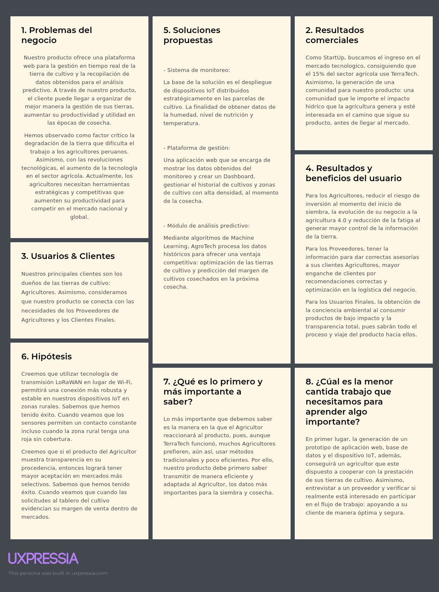

# Chapter I: Introduction

## 1.1. Startup Profile

### 1.1.1 Descripción de la Startup

NovaTech es una startup dedicada a transformar la vida de nuestros clientes mediante soluciones tecnológicas, eficientes y escalables en distintos sectores. Actualmente, tras detectar los desafíos críticos en el sector agricola, hemos creado TerraTech : una solución web que conectará la tecnología con la tierra. Mediante sensores de humedad y nutrientes, ofrecemos un control total a los sembríos en tiempo real. Asimismo, la aplicación analizará los datos entregados para generar recomendaciones y obtención de las zonas más fertiles para asegurar la obtención de las mejores cosechas en el futuro.

**Misión:**

Buscamos el desarrollo de tecnológia innovadora y eficiente que transformen la calidad de trabajo en diversos sectores laborales, optimizando el uso de recursos y máximizando utilidades para mejorar la calidad de vida de nuestros clientes.

**Visión:**

Ser la líder en la integración tecnológica multisectorial, reconocida por soluciones efectivas sostenibles y de alta eficiencia a nivel internacional.

### 1.1.2 Perfiles de integrantes del equipo

<table border="1" cellspacing="0" cellpadding="2">
<thead>
<tr>

<th>
Foto
</th>
<th>
Apellido y nombre
</th>
<th>
Carrera
</th>
<th>
Acerca de
</th>

</tr>
</thead>

<tbody>

<tr>
<th>

</th>
<th>
Acuña de la Cruz, Luis Alfredo
</th>
<th>
Ingeniería de Software
</th>
<th>
Mi nombre es Luis Alfredo Acuña de la Cruz (u202417228), tengo 19 años y estoy cursando el 5to ciclo de la carrera de Ingeniería de Software en la Universidad Peruana de Ciencias Aplicadas. Me apasiona el desarrollo de software, el aprendizaje continuo y la resolución de problemas mediante soluciones innovadoras y eficientes. Busco aplicar buenas prácticas y tecnologías modernas para crear sistemas robustos, escalables y de alta calidad en cada proyecto.
</th>
</tr>

<tr>
<th>

</th>
<th>
Aguilar Untiveros, Rodrigo Fabrizio
</th>
<th>
Ingeniería de Software
</th>
<th>
Mi nombre es Rodrigo, estudiante de Ingeniería de Software comprometido con el aprendizaje de nuevas metodologías de desarrollo. Me motiva el análisis de retos técnicos para diseñar soluciones que sean tanto funcionales como innovadoras. Mi enfoque está orientado a la creación de herramientas digitales robustas, priorizando siempre la optimización de procesos y la implementación de estándares de calidad que permitan un crecimiento constante en cada desarrollo.
</th>
</tr>

<tr>
<th>

</th>
<th>
Howard Robles, Guillermo Arturo
</th>
<th>
Ingeniería de Software
</th>
<th>
Mi nombre es Guillermo Arturo Howard Robles (u202222275) tengo 20 años, Soy estudiante de Ingeniería de Software, enfocado y en constante aprendizaje. Me apasiona investigar y analizar problemas para proponer soluciones innovadoras. Busco desarrollar software integral, aplicando las buenas prácticas y tecnologías modernas que aseguren eficiencia, escalabilidad, calidad y mejora continua en cada proyecto.
</th>
</tr>

<tr>
<th>

</th>
<th>
Perez Encarnacion, Breithner Rodolfo
</th>
<th>
Ingeniería de Software
</th>
<th>
Mi nombre es Breithner Rodolfo Perez Encarnacion, tengo 19 años y soy estudiante de la carrera de Ingeniería de Software. Cuento con conocimientos y habilidades sólidas en el lenguaje C++ y en el diseño de modelos relacionales. Asimismo, poseo un manejo intermedio de bases de datos tanto SQL como NoSQL (MongoDB), incluyendo validación de reglas y pipelines de agregación. Me haré responsable del diseño del modelo relacional, la normalización de bases de datos y de asegurar la integridad técnica del proyecto junto a mi equipo.
</th>
</tr>

<tr>
<th>

</th>
<th>
Retuerto Rodríguez, Jorge Manuel
</th>
<th>
Ingeniería de Software
</th>
<th>
Mi nombre es Jorge Manuel Retuerto Rodríguez, tengo 20 años y estoy cursando el 6to ciclo de la carrera de Ingeniería de Software en la Universidad Peruana de Ciencias Aplicadas. Mi conocimiento y habilidades de programación son intermedias en C++, C#, HTML y CSS. Sin embargo, básicas en Python y Java. Me haré responsable de la comunicación del grupo, planificación y desarrollo junto a mi equipo.
</th>
</tr>

</tbody>
</table>

## 1.2 Solution Profile

TerraTech es una solución diseñada para el sector agricola que responde a las demandas del sector, aplicando soluciones mediante dispositivos IoT y análisis predictivo.

Nuestro objetivo es transformar la gestión tradicional de los campos en uno actualizado, integrado tegnológia en la tierra para aumentar la precisión de su fertilidad, bases de datos en tiempo real y proyecciones de rendimiento para maximizar la eficiencia y rentabilidad de los cultivos.

### 1.2.1 Antecedentes y problemática

Por un lado, la degradación de los suelos es uno de los principales desafíos críticos que la agricultura moderna enfrenta en nuestra región. El 45% de las tierras de cultivo en América del Sur ya presentan signos de deterioro (AgroPerú, 2025). Ante ello, surge la necesidad de implementar soluciones como TerraTech , que permitan el monitoreo de la calidad de tierra mediante dispositivos IoT, evitando la sobreexplotación y promoviendo la recuperación de tierra fértil.

Por otro lado, la agricultura 4.0 se basa en la utilización de tecnologías digitales dentro del sector, con la finalidad de obtener mejoras notables en la eficiencia, sostenibilidad y rentabilidad (CEPLAN, 2023). Por ello, con la finalidad de ofrecer una herramienta estratégica a los agricultores peruanos, TerraTech desarrolla soluciones competitivas de clase global, integrando IoT y análisis predictivo para transformar datos compilados en decisiones que aseguren la calidad en el futuro campo.

### 1.2.2 Lean UX Process

#### 1.2.2.1. Lean UX Problem Statements

Actualmente, el 70% de pequeños agricultores en Perú no tiene acceso a tecnología de monitoreo de suelos en tiempo real. A pesar de la existencia de soluciones internacionales costosas como CropX o Netafim que no se adaptan a la realidad de conectividad rural del Perú (falta de cobertura 4G en zonas alejadas, precios elevados que superan los S/ 5,000 por hectárea, y ausencia de soporte en español con interfaces adaptadas a bajos niveles de alfabetización digital), la degradación de la tierra afecta al 45% de las tierras agrícolas en la sierra peruana.

Los agricultores peruanos en zonas rurales de Huánuco, Cusco y Cajamarca no pueden optimizar el riego y la fertilización de sus cultivos porque carecen de datos en tiempo real sobre la humedad del suelo, niveles de nitrógeno y condiciones climáticas, durante todo el ciclo de cultivo, lo que les genera pérdidas de hasta el 30% de su cosecha anual y un desperdicio de hasta el 40% del agua utilizada.

#### 1.2.2.2. Lean UX Assumptions

**Business Outcomes**

1. ***Creemos que mis usuarios necesitan*** ... conocer al menos una vez al día el nivel de humedad del suelo (precisión ±3%) y los niveles de nitrógeno, fósforo y potasio de su tierra de cultivo para decidir si riegan o fertilizan, reduciendo así el riesgo de pérdida de cultivos por factores de nutrición de la tierra en un 25%.

2. ***Estas necesidades se pueden resolver con*** ... dispositivos IoT de bajo costo (menos de S/ 300 por dispositivo), instalados a 30 cm bajo la tierra, que utilizan tecnología de transmisión LoRaWAN (alcance de 2-5 km sin cobertura celular), conectados con una base de datos en la nube encargada de analizar los datos para ofrecer recomendaciones predictivas.

3. ***Mis clientes iniciales serán*** ... agricultores peruanos asociados a cooperativas agrarias en las regiones de Huánuco, Cusco y Cajamarca que enfrentan los retos de tierras degradadas con pérdidas superiores al 20% de su producción anual.

4. ***El valor #1 que un cliente quiere de mi servicio es*** ... la optimización de la rentabilidad medida en S/ por hectárea, o sea, permitir al agricultor reducir sus costos de agua (ahorro mínimo 25%) y fertilizantes (ahorro mínimo 20%) para alcanzar un mayor margen de utilidad, conservando la calidad de su producto.

5. ***El cliente también puede obtener estos beneficios adicionales*** ... reducción de su huella hídrica en al menos un 30% certificable y acceso a mercados de agricultura sostenible que pagan un premium del 15%.

6. ***Voy a adquirir la mayoría de mis clientes a través de*** ... alianzas corporativas con al menos 3 empresas agrarias grandes y 10 proveedores de insumos agrícolas (como Yara, Molinos & Cía., o AgroPerú) que ya tienen redes de distribución en las zonas objetivo.

7. ***Haré dinero a través de*** ... venta de los componentes IoT con un margen del 30% (precio al agricultor: S/ 250-S/ 350 por kit de sensor) y un modelo de suscripción por el acceso a la plataforma de análisis de datos de S/ 30-S/ 50 mensuales.

8. ***Mi competencia principal en el mercado será*** ... empresas nacionales y extranjeras que ofrezcan herramientas para la implementación de la agricultura 2.0, como CropX (Israel) con precios de US$ 500-1000 por hectárea+año, y soluciones caseras sin análisis predictivo.

9. ***Los venceremos debido a*** ... ofrecer una solución adaptada en el Perú (precio 70% menor, interfaz en español con íconos simples, soporte técnico local) y la relación entre cliente, proveedor y agricultor que crea un ecosistema de datos valioso.

10. ***Mi mayor riesgo de producto es*** ... la falta de conectividad estable en zonas rurales (35% del territorio no tiene cobertura 4G) y la resistencia cultural al cambio en el Perú a la agricultura 4.0 entre agricultores mayores de 50 años.

11. ***Resolveremos esto a través de*** ... interfaces sencillas basadas en íconos y alertas sonoras, considerando siempre el UX y feedback de próximos lanzamientos, que muestren resultados económicos inmediatos en los primeros 30 días de uso y uso de dispositivos IoT con tecnología LoRaWAN adaptados a los desafíos de las zonas rurales sin cobertura.

12. ***¿Qué suposiciones tenemos?***

a. El Proveedor le interesan los datos anonimizados de al menos 100 agricultores, para mejorar la venta de insumos con recomendaciones basadas en datos reales.

b. El Agricultor confía en compartir sus datos de ubicación precisa y rendimiento de cosecha en la plataforma web si recibe recomendaciones personalizadas que demuestren ahorro en los primeros 2 meses.

c. El Cliente Final está interesado en comprar productos con trazabilidad real y visible mediante código QR que muestre fecha de siembra, uso de agua y fertilizantes, pagando un premium del 10-15%.

13. ***¿De las suposiciones, si se prueba que es falso, causará que nuestro negocio no funcione?***

a. Si los Proveedores no consideran que nuestro producto les puede servir para mejorar la efectividad de sus recomendaciones de venta (aumentar ventas cruzadas en al menos 15%), entonces perdemos a los principales agentes en acercarnos a los Agricultores.

b. Si el Agricultor no confía en nuestra plataforma web (menos del 60% de adopción en fase piloto), no podremos ofrecer nuestro servicio de manera eficiente, obstaculizando la meta a cumplir de nuestro servicio: aumento de la utilidad en al menos 25% y reducción de costos en 20%.

**User Outcomes**

1. ***¿Quién es nuestro usuario?***

Nuestro principal usuario son los dueños de las tierras de cultivo de 1 a 20 hectáreas: Agricultores de 35-60 años con educación primaria/secundaria. Asimismo, como usuarios secundarios tenemos a los Proveedores, gerentes de ventas técnicas de empresas de insumos agrícolas que buscan hacer mejores recomendaciones de producto a sus clientes Agricultores basadas en datos reales, y los Clientes Finales, compradores urbanos de 25-45 años que buscan una trazabilidad real y transparente del producto.

2. ***¿Dónde encaja nuestro producto en su trabajo o vida?***

Para los Agricultores, encaja en la rutina diaria de trabajo, revisando el dashboard cada mañana para decidir si regar o fertilizar. Para los Proveedores, en el proceso de post-venta y soporte al cliente, consultando la plataforma semanalmente para ofrecer insumos específicos basados en datos de suelo. Para el Cliente Final, encaja en el proceso de compra, escaneando un código QR para visualizar la trazabilidad en menos de 30 segundos.

3. ***¿Qué problemas tiene nuestro producto que resolver?***

AgroTech permite tener una mejor certidumbre, respecto a las zonas de cultivo más eficientes mediante mapa de calor de productividad histórica. Asimismo, reducirá el desperdicio de recursos: agua (ahorro 25-40%) y fertilizantes (ahorro 20-30%). Además, previene el deterioro de la tierra al permitir un control en tiempo real mediante alertas tempranas cuando los nutrientes bajan de umbrales críticos. Finalmente, la función de proyección de zonas más óptimas para cultivo según datos históricos y predicciones climáticas.

4. ***¿Cuándo y cómo es nuestro producto usado?***

Se usa las 24 horas del día, cada día de la semana, de manera automática para la captura de datos (sensores envían datos cada 15-30 minutos vía LoRaWAN) y, asistida por el cliente, para consultar un dashboard con la información más importante de la tierra: humedad, próximo riego, nivel de nutrientes, etc., consultando 2-3 veces al día.

Funciona gracias a los sensores que se comunican a un gateway comunitario (alcance 2-5 km) y luego a la base de datos en la nube. El usuario accede a la plataforma web desde cualquier dispositivo con navegador (funciona en modo texto en conexiones 2G) y, desde allí, visualiza un dashboard con la información relevante.

5. ***¿Qué características son importantes?***

La visualización en tiempo real del estado de la tierra (latencia máxima 5 minutos), las alertas inteligentes por SMS/WhatsApp para los casos críticos (humedad < umbral por 2 horas), módulo de análisis predictivo que recomienda fecha óptima de siembra/cosecha y reportes de sostenibilidad descargables en PDF para certificaciones.

6. ***¿Cómo debe verse nuestro producto y cómo comportarse?***

Por un lado, respecto a la aplicación, debe verse con una interfaz limpia y profesional con paleta de verdes y azules, tipografía grande (mínimo 16px), botones táctiles y espaciados, intuitiva y rápida de usar (carga inicial menos de 3 segundos en 3G). Por otro lado, respecto a los componentes IoT, deben ser robustos (IP67 resistente a agua y polvo), sólidos (vida útil mínima 2 años), manejar los datos de manera rápida (envío cada 15 minutos) y, considerando las zonas rurales, mantener un bajo consumo energético (batería recargable por energía solar opcional) y administrar un área de red amplia (gateway LoRaWAN con alcance de 5 km a campo abierto).

#### 1.2.2.3. Lean UX Hypothesis Statements

- **Creemos que** usando nuestros sensores de humedad con precisión ±3% y alertas automáticas cuando la humedad baje del 40%, lograremos disminuir en un 30% el derroche de agua mensual en parcelas de papa en Huánuco durante la temporada seca. **Sabremos que** tuvimos éxito. **Cuando veamos que** el consumo de agua en las zonas instaladas se reduzca de un promedio de 5,000 m³/hectárea/mes a 3,500 m³/hectárea/mes, tomando en comparación el consumo de los 3 meses anteriores a la instalación de nuestro producto.

- **Creemos que** ofrecer proyecciones de zonas de cultivo eficiente mediante mapas de calor basados en datos históricos de 12 meses aumentarán las utilidades obtenidas de nuestro cliente Agricultor en al menos un 25% en el primer ciclo de cultivo. **Sabremos que** tuvimos éxito. **Cuando veamos que** el 80% de nuestros clientes piloto (mínimo 20 agricultores) confirmen la obtención de al menos 2 toneladas adicionales por hectárea y, por consecuencia, aumento en la utilidad neta de al menos S/ 2,000 por hectárea.

- **Creemos que** dar acceso a los proveedores a los datos agregados y anonimizados de la tierra de al menos 50 agricultores, permitirá la venta de insumos correctos para la fertilidad de la tierra, incrementando la efectividad de sus recomendaciones en un 40%. **Sabremos que** hemos tenido éxito. **Cuando veamos que** al menos 5 proveedores usen nuestra aplicación para justificar la venta de sus productos con datos específicos y su tasa de conversión aumente del 15% actual al 25% en los primeros 3 meses.

- **Creemos que** si el producto del Agricultor muestra transparencia en su procedencia mediante código QR por lote con fecha de siembra, uso de agua y fertilizantes, entonces logrará tener mayor aceptación en mercados más selectivos como tiendas orgánicas. **Sabremos que** hemos tenido éxito. **Cuando veamos que** las solicitudes al dashboard del cultivo (escaneos de QR) superen las 500 por semana y el agricultor logre vender al menos el 30% de su producción en canales premium con un precio superior del 15%.

- **Creemos que** diseñar una interfaz móvil con alertas visuales y sonoras simples (íconos, colores rojo/amarillo/verde, alertas por WhatsApp con emojis) logrará que agricultores con niveles bajos de educación (primaria completa o menos) puedan usar nuestra aplicación sin tener problemas de usabilidad. **Sabremos que** tendremos éxito. **Cuando veamos que** el 90% de los agricultores en nuestro piloto complete la tarea de "verificar humedad y recibir alerta" sin asistencia técnica dentro de los primeros 2 días, y la alerta de falta de riego sea satisfecha rápidamente en menos de 2 horas.

- **Creemos que** utilizar tecnología de transmisión LoRaWAN (frecuencia 915 MHz) en lugar de Wi-Fi o 4G, permitirá una conexión más robusta y estable en nuestros dispositivos IoT en zonas rurales sin cobertura celular (hasta 90% del territorio en algunas zonas). **Sabremos que** hemos tenido éxito. **Cuando veamos que** los sensores mantengan una tasa de entrega de datos superior al 95% incluso cuando la zona rural no tenga cobertura 4G, y los sensores permitan un contacto constante con autonomía superior a 3 meses.

#### 1.2.2.4. Lean UX Canvas

**Figura 1:**

*Lean ux canvas*

## 1.3. Segmentos Objetivo

- Agricultores:

    - Perfil: Pequeños y medianos agricultores de fundos
    - Problema: Incertidumbre sobre el estado de la tierra de cultivo, altos costos de inversión y riesgo de pérdida.
    - Beneficio: Monitoreo real del estado del suelo, alertas respecto a valores variables de la tierra y análizis predictivo para próximas siembras: reducción del riesgo de pérdida.

- Proveedores:

    - Perfil: distribuidores de productos agrícolas y asesores locales.
    - Problema: falta de datos reales para hacer recomendaciones correctas para solucionar problemas de sus clientes (agricultores). Teniendo como consecuencia de errores la pérdida de clientes y confianza.
    - Beneficio: Asesoría eficientes, fidelización de clientes y reducción de reclamos por errores.

- Clientes Finales:

    - Perfil: compradores mayoristas y minoristas del mercado.
    - Problema: dificultad en verificar procedencia, trato e impacto ambiental del producto.
    - Beneficio: tener una transparencia total del producto que está comprando.
  
