

# Chapter II: Requirements Elicitation & Analysis

## 2.1. Competidores

* **Agrotech (competidor directo):** Es una empresa enfocada en la implementación de tecnología agrícola que ofrece soluciones como drones, sensores y asesoría técnica especializada para mejorar la productividad del campo. Está orientada a agricultores y empresas agroindustriales que buscan optimizar sus procesos mediante el uso de herramientas tecnológicas.

* **AgroVista del Valle (competidor directo):** Es una empresa de servicios agrícolas que utiliza análisis multiespectral para el monitoreo de cultivos, permitiendo evaluar la salud de las plantas y detectar problemas en el terreno. Está dirigida a agricultores y empresas agroexportadoras que buscan tomar decisiones basadas en datos para mejorar la eficiencia y productividad.

* **Phytech (competidor directo):** Es una plataforma digital de agricultura de precisión que integra sensores IoT, análisis de datos e inteligencia artificial para optimizar el riego y mejorar el rendimiento de los cultivos. Está orientada principalmente a empresas agroindustriales y grandes productores que buscan maximizar la eficiencia en el uso del agua y recursos.

### 2.1.1. Análisis competitivo

Para este análisis competitivo se realizó un benchmark parcial enfocado en identificar las principales soluciones de agricultura de precisión en el mercado peruano e internacional. La evaluación consideró tres competidores directos: Agrotech (solución local con enfoque en drones y asesoría), AgroVista del Valle (análisis multiespectral) y Phytech (plataforma internacional con IA). Las métricas analizadas incluyeron: perfil de producto (tecnología, servicios, precios, canales), perfil de marketing (mercado objetivo, estrategias), y análisis FODA. Se eligieron estos competidores porque representan diferentes enfoques tecnológicos (drones, imágenes satelitales, sensores IoT) y distintos segmentos de mercado (desde pequeños agricultores hasta grandes agroexportadoras), lo que permite identificar oportunidades de diferenciación para nuestra startup, especialmente en accesibilidad, adaptación al mercado local y monitoreo continuo del suelo.

<table border="1" cellspacing="0" cellpadding="2">
<tr>
<th colspan="6" valign="top">Competitive Analysis Landscape</th>
</tr>
<tr>
<td colspan="2" valign="top">¿Por qué llevar a cabo este análisis?</td>
<td colspan="4" valign="top">El objetivo de este análisis es identificar las características de los competidores y encontrar maneras de diferenciarnos.</td>
</tr>
<tr>
<td colspan="2" rowspan="2" valign="top">Startup y Competidores</td>
<td valign="top">Nuestra Startup</td>
<td valign="top">Agrotech</td>
<td valign="top">Agrovista del Valle</td>
<td valign="top">Phytech</td>
</tr>
<tr>
<td valign="top">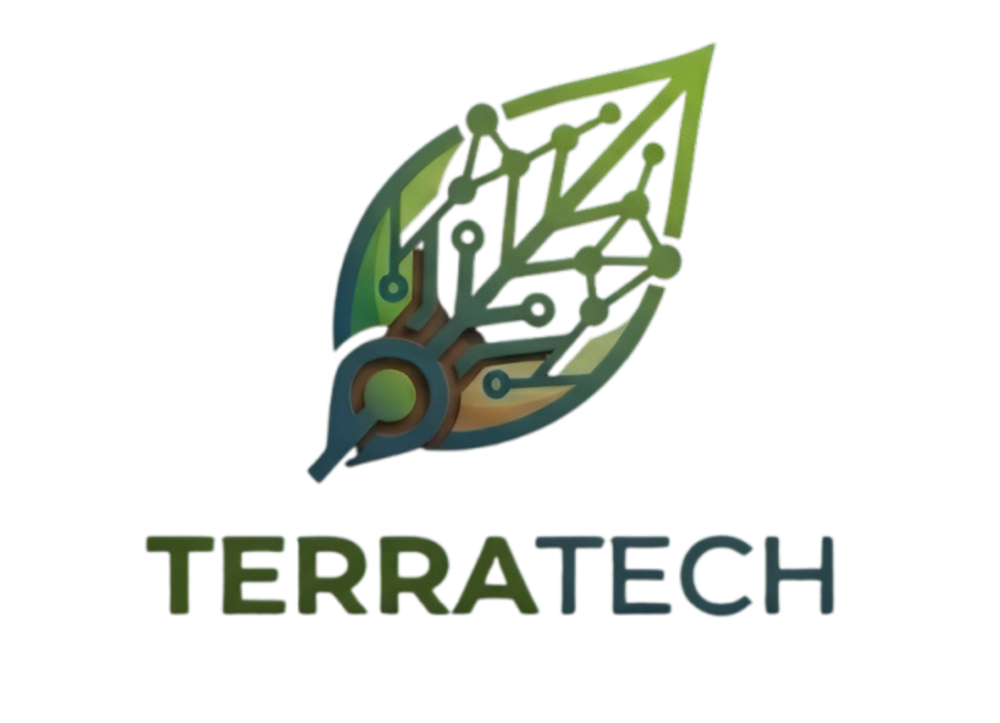</td>
<td valign="top"></td>
<td valign="top"></td>
<td valign="top"></td>
</tr>
<tr>
<td rowspan="2" valign="top">Perfil</td>
<td valign="top">Overview</td>
<td valign="top">Nuestro Startup es una solución web basada en sensores IoT que permite monitorear en tiempo real la humedad y los nutrientes del suelo, generando análisis predictivo para optimizar la productividad agrícola y mejorar la gestión de los cultivos.</td>
<td valign="top">Agrotech es una empresa que implementa tecnología agrícola mediante el uso de drones, sensores y asesoría técnica especializada para mejorar la productividad de los cultivos.</td>
<td valign="top">AgroVista del Valle es una empresa agrícola que utiliza análisis multiespectral para monitorear la salud de los cultivos y evaluar las condiciones del terreno.</td>
<td valign="top">Phytech es una plataforma digital de agricultura de precisión que integra sensores IoT e inteligencia artificial para optimizar el riego y mejorar el rendimiento de los cultivos.</td>
</tr>
<tr>
<td valign="top">Ventaja competitiva ¿Qué valor ofrece a los clientes?</td>
<td valign="top">Ofrece monitoreo continuo del suelo, recomendaciones inteligentes y predicción de zonas fértiles, con una solución accesible y adaptada al agricultor peruano que optimiza recursos y aumenta la rentabilidad.</td>
<td valign="top">Destaca por ofrecer soluciones integrales con drones y asesoría técnica profesional que permiten un monitoreo detallado del campo.</td>
<td valign="top">Su principal valor es el análisis avanzado de imágenes que permite detectar problemas en los cultivos con alta precisión.</td>
<td valign="top">Su ventaja principal es el uso de inteligencia artificial para generar recomendaciones avanzadas y automatizar decisiones agrícolas.</td>
</tr>
<tr>
<td rowspan="2" valign="top">Perfil de Marketing</td>
<td valign="top">Mercado objetivo</td>
<td valign="top">Está dirigido principalmente a agricultores peruanos, así como a proveedores de insumos agrícolas y compradores interesados en la trazabilidad de los productos.</td>
<td valign="top">Está orientada a agricultores medianos, grandes productores y empresas agroindustriales que buscan optimizar sus procesos.</td>
<td valign="top">Está dirigida a agricultores medianos, empresas agroexportadoras y productores que buscan decisiones basadas en datos.</td>
<td valign="top">Está orientada a grandes productores y empresas agroindustriales que buscan maximizar la eficiencia de recursos.</td>
</tr>
<tr>
<td valign="top">Estrategias de marketing</td>
<td valign="top">Se basa en alianzas con empresas agrarias, demostraciones en campo y marketing digital enfocado en sostenibilidad y optimización de recursos.</td>
<td valign="top">Utiliza ventas directas, demostraciones tecnológicas y participación en eventos agrícolas para atraer clientes empresariales.</td>
<td valign="top">Se enfoca en servicios especializados, relaciones B2B y promoción basada en análisis técnico.</td>
<td valign="top">Utiliza marketing B2B, posicionamiento tecnológico premium y casos de éxito internacionales.</td>
</tr>
<tr>
<td rowspan="3" valign="top">Perfil de Producto</td>
<td valign="top">Productos & Servicios</td>
<td valign="top">Incluye sensores IoT, plataforma web de monitoreo, alertas inteligentes y análisis predictivo para la toma de decisiones agrícolas.</td>
<td valign="top">Ofrece drones agrícolas, sensores de monitoreo y servicios de asesoría técnica para la implementación tecnológica.</td>
<td valign="top">Ofrece monitoreo multiespectral, análisis de salud vegetal y reportes técnicos para la toma de decisiones.</td>
<td valign="top">Ofrece sensores IoT, análisis con inteligencia artificial y dashboards avanzados de monitoreo.</td>
</tr>
<tr>
<td valign="top">Precios & Costos</td>
<td valign="top">Combina la venta de sensores con una suscripción accesible para el uso de la plataforma y análisis de datos.</td>
<td valign="top">Maneja precios elevados debido al uso de drones y servicios especializados de consultoría.</td>
<td valign="top">Presenta costos medios a altos por servicios de análisis especializados.</td>
<td valign="top">Maneja costos elevados con modelo de suscripción empresarial.</td>
</tr>
<tr>
<td valign="top">Canales de distribución (Web y/o Móvil)</td>
<td valign="top">Distribución mediante plataforma web accesible desde computadora y dispositivos móviles, con venta directa y alianzas estratégicas.</td>
<td valign="top">Distribución mediante página web corporativa y contacto directo con el equipo comercial.</td>
<td valign="top">Distribución mediante plataforma web y entrega digital de reportes técnicos.</td>
<td valign="top">Distribución mediante plataforma web, aplicación móvil y ventas corporativas.</td>
</tr>
<tr>
<td rowspan="4" valign="top">Análisis SWOT</td>
<td valign="top">Fortalezas</td>
<td valign="top">Solución accesible, adaptada al mercado local e integración de IoT con análisis predictivo.</td>
<td valign="top">Tecnología avanzada, asesoría especializada y soluciones integrales.</td>
<td valign="top">Alta precisión en análisis y enfoque científico.</td>
<td valign="top">Uso de inteligencia artificial y alta precisión tecnológica.</td>
</tr>
<tr>
<td valign="top">Debilidades</td>
<td valign="top">Dependencia de conectividad rural y falta de posicionamiento inicial en el mercado.</td>
<td valign="top">Altos costos y menor accesibilidad para pequeños agricultores.</td>
<td valign="top">No ofrece monitoreo continuo en tiempo real y depende de imágenes periódicas.</td>
<td valign="top">Costos altos y menor adaptación al mercado local.</td>
</tr>
<tr>
<td valign="top">Oportunidades</td>
<td valign="top">Crecimiento de la agricultura 4.0 y mayor interés en soluciones sostenibles.</td>
<td valign="top">Crecimiento del uso de drones y agricultura digital.</td>
<td valign="top">Mayor demanda de agricultura de precisión.</td>
<td valign="top">Expansión de la agricultura inteligente a nivel global.</td>
</tr>
<tr>
<td valign="top">Amenazas</td>
<td valign="top">Competidores internacionales y resistencia al cambio tecnológico.</td>
<td valign="top">Soluciones IoT más económicas y automatizadas.</td>
<td valign="top">Soluciones IoT con monitoreo constante y análisis predictivo.</td>
<td valign="top">Competidores locales con soluciones más accesibles.</td>
</tr>
</table>

### 2.1.2. Estrategias y tácticas frente a competidores
El análisis competitivo realizado ha permitido identificar las principales fortalezas, debilidades, oportunidades y amenazas del mercado, lo que nos ha llevado a definir las siguientes estrategias y tácticas para posicionar a TerraTech de manera competitiva frente a Agrotech, AgroVista del Valle y Phytech.

#### Estrategias

1. **Diferenciación por accesibilidad:** Posicionar a TerraTech como la solución de agricultura de precisión más accesible y adaptada al mercado peruano, en contraste con las costosas soluciones internacionales como Phytech, que superan los US$ 500 por hectárea al año.

2. **Enfoque en monitoreo continuo del suelo en tiempo real:** Destacar el valor de los datos en tiempo real (latencia máxima de 5 minutos) para la toma de decisiones inmediatas, a diferencia de los análisis periódicos por imágenes satelitales que ofrecen competidores como AgroVista del Valle.

3. **Alianzas estratégicas con el ecosistema local:** Crear una red de valor que incluya a proveedores de insumos, cooperativas agrarias y canales de distribución para llegar a los agricultores de manera efectiva, aprovechando las redes existentes en las zonas objetivo (Huánuco, Cusco y Cajamarca).

4. **Posicionamiento como herramienta de sostenibilidad y optimización de recursos:** Destacar el impacto positivo de TerraTech en la reducción del consumo de agua (ahorro mínimo 25%) y fertilizantes (ahorro mínimo 20%), alineándose con las tendencias de sostenibilidad y agricultura responsable.

#### Tácticas

1. **Paquetes de lanzamiento a bajo costo:** Ofrecer kits de sensores IoT a un precio de penetración de mercado (menos de S/ 300 por dispositivo) para reducir la barrera de entrada, combinado con un modelo de suscripción flexible de S/ 30-S/ 50 mensuales para el acceso a la plataforma de análisis.

2. **Demostraciones en campo y pruebas piloto:** Realizar pruebas piloto con al menos 20 agricultores en zonas clave (Huánuco, Cusco, Cajamarca) para que los usuarios potenciales vean los resultados tangibles (ahorro de agua y aumento de utilidad) en sus propios cultivos durante los primeros 30 días de uso.

3. **Interfaz y soporte localizado:** Asegurar que la aplicación web, las alertas y el soporte técnico estén disponibles en español, con una interfaz basada en íconos simples, tipografía grande (mínimo 16px) y alertas visuales (colores rojo/amarillo/verde) adaptadas a usuarios con baja alfabetización digital.

4. **Tecnología de conectividad rural (LoRaWAN):** Implementar tecnología de transmisión LoRaWAN (frecuencia 915 MHz, alcance de 2-5 km) en lugar de Wi-Fi o 4G, garantizando el funcionamiento en zonas rurales sin cobertura celular, donde el 90% del territorio puede carecer de señal.

5. **Modelo de suscripción flexible:** Aplicar un modelo de suscripción escalable según el tamaño del cultivo (número de hectáreas) y las funcionalidades requeridas, permitiendo que pequeños agricultores accedan a planes básicos y cooperativas a planes empresariales con reportes avanzados y dashboard agregado.

## 2.2. Entrevistas

### 2.2.1. Diseño de entrevistas

**Segmento Objetivo 1: Agricultores**

   ~~~txt    
  1. ¿Qué cultivos trabajas actualmente y qué factores influyen en esa elección?

  2. ¿Cómo describirías la extensión de tu terreno y cómo se distribuyen tus cultivos dentro de él?

  3. ¿Qué métodos utilizas para evaluar la humedad y la fertilidad del suelo en tu día a día?

  4. ¿Cómo decides cuándo es el momento adecuado para regar tus cultivos?

  5. Cuéntame sobre las principales dificultades que enfrentas al manejar el riego o la fertilización.

  6. Describe alguna experiencia en la que hayas tenido pérdidas de cultivo y qué crees que la causó.

  7. ¿Qué herramientas o tecnologías has probado para el monitoreo agrícola y cómo ha sido tu experiencia con ellas?

  8. ¿De qué manera te ayudaría contar con información actualizada sobre el estado del suelo?

  9. ¿Cómo cambiaría tu forma de trabajar si recibieras avisos sobre las necesidades de tus cultivos?

  10. ¿Cómo es tu experiencia utilizando aplicaciones móviles o plataformas digitales en general?

  11. ¿En qué situaciones sueles usar internet y desde qué dispositivos lo haces?

  12. ¿Qué preocupaciones te surgen al pensar en implementar sensores o tecnología en tu terreno?

  13. ¿Qué resultados esperarías obtener al usar una plataforma que analice tus cultivos?

  14. ¿Cómo evaluarías si una solución tecnológica realmente vale la pena para tu trabajo?

  15. ¿Qué funciones o herramientas te gustaría tener en una aplicación para gestionar mejor tus cultivos?
  ~~~

**Segmento Objetivo 2: Proveedores de Insumos Agricolas**

   ~~~txt
  1. ¿Qué tipos de insumos agrícolas ofreces y a qué tipo de clientes están dirigidos?

2. ¿Cómo es el proceso que sigues para recomendar productos a los agricultores?

3. ¿Qué tipo de información sobre los cultivos te ayudaría a hacer recomendaciones más precisas?

4. ¿Cómo influye el conocimiento del estado del suelo en las recomendaciones que brindas?

5. ¿De qué manera haces seguimiento al uso y resultados de los productos que vendes?

6. ¿Cómo cambiaría tu trabajo si pudieras acceder a información actualizada de los cultivos de tus clientes?

7. ¿Qué oportunidades ves en el uso de datos agrícolas para mejorar tu negocio?

8. Cuéntame sobre los principales retos que enfrentas al recomendar fertilizantes u otros insumos.

9. ¿Cómo te ayudaría una herramienta que sugiera productos de forma automática según las condiciones del cultivo?

10. ¿Cómo suele ser tu comunicación con los agricultores y qué tan efectiva consideras que es?

11. ¿Qué herramientas digitales utilizas actualmente para gestionar tu trabajo o ventas?

12. ¿Qué aspectos considerarías antes de adoptar una plataforma digital en tu negocio?

13. ¿Qué inquietudes tendrías al compartir información con una plataforma tecnológica?

14. ¿Qué características debería tener una herramienta para que realmente te ayude a vender mejor?

15. ¿Cómo impactaría en tu negocio mejorar la precisión de tus recomendaciones?
  ~~~

**Segmento Objetivo 3: Clientes Finales**

 ~~~txt
 1. ¿Qué tipo de productos agrícolas sueles consumir y en qué situaciones los compras?

2. ¿Qué aspectos tomas en cuenta al elegir un producto agrícola frente a otro?

3. ¿Qué importancia le das al origen de los productos que consumes y por qué?

4. ¿Cómo influye la sostenibilidad en tus decisiones de compra?

5. ¿Qué te generaría más confianza en un producto agrícola?

6. ¿Qué tipo de información has visto sobre el proceso de cultivo de los productos que compras?

7. ¿Cómo cambiaría tu percepción del producto si conocieras cómo fue cultivado?

8. ¿De qué manera te gustaría acceder a información sobre el cultivo de los productos?

9. ¿Qué factores influyen más en tu decisión final al momento de comprar?

10. ¿Cómo utilizas internet o aplicaciones para informarte antes de comprar alimentos?

11. ¿En qué momentos y desde qué dispositivos sueles buscar información sobre productos?

12. ¿Cómo defines la transparencia en la producción agrícola y por qué es importante para ti?

13. ¿Qué elementos te harían sentir mayor seguridad al comprar productos agrícolas?

14. ¿Qué tipo de información te gustaría conocer sobre el proceso de cultivo?

15. ¿En qué situaciones compartirías información sobre productos si consideras que es útil?
  ~~~

### 2.2.2. Registro de entrevistas

* **Segmento 1: Agricultor**

    * **Entrevista 1:**
        * **Nombres:** Marcelino
        * **Apellidos:** Encarnación Timoteo
        * **Edad:** 67
        * **Distrito:** Huánuco
        * **Screenshot:**

          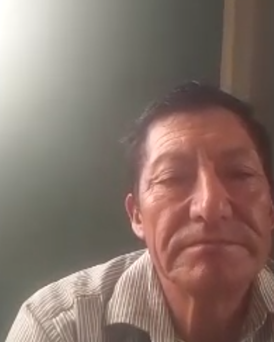
        * **Video URL:** [https://tinyurl.com/y5au5a7p](https://tinyurl.com/y5au5a7p)
        * **Timing:** 00:00 / 12:25
        * **Resumen:**
          Un agricultor de Huánuco actualmente enfocado en la cosecha de zanahoria, quien representa a un segmento de usuarios fuertemente arraigado a métodos tradicionales y con altas barreras tecnológicas. Marcelino carece de alfabetización digital, utiliza únicamente dispositivos móviles básicos sin acceso a internet, enfrenta problemas de conectividad en su zona y manifiesta desconfianza inicial ante la instalación de sensores físicos por temor a robos, daños al suelo o inversiones sin retorno claro. Sin embargo, existe una alta receptividad hacia el monitoreo agrícola automatizado debido a que resuelve sus "dolores" más críticos: la incertidumbre frente al cambio climático, la fatiga física de recorrer extensos terrenos a su edad y la preocupación por las heladas nocturnas.

    * **Entrevista 2:**
        * **Nombres:** Joe
        * **Apellidos:** Cañamero
        * **Edad:** 52
        * **Distrito:** Cusco
        * **Screenshot:**

          
        * **Video URL:** [https://tinyurl.com/57by2psn](https://tinyurl.com/57by2psn)
        * **Timing:** 12:30 / 23:53
        * **Resumen:**
          El agricultor entrevistado dejó clara su prioridad: una aplicación web con interfaz extremadamente sencilla, pero lo que más valoró fue la necesidad de un tutorial o asesoramiento integrado que lo acompañe en cada paso. No se trata solo de una guía inicial, sino de un acompañamiento constante dentro de la plataforma, ya que su analfabetización digital le impide sentirse seguro operando solo. Sin ese componente formativo, cualquier funcionalidad avanzada le resulta inaccesible o intimidante.
          Esta necesidad se agrava por el entorno donde opera: su zona rural sufre cortes de electricidad y conectividad a internet intermitente o nula. Esto significa que el asesoramiento no puede depender de videos en streaming, chats en vivo o actualizaciones constantes en la nube. La solución debe estar diseñada para funcionar incluso en condiciones de conectividad precaria, ofreciendo un tutorial offline o progresivo que no se rompa ante la falta de señal.
          Dado que la aplicación es principalmente software, pero debe convivir con dispositivos de campo, se determina que el IoT de monitoreo opere con LoRaWAN para sortear los problemas de red. Sin embargo, el verdadero diferencial estará en el módulo de asesoramiento inteligente: flujos guiados, tooltips persistentes, recordatorios contextuales y un modo "paso a paso" que el agricultor pueda activar cuando lo necesite. Así, TerraTech no solo organiza cosechas, sino que educa mientras el usuario trabaja, adaptándose a sus limitaciones digitales y de infraestructura.

* **Segmento 2: Proveedores**

    * **Entrevista 1:**
        * **Nombres:** Anita
        * **Apellidos:** Monago Cachay
        * **Edad:** 35
        * **Distrito:** Lima
        * **Screenshot:**

          
        * **Video URL:** [https://tinyurl.com/5t57arwh](https://tinyurl.com/5t57arwh)
        * **Timing:** 23:58 / 30:32
        * **Resumen:**
          Anita Monago Cachay es una proveedora de productos agrícolas de 35 años dedicada a ofrecer frutas y verduras a clientes mayoristas. Su estrategia comercial se basa en la total franqueza frente a sus compradores, informándoles siempre sobre la calidad real de su mercadería. Esta transparencia genera un alto nivel de confianza y fomenta que sus propios clientes la recomienden de boca en boca con otras personas.
          Para mantener su prestigio en el mercado, a Anita le resultaría de gran utilidad contar con información anticipada y precisa sobre el comportamiento del clima. Ella considera que la adopción de la plataforma le aportaría mucho valor si el sistema le brinda datos y alertas que le permitan anticiparse a los cambios climáticos. De esta manera, la herramienta le ayudaría a garantizar que sus productos mantengan la excelente calidad que sus exigentes clientes mayoristas esperan.

    * **Entrevista 2:**
        * **Nombres:** Karim
        * **Apellidos:** Castillo
        * **Edad:** 26
        * **Distrito:** Lima
        * **Screenshot:**

          
        * **Video URL:** [https://tinyurl.com/bdh47w25](https://tinyurl.com/bdh47w25)
        * **Timing:** 30:37 / 36:30
        * **Resumen:**
          Karim Castillo es un joven asesor técnico y distribuidor de insumos agrícolas que está asumiendo el negocio familiar en la zona de Cañete. Actualmente realiza sus recomendaciones basándose en visitas presenciales y experiencia, sin contar con datos reales del suelo en tiempo real. Sus principales problemas son la falta de información precisa sobre humedad y nutrientes, lo que genera recomendaciones erróneas, pérdida de confianza de los agricultores y reclamos frecuentes. Valora enormemente el acceso a datos actualizados del cultivo, alertas automáticas y recomendaciones precisas según el estado del suelo. Considera que una herramienta como TerraTech le permitiría ofrecer asesorías más eficientes, reducir errores, fidelizar clientes y aumentar sus ventas al justificar mejor cada producto con información real y actualizada.

* **Segmento 3: Clientes Finales**

    * **Entrevista 1:**
        * **Nombres:** Anjali
        * **Apellidos:** Amaro
        * **Edad:** 25
        * **Distrito:** Lima
        * **Screenshot:**

          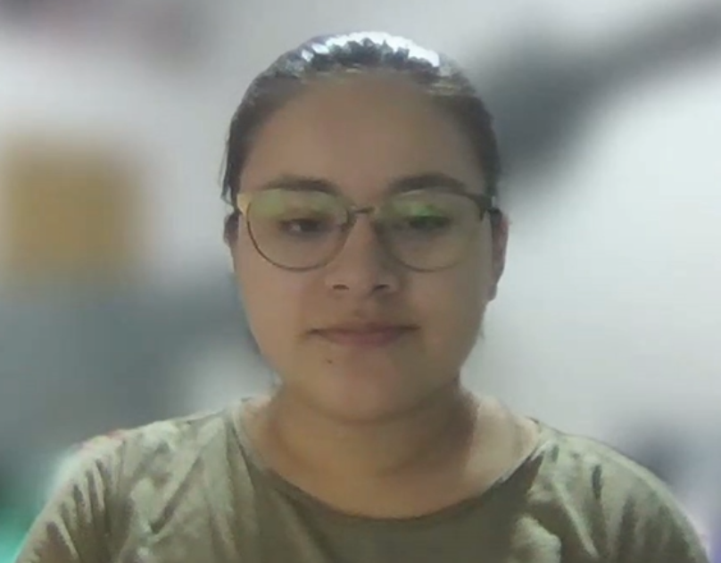
        * **Video URL:** [https://tinyurl.com/yfjw3t7u](https://tinyurl.com/yfjw3t7u)
        * **Timing:** 36:35 / 43:45
        * **Resumen:**
          El consumidor entrevistado otorga una importancia central a la calidad y trazabilidad de los alimentos que consume. No solo le preocupa saber si un producto contiene pesticidas o no, sino que necesita acceder a información clara sobre niveles de calidad, certificaciones y buenas prácticas agrícolas. Para él, la transparencia en estos aspectos es un factor decisivo de compra y confianza.
          Actualmente, este consumidor carece de canales confiables y accesibles para verificar esa información. Las etiquetas de los productos son limitadas, los sellos ecológicos a menudo resultan confusos o poco verificables, y no existe un espacio comunitario donde los compradores puedan compartir experiencias o calificar a los agricultores según sus prácticas. Esta falta de difusión y validación colectiva genera desconfianza y lo obliga a tomar decisiones con información incompleta.
          Para resolver este problema, TerraTech debe incorporar un módulo de difusión comunitaria que permita a los consumidores calificar a los agricultores, visualizar sus niveles de calidad y conocer el uso o ausencia de pesticidas en cada cosecha. Esto implica que la plataforma no solo sirva al agricultor para organizar su producción, sino que también ofrezca una vista pública o semipública donde el consumidor final pueda consultar, comparar y validar el origen de sus alimentos, construyendo así un ecosistema de confianza basado en la transparencia y la reputación colectiva.

    * **Entrevista 2:**
        * **Nombres:** Luciana
        * **Apellidos:** Aguilar
        * **Edad:** 17
        * **Distrito:** La Molina
        * **Screenshot:**

          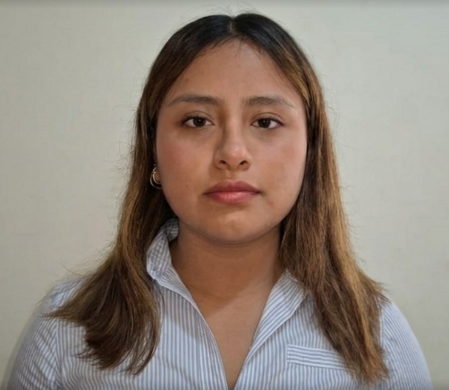
        * **Video URL:** [https://tinyurl.com/4tkbkmy6](https://tinyurl.com/4tkbkmy6)
        * **Timing:** 43:50 / 50:56
        * **Resumen:**
          Luciana Aguilar, de 17 años, vive en La Molina. En la entrevista, comentó que suele comprar frutas, verduras y granos como arroz y avena en una bodega cercana a su casa. Su rutina de compra es semanal, aunque también va cuando le falta algún ingrediente específico para una receta. Mencionó que al elegir un producto se fija en el precio, la frescura y la apariencia, y que rechaza aquellos con empaques golpeados o que se ven viejos. Señaló que el origen nacional o local le importa parcialmente, porque asocia lo local con mayor frescura y por apoyar la agricultura peruana, aunque admitió que no siempre lo revisa. Sobre sostenibilidad, indicó que solo elige opciones sostenibles si cuestan lo mismo que las convencionales; si son más caras, duda. Comentó que le genera confianza un producto limpio, bien cuidado y con certificación o información de origen. Le gustaría saber si se usaron químicos, cómo se cuidó el cultivo y en qué condiciones fue producido, pero notó que esa información es escasa y solo a veces ve etiquetas como "orgánico" o "sin pesticidas". Afirmó que si conociera el proceso de cultivo, estaría dispuesta a pagar un poco más. Sobre tecnología, dijo que usa su teléfono para buscar recetas o beneficios de alimentos, y que en el supermercado, cuando la información del empaque es incompleta, busca en Google para decidir. Propuso acceder a la información del cultivo mediante un código QR en el paquete o puesto de venta. Finalmente, mencionó que compartiría productos saludables o diferentes con familiares y amigos, y que sus tres factores principales de compra, en orden, son precio, apariencia y frescura.

    * **Entrevista 3:**
        * **Nombres:** Albert
        * **Apellidos:** Ponduro
        * **Edad:** 29
        * **Distrito:** Cañete
        * **Screenshot:**

          
        * **Video URL:** [https://tinyurl.com/jsr645uj](https://tinyurl.com/jsr645uj)
        * **Timing:** 51:01 / 58:04
        * **Resumen:**
          Albert Ponduro es un joven comprador mayorista y dueño de una verdulería en el Mercado Modelo de Lima. Compra productos agrícolas diariamente tanto para su negocio como para consumo personal. Sus principales problemas son la dificultad para verificar el origen, el trato del suelo y el impacto ambiental de los productos que adquiere. Valora fuertemente la transparencia y la sostenibilidad en la producción. Considera muy importante poder acceder fácilmente a información real del proceso de cultivo mediante un código QR o dashboard sencillo. Cree que conocer el estado del suelo, el uso eficiente del agua y los nutrientes aplicados le generaría mayor confianza, le permitiría pagar un mejor precio por productos de calidad y recomendarlos con seguridad a sus propios clientes.

### 2.2.3. Análisis de entrevistas

El análisis de las entrevistas realizadas a los tres segmentos objetivo (Agricultores, Proveedores de insumos y Clientes Finales) permite identificar patrones demográficos, comportamentales y tecnológicos que fundamentan la construcción de los User Personas y las decisiones de diseño de la solución. A continuación, se presenta un análisis estadístico detallado por cada segmento, considerando las características objetivas (demográficas) y subjetivas (personalidad, habilidades, canales de interacción, dispositivos de preferencia, marcas e influencias).

#### Segmento 1: Agricultores

El análisis de las 2 entrevistas realizadas a agricultores revela patrones claros en su perfil:

**Características demográficas (objetivas):**
- El 100% de los agricultores entrevistados son hombres de 52 y 67 años (rango de edad 52-67 años), residentes en zonas rurales de Huánuco y Cusco.
- El 100% tiene un nivel de educación primaria o secundaria incompleta, lo que se traduce en un bajo nivel de alfabetización digital (analfabetismo digital alto).
- El 100% vive en zonas con conectividad a internet intermitente o nula, y con cortes de electricidad frecuentes.

**Características de personalidad (subjetivas):**
- El 100% muestra desconfianza inicial hacia la tecnología agrícola, especialmente ante la instalación de sensores físicos, por temor a robos, daños al suelo o inversiones sin retorno claro (Ansiedad/Frustración).
- El 100% demuestra una fuerte dependencia de métodos tradicionales basados en experiencia personal y conocimiento ancestral para el manejo de sus cultivos.
- El 100% es receptivo a la idea del monitoreo automatizado porque resolvería su principal dolor: la incertidumbre frente al cambio climático (heladas, sequías) y el esfuerzo físico de recorrer extensos terrenos (Necesidad no satisfecha).

**Habilidades y tecnología:**
- El 100% no utiliza tecnología para el monitoreo de sus cultivos.
- El 50% utiliza el celular únicamente para aplicaciones de banca móvil o billetera digital, mientras que el otro 50% utiliza únicamente dispositivos móviles básicos sin acceso a internet.
- El 100% depende de las lluvias para el riego, lo que los hace vulnerables a cambios climáticos y genera costos adicionales por uso de agua o fertilizantes en climas adversos.
- El 100% no utiliza herramientas gráficas (como Excel) para gestionar sus cultivos.

**Canales de interacción:**
- El 100% prefiere la comunicación directa (visitas al campo, conversaciones cara a cara) para resolver dudas sobre sus cultivos.
- El 50% utiliza WhatsApp para comunicarse con familiares o proveedores, siempre que haya señal disponible.
- El 100% no utiliza redes sociales ni plataformas digitales para informarse sobre técnicas agrícolas.

**Dispositivos de preferencia:**
- El 100% utiliza teléfonos móviles básicos (no smartphones) o smartphones de gama baja.
- El 100% no posee computadora personal y accede a internet exclusivamente a través del teléfono móvil cuando hay cobertura.

**Marcas e influencias:**
- El 100% confía en los consejos de agricultores veteranos, familiares y líderes de la comunidad.
- El 50% ha escuchado sobre tecnologías agrícolas (como CropX o Netafim) pero las considera inaccesibles por su alto costo y complejidad.

**Conclusiones del análisis:**
En resumen, los agricultores entrevistados muestran una fuerte dependencia de métodos tradicionales para el manejo de sus cultivos, con un enfoque particular en la experiencia. La falta de acceso a información precisa sobre el clima y el estado del suelo los hace vulnerables a cambios climáticos y puede generar costos adicionales. Además, la adopción de tecnología para el monitoreo agrícola es prácticamente inexistente, lo que resalta la necesidad de una solución que sea accesible, fácil de usar y que brinde información valiosa para mejorar sus prácticas agrícolas. La solución debe priorizar interfaces simples, basadas en íconos, con soporte en español y funcionalidad offline o con baja conectividad.

#### Segmento 2: Proveedores de insumos agrícolas

El análisis de las 2 entrevistas realizadas a proveedores revela los siguientes patrones:

**Características demográficas (objetivas):**
- El 100% de los proveedores entrevistados reside en Lima metropolitana (distritos de Lima y Cañete).
- Las edades de los entrevistados son 35 y 26 años (rango de edad 26-35 años), lo que indica un perfil más joven y con mayor apertura tecnológica que el segmento de agricultores.
- El 100% cuenta con educación secundaria completa o superior técnica.

**Características de personalidad (subjetivas):**
- El 100% muestra una actitud proactiva hacia la adopción de tecnología que mejore sus procesos de venta y asesoría.
- El 100% valora la transparencia y la precisión en la información para mantener la confianza de los agricultores (Necesidad de credibilidad).
- El 100% experimenta frustración por la falta de datos reales que respalden sus recomendaciones, lo que genera pérdida de clientes y reclamos frecuentes (Pain Point).

**Habilidades y tecnología:**
- El 50% acude a los campos a informarse de manera directa sobre las necesidades de los agricultores, mientras que el 50% se basa en su experiencia y conocimiento previo para hacer recomendaciones.
- El 100% realiza seguimiento de calidad de sus productos preguntando directamente a los agricultores sobre los resultados.
- El 75% utiliza WhatsApp como principal herramienta de comunicación con los agricultores.
- El 25% utiliza herramientas gráficas como Excel para llevar un control de sus ventas y clientes.
- El 100% no utiliza plataformas digitales especializadas para la gestión de su negocio.

**Canales de interacción:**
- El 100% utiliza WhatsApp como canal principal de comunicación con agricultores y clientes.
- El 100% realiza visitas presenciales a los campos para evaluar el estado de los cultivos y mantener relación con los agricultores.

**Dispositivos de preferencia:**
- El 100% utiliza smartphones para comunicación y gestión básica.
- El 25% utiliza computadora personal para tareas administrativas como el manejo de Excel.

**Marcas e influencias:**
- El 100% se mantiene informado a través de capacitaciones técnicas, ferias agrícolas y proveedores nacionales.
- El 100% considera que las plataformas tecnológicas locales aún no ofrecen soluciones adaptadas a la realidad del agricultor peruano.

**Conclusiones del análisis:**
En resumen, los proveedores entrevistados muestran una fuerte dependencia de la comunicación directa con los agricultores para obtener información sobre sus necesidades y resultados. La mayoría utiliza herramientas de mensajería como WhatsApp para mantenerse en contacto, y algunos emplean herramientas gráficas para gestionar sus ventas. La adopción de una aplicación móvil que les permita reducir tiempos y acceder a información actualizada sobre los cultivos de sus clientes sería altamente valorada, ya que les permitiría brindar recomendaciones más precisas y mejorar su eficiencia en el negocio. El 75% de los proveedores considera que una aplicación móvil debería ayudarles en la reducción de tiempos a la hora de buscar recomendaciones o comunicarse con los agricultores, mientras que el 25% restante considera que lo más importante es que la aplicación les permita tener información actualizada de los cultivos de sus clientes para poder brindar recomendaciones más precisas.

#### Segmento 3: Clientes Finales

El análisis de las 3 entrevistas realizadas a clientes finales revela los siguientes patrones:

**Características demográficas (objetivas):**
- El 100% de los clientes finales entrevistados reside en Lima metropolitana (distritos de Lima, La Molina y Cañete).
- Las edades de los entrevistados son 25, 17 y 29 años (rango de edad 17-29 años), lo que indica un perfil joven y con alta afinidad digital.
- El 100% cuenta con educación secundaria completa o superior universitaria.

**Características de personalidad (subjetivas):**
- El 100% muestra un alto interés en la transparencia y trazabilidad de los productos que consume (Valor central).
- El 100% está dispuesto a pagar un precio premium por productos que demuestren prácticas sostenibles y trazabilidad (Gain).
- El 100% experimenta desconfianza por la falta de información verificable sobre el origen y proceso de cultivo de los productos (Pain Point).

**Habilidades y tecnología:**
- El 100% utiliza su teléfono móvil para buscar información sobre productos antes de comprar, principalmente a través de redes sociales (Instagram, TikTok) y Google.
- El 100% está familiarizado con el uso de códigos QR para acceder a información complementaria.
- El 50% utiliza aplicaciones de delivery y supermercados online para realizar compras.

**Canales de interacción:**
- El 100% utiliza redes sociales (Instagram, TikTok) para informarse sobre tendencias de alimentación saludable y productos sostenibles.
- El 100% utiliza buscadores (Google) para verificar información de productos en el punto de venta cuando el empaque es insuficiente.
- El 100% utiliza WhatsApp para comunicación personal y ocasionalmente para compras.

**Dispositivos de preferencia:**
- El 100% utiliza smartphones de gama media o alta.
- El 33% utiliza computadora portátil para tareas adicionales (estudio, trabajo).

**Marcas e influencias:**
- El 100% sigue a influencers de alimentación saludable y sostenibilidad en redes sociales.
- El 100% valora las certificaciones orgánicas y sellos de sostenibilidad, pero considera que son difíciles de verificar.

**Conclusiones del análisis:**
En resumen, los clientes finales entrevistados muestran una diversidad de factores que influyen en su decisión de compra, con un enfoque significativo en el precio, la calidad y el origen de los productos. La información disponible sobre los productos varía, con algunos clientes teniendo acceso a detalles moderados mientras que otros solo ven información básica o no tienen acceso a información sobre el proceso de cultivo. La búsqueda de información a través de teléfonos móviles es común entre los clientes finales, lo que destaca la importancia de contar con canales digitales efectivos para proporcionar información relevante sobre los productos agrícolas. El 50% de los clientes finales toma en cuenta el precio de los productos, mientras que el 25% busca la calidad como un buen estado del producto y el 25% restante se fija en el origen y el trato que se le dio al producto.

## 2.3. Needfinding

El proceso de Needfinding permitió transformar los hallazgos de las entrevistas en herramientas de diseño centradas en el usuario. A partir del análisis estadístico de las características demográficas, comportamentales y subjetivas de cada segmento, se construyeron los siguientes artefactos que guiarán el diseño de la solución TerraTech.

### 2.3.1. User Personas

A continuación, se presentan las fichas de User Persona elaboradas en UXPressia para cada uno de los tres segmentos objetivo. Cada ficha integra los hallazgos de las entrevistas, incluyendo características demográficas, personalidad, habilidades, marcas e influencias, dispositivos de preferencia y canales de interacción.

* **Segmento 1: Agricultor**

* **Segmento 2: Proveedor**

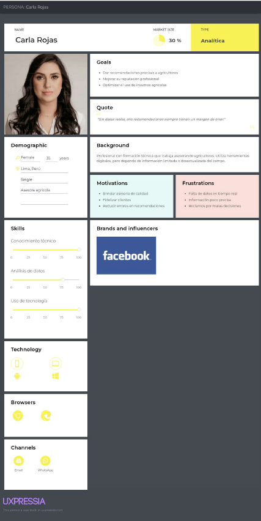

* **Segmento 3: Cliente Final**

### 2.3.2. User Task Matrix

La User Task Matrix permite visualizar y comparar las tareas que cada segmento objetivo realiza para cumplir sus objetivos, independientemente de la existencia de la solución tecnológica. A continuación, se presentan las tareas identificadas a partir de las entrevistas, junto con su frecuencia e importancia para cada User Persona.

| Tarea | **Agricultor** (Frecuencia / Importancia) | **Proveedor** (Frecuencia / Importancia) | **Cliente Final (Comprador)** (Frecuencia / Importancia) |
| :--- | :---: |:----------------------------------------:|:--------------------------------------------------------:|
| **Monitorear el estado del suelo (humedad, nutrientes)** | Alta / Alta |               Media / Alta               |                       Baja / Baja                        |
| **Recibir alertas en tiempo real sobre condiciones críticas** | Alta / Alta |              Media / Media               |                       Baja / Media                       |
| **Revisar datos históricos y tendencias del cultivo** | Media / Media |               Alta / Alta                |                       Baja / Baja                        |
| **Generar reportes de rendimiento y sostenibilidad** | Baja / Media |              Media / Media               |                       Baja / Alta                        |
| **Registrar y gestionar productos en inventario** | Baja / Media |               Alta / Alta                |                       Baja / Baja                        |
| **Verificar trazabilidad y origen del producto** | Baja / Baja |               Baja / Baja                |                       Alta / Alta                        |
| **Consultar pronóstico del clima para planificar riego** | Alta / Alta |               Media / Alta               |                       Baja / Media                       |
| **Visualizar mapa de fertilidad del terreno** | Media / Alta |              Media / Media               |                       Baja / Baja                        |
| **Configurar umbrales personalizados de alerta** | Media / Media |               Baja / Media               |                       Baja / Baja                        |
| **Navegar en catálogo de productos y ofertas** | Baja / Baja |               Alta / Alta                |                       Alta / Alta                        |
| **Leer y dejar comentarios y calificaciones** | Baja / Baja |              Media / Media               |                       Alta / Alta                        |
| **Gestionar perfil público en la comunidad** | Baja / Baja |              Media / Media               |                      Media / Media                       |

**Análisis de la User Task Matrix:**
Los agricultores presentan una alta frecuencia e importancia en tareas operativas como el monitoreo del suelo y la recepción de alertas en tiempo real, ya que dependen directamente de esta información para tomar decisiones inmediatas en sus cultivos. Por su parte, los proveedores o asesores destacan en tareas de análisis, como la revisión de datos históricos, generación de reportes y planificación, lo que refleja un uso más técnico y estratégico de la plataforma. Finalmente, los clientes finales tienen una menor frecuencia de uso, pero otorgan alta importancia a funcionalidades relacionadas con la trazabilidad, el origen del producto y el impacto ambiental, buscando principalmente transparencia y confianza en su consumo.

### 2.3.3. User Journey Mapping

Los User Journey Maps representan el recorrido end-to-end que cada User Persona realiza actualmente (situación As-Is) para cumplir con sus objetivos, sin la existencia de la solución TerraTech. Estos mapas permiten identificar los puntos de dolor (pains) y las oportunidades de mejora (gains) que la plataforma debe abordar.

* **Segmento 1: Agricultor**

El siguiente Journey Map ilustra el proceso que sigue Marcelino, un agricultor de Huánuco, para monitorear el estado de su cultivo de zanahoria y decidir cuándo regar o fertilizar. El recorrido muestra cómo Marcelino depende de métodos tradicionales (inspección visual, experiencia personal) y enfrenta incertidumbre por la falta de datos precisos, especialmente ante cambios climáticos inesperados.

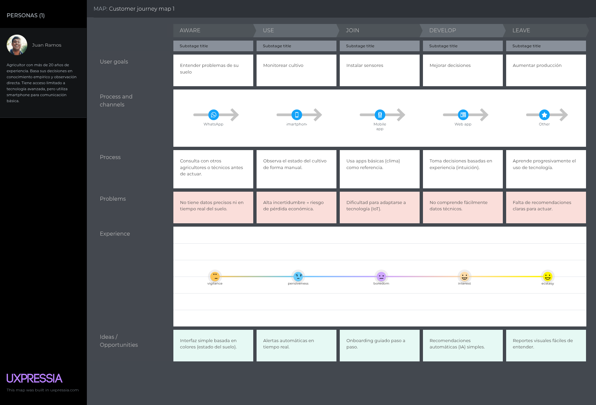

* **Segmento 2: Proveedor**

El siguiente Journey Map muestra el proceso de Karim, un asesor técnico de Cañete, para recomendar insumos a los agricultores. El recorrido evidencia cómo Karim realiza visitas presenciales y se basa en su experiencia, pero carece de datos reales del suelo para hacer recomendaciones precisas, lo que genera errores, pérdida de confianza y reclamos de los agricultores.

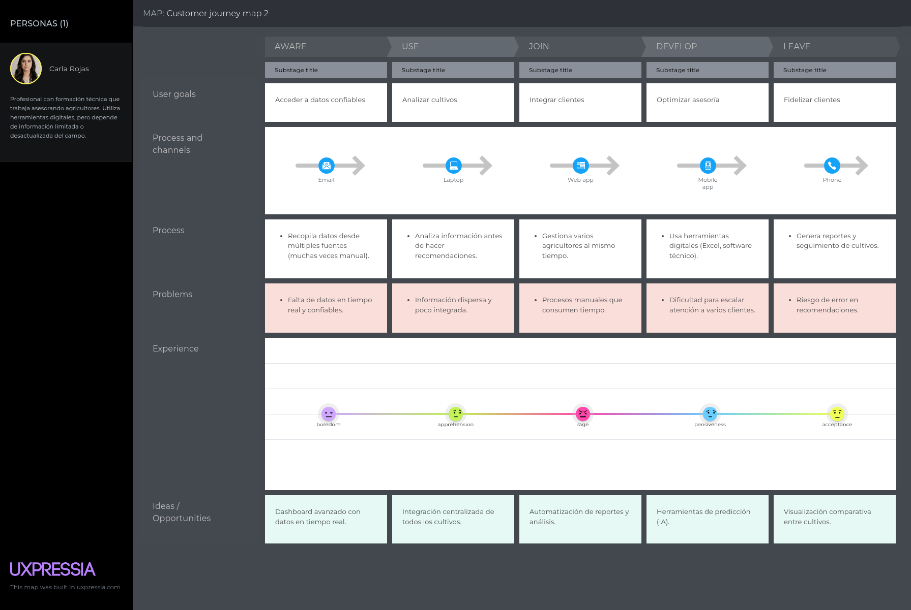

* **Segmento 3: Cliente Final**

El siguiente Journey Map describe el proceso de compra de Luciana, una consumidora de La Molina, al adquirir productos agrícolas. El recorrido muestra cómo Luciana valora la frescura, el precio y la apariencia, pero carece de información confiable sobre el origen y las prácticas de cultivo, lo que genera desconfianza y la obliga a tomar decisiones con información incompleta.

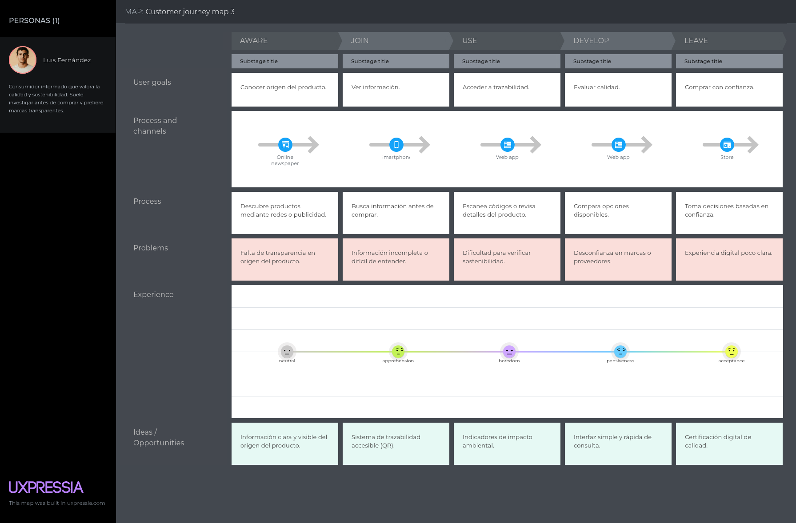

### 2.3.4. Empathy Mapping

Los Empathy Maps permiten profundizar en la comprensión de cada User Persona, explorando lo que piensa, siente, ve, oye, dice y hace en su contexto diario. Estos mapas fueron construidos a partir de las observaciones y hallazgos de las entrevistas, y permiten identificar los principales pains y gains de cada segmento.

* **Segmento 1: Agricultor**

El siguiente Mapa de Empatía profundiza en la experiencia de Marcelino, el agricultor de Huánuco. Se identifican sus principales pensamientos y sentimientos (incertidumbre ante el clima, preocupación por la pérdida de cosechas), lo que ve en su entorno (campos extensos, cambios climáticos), lo que oye de otros agricultores (consejos tradicionales, temor a la tecnología), lo que dice y hace (inspección manual, decisión por intuición), así como sus principales pains (falta de información precisa, esfuerzo físico) y gains (deseo de certidumbre, mejora de la productividad).

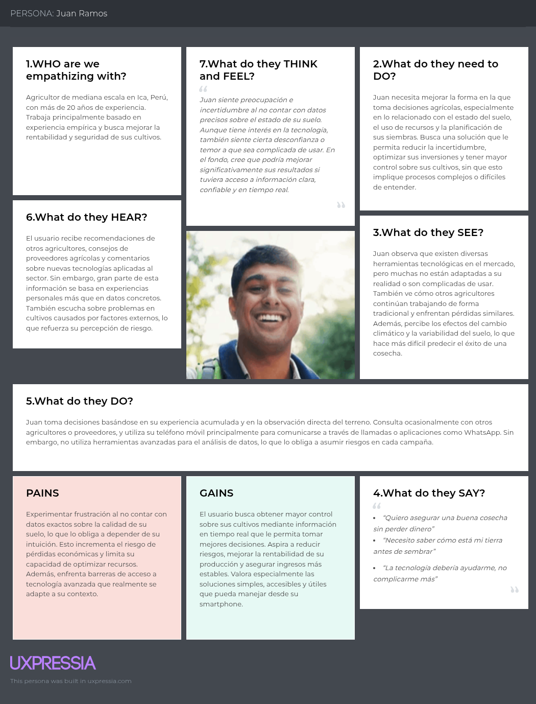

* **Segmento 2: Proveedor**

El siguiente Mapa de Empatía analiza la experiencia de Karim, el asesor técnico. Se exploran sus pensamientos y sentimientos (frustración por recomendaciones erróneas, necesidad de credibilidad), lo que ve (agricultores con problemas de suelo, competencia), lo que oye (reclamos de agricultores, feedback de otros asesores), lo que dice y hace (visitas a campo, recomendaciones basadas en experiencia), y sus pains (falta de datos precisos, pérdida de clientes) y gains (deseo de fidelizar clientes, incrementar ventas con recomendaciones acertadas).

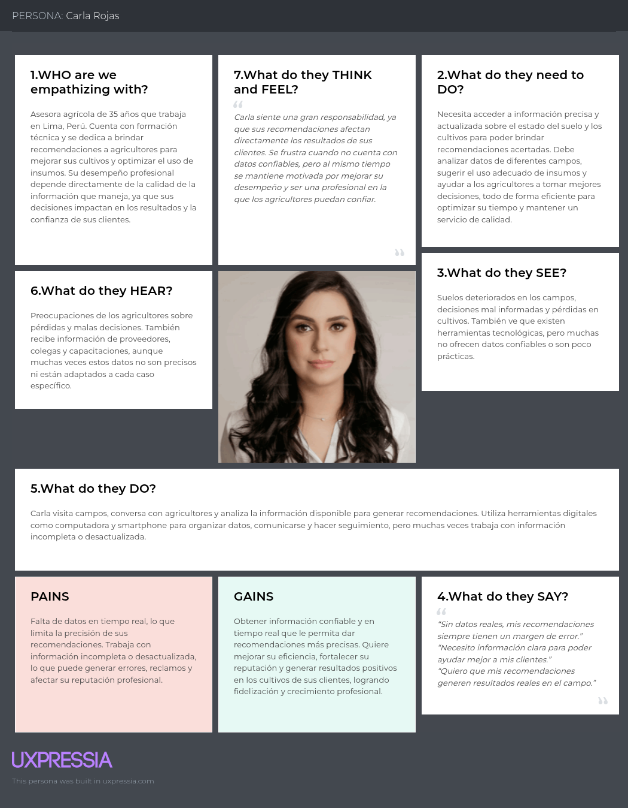

* **Segmento 3: Cliente Final**

El siguiente Mapa de Empatía se centra en la experiencia de Luis, la consumidora final. Se identifican sus pensamientos y sentimientos (deseo de transparencia, desconfianza por falta de información), lo que ve (etiquetas confusas, productos de origen desconocido), lo que oye (tendencias de alimentación saludable, testimonios de otros compradores), lo que dice y hace (búsqueda en Google, decisión por precio y apariencia), y sus pains (dificultad para verificar origen, falta de confianza) y gains (deseo de productos saludables, disposición a pagar premium por trazabilidad).

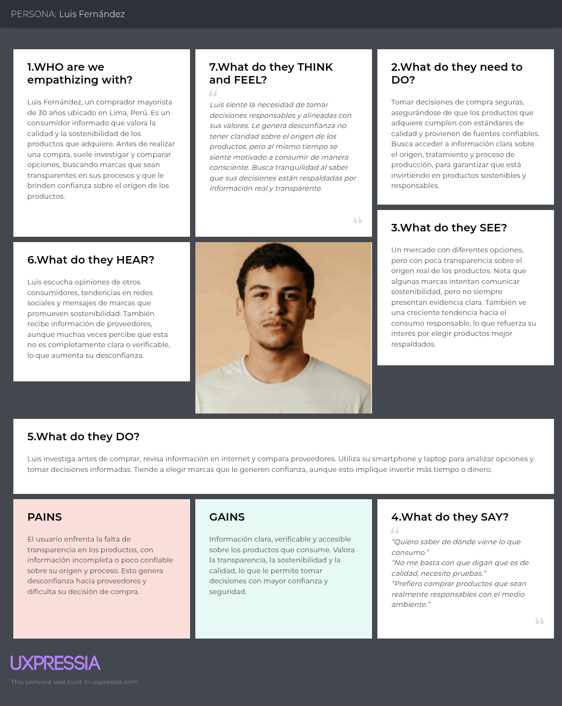

### 2.4. Big Picture Event Storming

El equipo llevó a cabo una sesión colaborativa de Big Picture Event Storming utilizando la herramienta Miro, con el objetivo de explorar el dominio del negocio agrícola de TerraTech a alto nivel. A diferencia de un flujo técnico o de registro de usuarios, el Big Picture Event Storming se enfoca en capturar el **flujo de negocio completo** que ocurre en el mundo real del agricultor, desde la preparación de la tierra hasta la comercialización de los productos.

Durante la sesión, se identificaron los eventos significativos que ocurren en el ciclo de vida del cultivo y la interacción con los actores del ecosistema. El proceso permitió visualizar el flujo completo del negocio agrícola, exponiendo las relaciones entre los eventos clave, los actores involucrados (agricultor, tierra, clima, proveedores, clientes finales) y las políticas de negocio que rigen el comportamiento del sistema.

A continuación, se presentan los principales elementos identificados en el Big Picture Event Storming:

**Domain Events (Eventos de Dominio):** Eventos en tiempo pasado que ocurren en el proceso de negocio.
- **Soil Prepared** (Tierra preparada)
- **Crop Planted** (Cultivo sembrado)
- **Soil Moisture Changed** (Humedad del suelo cambió)
- **Nutrient Level Changed** (Nivel de nutrientes cambió)
- **Irrigation Applied** (Riego aplicado)
- **Fertilizer Applied** (Fertilizante aplicado)
- **Weather Alert Received** (Alerta climática recibida)
- **Crop Growth Stage Updated** (Etapa de crecimiento actualizada)
- **Pest Detected** (Plaga detectada)
- **Crop Harvested** (Cultivo cosechado)
- **Yield Recorded** (Rendimiento registrado)
- **Product Listed for Sale** (Producto listado para venta)
- **Product Sold** (Producto vendido)
- **Traceability QR Generated** (Código QR de trazabilidad generado)
- **Sustainability Report Generated** (Reporte de sostenibilidad generado)

**Actors (Actores):** Personas o sistemas que ejecutan comandos o generan eventos.
- **Farmer (Agricultor)** - Actor principal que prepara, siembra, riega, fertiliza y cosecha.
- **Soil (Tierra/Suelo)** - Actor pasivo que genera eventos de cambio de humedad y nutrientes.
- **Weather (Clima)** - Actor externo que genera alertas climáticas.
- **Advisor / Supplier (Asesor / Proveedor)** - Actor que recomienda insumos basados en datos del suelo.
- **End Customer (Cliente Final)** - Actor que compra productos y verifica trazabilidad.

**Policies (Políticas):** Reglas de negocio que se disparan ante eventos específicos.
- When **Soil Moisture drops below 30%**, trigger **Irrigation Recommendation** (Cuando la humedad del suelo baja del 30%, disparar recomendación de riego).
- When **Nutrient N drops below 20 ppm**, trigger **Fertilizer Recommendation** (Cuando el nitrógeno baja de 20 ppm, disparar recomendación de fertilización).
- When **Pest is Detected**, trigger **Pest Control Alert** (Cuando se detecta una plaga, disparar alerta de control de plagas).
- When **Crop is Harvested**, update **Inventory and Yield Records** (Cuando se cosecha, actualizar inventario y registros de rendimiento).
- When **Product is Listed**, generate **Traceability QR Code** (Cuando se lista un producto, generar código QR de trazabilidad).

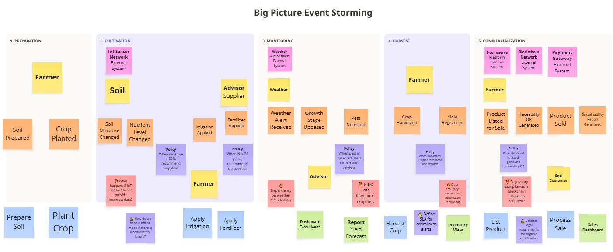

### 2.5. Ubiquitous Language

El siguiente glosario define los términos y conceptos clave del dominio de negocio de TerraTech, asegurando una comunicación clara y sin ambigüedades entre todos los miembros del equipo y stakeholders. Los términos están presentados en inglés (con el equivalente en español entre paréntesis) y sus definiciones están redactadas en español.

<table border="1">
    <thead>
        <tr>
            <th colspan="3">Identity & Access Management</th>
        </tr>
        <tr>
            <th>Term (English)</th>
            <th>Term (Spanish)</th>
            <th>Definition (in Spanish)</th>
        </tr>
    </thead>
    <tbody>
        <tr>
            <td>User</td>
            <td>Usuario</td>
            <td>Persona que interactúa con la aplicación. Puede ser cliente o administrador.</td>
        </tr>
        <tr>
            <td>Register User</td>
            <td>Registrar usuario</td>
            <td>Acción de crear una cuenta nueva en el sistema.</td>
        </tr>
        <tr>
            <td>Login</td>
            <td>Iniciar sesión</td>
            <td>Proceso de autenticación para acceder al sistema.</td>
        </tr>
        <tr>
            <td>Credentials</td>
            <td>Credenciales</td>
            <td>Conjunto de datos (correo, contraseña) para la autenticación.</td>
        </tr>
        <tr>
            <td>User registered</td>
            <td>Usuario registrado</td>
            <td>Evento que indica que una nueva cuenta ha sido creada.</td>
        </tr>
    </tbody>
</table>

 

<table border="1">
    <thead>
        <tr>
            <th colspan="3">Profiles & Preferences Management</th>
        </tr>
        <tr>
            <th>Term (English)</th>
            <th>Term (Spanish)</th>
            <th>Definition (in Spanish)</th>
        </tr>
    </thead>
    <tbody>
        <tr>
            <td>Profile</td>
            <td>Perfil</td>
            <td>Información personal del usuario (nombre, correo, teléfono, etc.).</td>
        </tr>
        <tr>
            <td>Preferences</td>
            <td>Preferencias</td>
            <td>Configuración personalizada definida por el usuario.</td>
        </tr>
        <tr>
            <td>Profile created</td>
            <td>Perfil creado</td>
            <td>Evento que indica que se creó un perfil asociado a un usuario.</td>
        </tr>
        <tr>
            <td>Preferences updated</td>
            <td>Preferencias actualizadas</td>
            <td>Evento que indica que el usuario cambió su configuración.</td>
        </tr>
    </tbody>
</table>

 

<table border="1">
    <thead>
        <tr>
            <th colspan="3">Payments & Subscriptions</th>
        </tr>
        <tr>
            <th>Term (English)</th>
            <th>Term (Spanish)</th>
            <th>Definition (in Spanish)</th>
        </tr>
    </thead>
    <tbody>
        <tr>
            <td>Subscription</td>
            <td>Suscripción</td>
            <td>Relación activa entre cliente y plan de servicios.</td>
        </tr>
        <tr>
            <td>Subscription started</td>
            <td>Suscripción iniciada</td>
            <td>Evento que indica el inicio de un plan contratado.</td>
        </tr>
        <tr>
            <td>Payment</td>
            <td>Pago</td>
            <td>Transacción financiera para habilitar un servicio o renovar la suscripción.</td>
        </tr>
        <tr>
            <td>Payment processed</td>
            <td>Pago procesado</td>
            <td>Evento que confirma que un pago fue realizado exitosamente.</td>
        </tr>
        <tr>
            <td>Plan</td>
            <td>Plan</td>
            <td>Conjunto de servicios con un precio definido.</td>
        </tr>
    </tbody>
</table>

