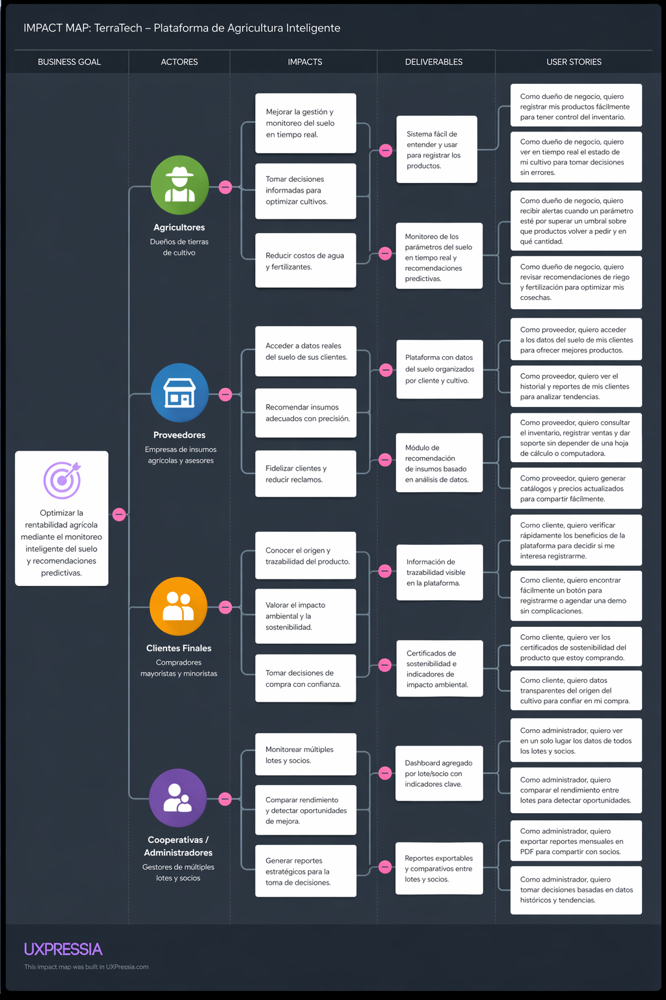

# Chapter III: Requirements Specification

## 3.1. User Stories

| EPIC ID | Nombre                                                                                                           | User Stories                                                     |
|:--------|:-----------------------------------------------------------------------------------------------------------------|:-----------------------------------------------------------------|
| EPIC01  | Landing Page & Marketing                                                                                         | US01, US02, US03, US04, US05                                     |
| EPIC02  | Autenticación y Gestión de Usuarios                                                                              | US06, US07, US08, US09                                           |
| EPIC03  | Dashboard de Monitoreo en Tiempo Real                                                                            | US10, US11, US12                                                 |
| EPIC04  | Mapa de Fertilidad                                                                                               | US13, US14                                                       |
| EPIC05  | Motor de Recomendaciones                                                                                         | US15, US16                                                       |
| EPIC06  | Gestión de Sensores                                                                                              | US17, US18                                                       |
| EPIC07  | API RESTful                                                                                                      | US21, US22, US23                                                 |
| EPIC08  | Integración con Servicios Externos                                                                               | US24, US25                                                       |
| EPIC09  | Inventory Management                                                                                             | US26, US27, US28                                                 |
| EPIC10  | Notifications Management                                                                                         | US29, US30, US31, US32, US33, US34                               |
| EPIC11  | Community & Reputation                                                                                           | US35, US36, US37, US38                                           |
| EPIC12  | Analytics & Catalog                                                                                              | US39, US40, US41, US42                                           |
| EPIC13  | Configuración y Despliegue (Technical Stories)                                                                   | TS01, TS02, TS03, TS04, TS05, TS06, TS07, TS08, TS09, TS10, TS11 |

---

## EPIC01: Landing Page & Marketing

| USER ID | Título | Descripción | Criterios de Aceptación | EPIC ID |
|:--------|:-------|:------------|:------------------------|:--------|
| US01    | Visualización de Hero Section | Como visitante, deseo ver un mensaje claro sobre el valor de AgroTech para comprender rápidamente qué ofrece la solución. | **Scenario 1: Carga correcta de la página** Given el visitante accede a la URL del Landing Page When la página termina de cargar Then se visualiza el Hero Section con título, subtítulo y botón CTA "Solicitar Demo" And el botón "Solicitar Demo" es clicable y visible sin necesidad de scroll  **Scenario 2: Responsive en móvil** Given el visitante accede desde un dispositivo móvil con ancho de 320px When la página se renderiza Then el Hero Section se adapta verticalmente sin desbordamiento horizontal And el tamaño de la fuente del título es mínimo de 1.5rem | EPIC1 |
| US02    | Visualización de Sección de Características | Como visitante, deseo conocer las características principales de AgroTech para evaluar si la solución satisface mis necesidades. | **Scenario 1: Visualización de 3 características** Given el visitante ha cargado el Landing Page When hace scroll hasta la sección de características Then se muestran exactamente tres características: "Sensor de Humedad", "Sensor de Nutrientes", "Alertas en Tiempo Real"  **Scenario 2: Cada característica tiene ícono y descripción** Given la sección de características está visible When el visitante observa cada característica Then cada una tiene un ícono representativo (formato SVG o FontAwesome), un título H3 y una descripción de máximo 150 caracteres | EPIC1 |
| US03    | Envío de Formulario de Solicitud de Demo | Como visitante, deseo completar un formulario para solicitar una demostración para recibir información personalizada sobre AgroTech. | **Scenario 1: Envío exitoso** Given el visitante accede al formulario de demo en el Landing Page When completa todos los campos (Nombre, Email, Teléfono, Tamaño de terreno en hectáreas) y presiona "Enviar" Then se muestra un mensaje de éxito "Gracias, nos contactaremos pronto" And el formulario se limpia automáticamente  **Scenario 2: Validación de campos obligatorios** Given el visitante está en el formulario When intenta enviar sin completar el campo Email Then se muestra un mensaje de error "El correo electrónico es requerido" And el formulario no se envía al servidor  **Scenario 3: Validación de formato de email** Given el visitante ingresa "correo-invalido" en el campo Email When presiona "Enviar" Then se muestra un mensaje en rojo "Ingrese un correo electrónico válido (ej: usuario@dominio.com)" And el campo Email tiene borde rojo | EPIC1 |
| US04    | Enlace a Términos y Condiciones | Como visitante, deseo leer los términos y condiciones de servicio para conocer mis derechos y obligaciones al usar AgroTech. | **Scenario 1: Acceso desde footer del Landing Page** Given el visitante está en el Landing Page When hace clic en el enlace "Términos y Condiciones" en el footer Then se abre una nueva pestaña con el documento completo de términos And el documento tiene fecha de última actualización visible  **Scenario 2: Access desde Web Application (logueado)** Given el usuario ha iniciado sesión en la Web App When hace clic en "Términos y Condiciones" en el footer de la aplicación Then se abre un modal con el mismo documento And el modal tiene botón "Aceptar" y botón "Cerrar" | EPIC1 |
| US05    | Visualización de Información del Proyecto y Equipo | Como visitante, deseo visualizar información sobre el proyecto y el equipo de desarrollo para comprender el propósito de la solución y conocer a las personas detrás de ella. | **Scenario 1: Visualización de la sección "Sobre el Proyecto"** Given el visitante accede al Landing Page When hace scroll hasta la sección "Sobre el Proyecto" Then se muestra una descripción clara del propósito de TerraTech, su misión y visión And se visualiza el logo y nombre de la startup NovaTech  **Scenario 2: Visualización de la sección "Equipo"** Given el visitante está en la sección del equipo Then se muestran las fotos, nombres completos y roles de los 5 integrantes del equipo de desarrollo And cada miembro tiene una breve descripción de su perfil y especialidad  **Scenario 3: Diseño responsive** Given el visitante accede desde un dispositivo móvil (320px de ancho) When visualiza las secciones del proyecto y equipo Then las tarjetas de los miembros del equipo se organizan en columna sin desbordamiento And los textos son legibles con un tamaño de fuente mínimo de 1rem | EPIC1 |

---

## EPIC02: Autenticación y Gestión de Usuarios

| USER ID | Título | Descripción | Criterios de Aceptación | EPIC ID |
|:--------|:-------|:------------|:------------------------|:--------|
| US06    | Registro de Nuevo Usuario | Como agricultor, deseo crear una cuenta en AgroTech para acceder a la plataforma y configurar mis sembríos. | **Scenario 1: Registro exitoso** Given el usuario accede a la página /register When ingresa Nombre (mínimo 2 caracteres), Email válido, Contraseña (mínimo 6 caracteres) y confirma contraseña correctamente And presiona "Registrarme" Then se crea la cuenta con rol "Agricultor" And se envía un correo de verificación con enlace válido por 24 horas And se redirige automáticamente a /login  **Scenario 2: Email ya registrado** Given el usuario ingresa un email que ya existe en la base de datos When presiona "Registrarme" Then se muestra el mensaje "Este correo ya está registrado. Inicia sesión o recupera tu contraseña" And se habilita un enlace a /forgot-password  **Scenario 3: Contreñas no coinciden** Given el usuario ingresa "123456" en Contraseña y "12345" en Confirmar Contraseña When presiona "Registrarme" Then se muestra el mensaje "Las contraseñas no coinciden" And el campo Confirmar Contraseña se marca con borde rojo | EPIC2 |
| US07    | Inicio de Sesión | Como usuario registrado, deseo iniciar sesión con mi email y contraseña para acceder a mi dashboard y datos. | **Scenario 1: Login exitoso** Given el usuario está en la página /login When ingresa email y contraseña válidos (registrados previamente y verificados) And presiona "Iniciar Sesión" Then se genera un token JWT válido por 8 horas And se redirige al dashboard principal /dashboard And el nombre del usuario aparece en el header de la aplicación  **Scenario 2: Credenciales incorrectas** Given el usuario ingresa email "campo@example.com" (existente) y contraseña "wrong123" When presiona "Iniciar Sesión" Then se muestra el mensaje "Credenciales inválidas. Intente nuevamente" And no se genera token And el usuario permanece en /login  **Scenario 3: Email no verificado** Given el usuario se registró pero no verificó su email When intenta iniciar sesión con credenciales correctas Then se muestra "Por favor, verifica tu correo electrónico antes de iniciar sesión" And se ofrece opción de "Reenviar correo de verificación" | EPIC2 |
| US08    | Recuperación de Contraseña | Como usuario registrado, deseo recuperar mi contraseña olvidada para volver a acceder a mi cuenta. | **Scenario 1: Envío de enlace de recuperación** Given el usuario está en la página /login y hace clic en "¿Olvidaste tu contraseña?" When ingresa su email registrado "campo@example.com" y presiona "Enviar enlace" Then se envía un correo con un enlace único (token) válido por 1 hora And se muestra mensaje "Revisa tu correo para restablecer tu contraseña"  **Scenario 2: Restablecimiento exitoso** Given el usuario hace clic en el enlace del correo y accede a /reset-password?token=valid_token When ingresa nueva contraseña "newPass123" y la confirma correctamente And presiona "Restablecer Contraseña" Then la contraseña se actualiza en la base de datos (hasheada con bcrypt) And se redirige a /login con mensaje "Contraseña actualizada. Inicia sesión"  **Scenario 3: Token expirado o inválido** Given el usuario hace clic en un enlace de recuperación con token inválido o expirado When intenta restablecer su contraseña Then se muestra "El enlace ha expirado o es inválido. Solicita uno nuevo" And se habilita un botón "Solicitar nuevo enlace" | EPIC2 |
| US09    | Visualización de Perfil de Usuario | Como agricultor, deseo ver y editar mi perfil para mantener actualizada mi información personal y de mi finca. | **Scenario 1: Visualización de perfil** Given el usuario ha iniciado sesión y navega a "Mi Perfil" When la página carga Then se muestran los campos precargados: Nombre, Email (no editable), Teléfono, Ubicación (ciudad/departamento), Tamaño de terreno (hectáreas) And se muestra la fecha de registro de la cuenta  **Scenario 2: Edición exitosa del perfil** Given el usuario está en su perfil When modifica el campo Teléfono de "999888777" a "999111222" y presiona "Guardar Cambios" Then se muestra mensaje verde "Perfil actualizado correctamente" And la base de datos refleja el nuevo número de teléfono  **Scenario 3: Validación de campos** Given el usuario ingresa un tamaño de terreno negativo "-5" en hectáreas When presiona "Guardar Cambios" Then se muestra error "El tamaño del terreno debe ser mayor a 0" And no se actualiza el perfil | EPIC2 |

---

## EPIC03: Dashboard de Monitoreo en Tiempo Real

| USER ID | Título | Descripción | Criterios de Aceptación | EPIC ID |
|:--------|:-------|:------------|:------------------------|:--------|
| US10    | Visualización de Indicadores Clave | Como agricultor, deseo ver en tiempo real los valores de humedad, nutrientes y temperatura del suelo para tomar decisiones informadas sobre riego y fertilización. | **Scenario 1: Carga inicial del dashboard** Given el agricultor inicia sesión con rol "Agricultor" y tiene al menos un sensor asociado When accede a /dashboard Then se muestran tres tarjetas con valores actuales: Humedad (%, con barra de progreso), Nutrientes (N-P-K en ppm), Temperatura del suelo (°C) And cada tarjeta muestra la última fecha y hora de actualización (formato DD/MM/YYYY HH:MM:SS)  **Scenario 2: Actualización automática por WebSocket** Given el dashboard está visible y hay conexión WebSocket activa When el backend recibe un nuevo dato del sensor (cada 5 minutos) Then los valores en las tarjetas se actualizan sin recargar la página And se muestra una animación de "actualizado" durante 1 segundo en la tarjeta modificada  **Scenario 3: Pérdida de conexión con el sensor** Given un sensor no envía datos durante más de 30 minutos When el dashboard intenta actualizar Then se muestra un ícono de advertencia amarillo ⚠️ y el mensaje "Datos desactualizados - Sensor sin conexión" | EPIC3 |
| US11    | Selección de Zona o Sensor Específico | Como agricultor, deseo seleccionar una zona específica de mi sembrío para ver los datos de sensores individuales. | **Scenario 1: Desplegable de zonas** Given el agricultor tiene configuradas 3 zonas con nombres "Norte", "Centro", "Sur" When hace clic en el selector de zona (combobox) en la parte superior del dashboard Then se despliegan las 3 opciones disponibles And se muestra la zona activa actualmente ("Norte" por defecto)  **Scenario 2: Cambio de zona actualiza todos los indicadores** Given el dashboard muestra datos de la zona Norte (humedad 45%) When el agricultor selecciona "Sur" en el selector Then los indicadores (humedad, nutrientes, temperatura) se actualizan con los datos de los sensores en la zona Sur And el gráfico histórico también se actualiza para mostrar datos de la zona Sur And se registra en un log interno el cambio de zona | EPIC3 |
| US12    | Visualización de Histórico de Datos (Gráfico) | Como agricultor, deseo ver un gráfico con el histórico de humedad de los últimos 7 días para identificar tendencias y patrones. | **Scenario 1: Carga del gráfico por defecto (7 días)** Given el agricultor está en el dashboard y hace clic en la pestaña "Histórico" When la pestaña se activa Then se muestra un gráfico de líneas o área con los valores de humedad de los últimos 7 días And el eje X muestra fechas (formato "DD/MM") y el eje Y muestra porcentaje de humedad (0-100%) And se dibuja una línea horizontal punteada en el umbral mínimo configurado (ej: 30%)  **Scenario 2: Cambio de rango de fechas a 30 días** Given el gráfico histórico está visible con rango "7 días" When el agricultor selecciona "30 días" en el selector de rango de fechas Then el gráfico se actualiza mostrando los últimos 30 días de datos And la carga de datos toma menos de 2 segundos (con paginación o lazy loading)  **Scenario 3: Tooltip al pasar el mouse** Given el gráfico histórico está visible When el agricultor pasa el mouse sobre un punto del gráfico Then se muestra un tooltip con: fecha exacta, valor de humedad, y si ese día hubo alerta (ícono rojo si aplica) | EPIC3 |

---

## EPIC04: Mapa de Fertilidad

| USER ID | Título | Descripción | Criterios de Aceptación | EPIC ID |
|:--------|:-------|:------------|:------------------------|:--------|
| US13    | Visualización de Mapa de Calor de Fertilidad | Como agricultor, deseo ver un mapa de calor de mi sembrío que indique las zonas más fértiles para planificar la rotación de cultivos y optimizar la siembra. | **Scenario 1: Carga del mapa interactivo** Given el agricultor accede a la sección "Mapa de Fertilidad" desde el menú principal When la página carga y existe al menos una zona con datos de sensores Then se muestra un mapa interactivo (basado en Leaflet o Google Maps) con superposición de colores: - Verde (#2ecc71) para niveles óptimos (humedad >60% y nutrientes óptimos) - Amarillo (#f1c40f) para niveles moderados (humedad 30-60% o nutrientes medios) - Rojo (#e74c3c) para niveles críticos (humedad <30% o nutrientes bajos) And cada zona del mapa es clicable  **Scenario 2: Leyenda explicativa y acciones sugeridas** Given el mapa de calor está visible When el agricultor hace clic en el ícono de información (i) en la esquina superior derecha del mapa Then se muestra un modal con leyenda de colores y para cada color una acción sugerida: - "Verde: Mantener plan actual" - "Amarillo: Monitorear cada 12 horas" - "Rojo: Regar/fertilizar en las próximas 2 horas" And el modal tiene botón "Entendido" para cerrar | EPIC4 |
| US14    | Zoom y Navegación en el Mapa | Como agricultor, deseo hacer zoom y desplazarme por el mapa para examinar zonas específicas con mayor detalle. | **Scenario 1: Zoom con mouse y controles táctiles** Given el mapa de fertilidad está visible en el navegador When el agricultor usa la rueda del mouse hacia arriba (o pellizca hacia afuera en móvil) Then el mapa hace zoom in, centrado en la posición del cursor/punto de contacto And se muestran las calles o parcelas con mayor nivel de detalle (nombres de zonas visibles)  **Scenario 2: Desplazamiento (pan) del mapa** Given el mapa está con zoom nivel 15 (alta resolución) When el agricultor arrastra el mapa con el mouse (click sostenido + mover) o con el dedo en móvil Then la vista se desplaza suavemente para explorar otras áreas And el nivel de zoom se mantiene constante durante el desplazamiento  **Scenario 3: Botones de zoom incluidos** Given el mapa está visible When el agricultor hace clic en el botón "+" en la interfaz del mapa Then el mapa hace zoom in sin necesidad de mouse And el botón "-" hace zoom out | EPIC4 |

---

## EPIC05: Motor de Recomendaciones

| USER ID | Título | Descripción | Criterios de Aceptación | EPIC ID |
|:--------|:-------|:------------|:------------------------|:--------|
| US15    | Recepción de Recomendación de Riego | Como agricultor, deseo recibir una recomendación automática sobre si debo regar o no para optimizar el uso del agua y evitar estrés hídrico. | **Scenario 1: Recomendación de riego cuando humedad es críticamente baja** Given el agricultor ha iniciado sesión y está en el Dashboard And el sensor de la zona "Norte" reporta una humedad del 25% And el umbral mínimo configurado para esa zona es del 30% When el sistema procesa la última lectura (cada 5 minutos) Then el Dashboard debe mostrar una tarjeta de alerta con fondo rojo And la alerta debe decir: "【RIEGO URGENTE】Zona Norte: Humedad al 25%. Se recomienda regar por 25 minutos." And debe enviarse una notificación push al móvil del agricultor (si está habilitado)  **Scenario 2: Recomendación "No regar" cuando humedad adecuada** Given el sensor de humedad de la zona "Sur" muestra un valor del 65% And los umbrales configurados son min 30% y max 80% When el sistema procesa la lectura Then se muestra un mensaje informativo con fondo verde: "✅ Zona Sur: Suelo con humedad adecuada (65%). No es necesario regar." And NO se envía notificación push (para no saturar)  **Scenario 3: Alerta por humedad excesiva** Given el sensor de humedad reporta 85% y umbral máximo es 80% When el sistema evalúa la condición Then se muestra alerta naranja: "⚠️ Zona Centro: Humedad excesiva (85%). Suspender riego. Riesgo de pudrición de raíces." | EPIC5 |
| US16    | Recepción de Recomendación de Fertilización | Como agricultor, deseo recibir una recomendación sobre qué nutriente aplicar y en qué cantidad para evitar sobrefertilización y reducir costos. | **Scenario 1: Recomendación específica de Nitrógeno** Given el sensor de nutrientes de la zona "Este" reporta: N=15 ppm, P=25 ppm, K=40 ppm And los rangos óptimos son: N (20-40 ppm), P (15-30 ppm), K (30-50 ppm) When el sistema de recomendaciones evalúa los datos (cada 15 minutos) Then se muestra una tarjeta violeta: "🌱 RECOMENDACIÓN FERTILIZACIÓN - Zona Este: Aplicar 8 kg/ha de Nitrógeno (Urea 46-0-0). Nivel bajo: 15 ppm (óptimo: 20-40)." And se guarda la recomendación en la tabla Recommendations con tipo "fertilizer"  **Scenario 2: Todos los nutrientes en niveles óptimos** Given la zona "Oeste" reporta N=35 ppm, P=22 ppm, K=45 ppm When el usuario consulta la sección "Recomendaciones" Then se muestra mensaje informativo: "✅ Zona Oeste: Los niveles de nutrientes son adecuados. Mantener plan actual de fertilización." And No se generan alertas ni tareas pendientes  **Scenario 3: Múltiples deficiencias** Given la zona "Norte" reporta N=10 ppm, P=8 ppm, K=20 ppm When el sistema procesa los datos Then se muestra una tarjeta roja prioritaria: "⚠️ DEFICIENCIAS MÚLTIPLES - Zona Norte: Aplicar 12 kg/ha de NPK 20-20-20. N(10), P(8), K(20) están por debajo de rangos óptimos." | EPIC5 |

---

## EPIC06: Gestión de Sensores

| USER ID | Título | Descripción | Criterios de Aceptación | EPIC ID |
|:--------|:-------|:------------|:------------------------|:--------|
| US17    | Registro de Nuevo Sensor | Como agricultor, deseo registrar un nuevo sensor en mi cuenta para empezar a monitorear una nueva zona o sembrío. | **Scenario 1: Registro exitoso con código único** Given el agricultor está en la sección "Mis Sensores" (/sensors) When hace clic en "Agregar Sensor" y completa: - Código único del dispositivo (formato AGRO-XXXXXX, ej: AGRO-3F7D22) - Nombre de la zona (ej: "Parcela 5 - Tomates") - Cultivo actual (selector: Tomate, Maíz, Papa, etc.) And presiona "Registrar Sensor" Then el sensor aparece en la lista con estado "Activo" And comienza a recibir datos en los próximos 5 minutos And se muestra mensaje verde: "Sensor AGRO-3F7D22 registrado exitosamente"  **Scenario 2: Código de sensor inválido o inexistente** Given el agricultor ingresa un código "XYZ123" que no existe en el inventario global de sensores When presiona "Registrar Sensor" Then se muestra error en rojo: "❌ Código de sensor inválido. Verifica que el código sea correcto o contacta a soporte." And el sensor no se agrega a la lista  **Scenario 3: Código ya registrado por otro usuario** Given el código AGRO-3F7D22 ya está asociado a la cuenta de "campo@example.com" When otro agricultor intenta registrar el mismo código Then se muestra error: "Este sensor ya está registrado por otro usuario. Si es tuyo, contacta a soporte." | EPIC6 |
| US18    | Configuración de Umbrales de Alerta | Como agricultor, deseo configurar umbrales personalizados para humedad y nutrientes para recibir alertas cuando los valores salgan del rango deseado. | **Scenario 1: Configuración de umbrales de humedad por zona** Given el agricultor está en "Configuración de Alertas" y ha seleccionado la zona "Norte" When establece: - Humedad mínima: 25% (por defecto 30%) - Humedad máxima: 75% (por defecto 80%) And presiona "Guardar configuración" Then se guarda la configuración en la base de datos para esa zona específica And se muestra mensaje: "Umbrales actualizados para zona Norte"  **Scenario 2: Alerta por superación de umbral personalizado** Given el umbral máximo personalizado para zona "Centro" es 70% (más estricto que el default 80%) And el sensor reporta 72% de humedad When el sistema evalúa la condición Then se genera una alerta: "💧 Zona Centro: Humedad excesiva (72% - supera umbral configurado del 70%). Suspender riego por 12 horas." And la alerta se guarda en el historial  **Scenario 3: Restablecer umbrales a valores por defecto** Given el agricultor ha modificado los umbrales previamente When hace clic en "Restablecer valores por defecto" Then los umbrales vuelven a: Humedad min 30%, Humedad max 80%, N min 20 ppm, N max 40 ppm, etc. And se muestra mensaje de confirmación | EPIC6 |

---

## EPIC07: API RESTful

| USER ID | Título | Descripción | Criterios de Aceptación | EPIC ID |
|:--------|:-------|:------------|:------------------------|:--------|
| US19    | Documentación de Endpoints con Swagger | Como developer, deseo acceder a documentación interactiva de la API (Swagger/OpenAPI) para comprender cómo consumir los endpoints correctamente. | **Scenario 1: Acceso a Swagger UI en entorno de desarrollo** Given la API (backend .NET Core) está desplegada en entorno de desarrollo When el developer accede a https://api-dev.agrotech.com/swagger/index.html Then se muestra la interfaz de Swagger UI con todos los endpoints agrupados por controlador And cada endpoint muestra método HTTP, ruta, parámetros y ejemplos de request/response  **Scenario 2: Prueba de endpoint desde Swagger** Given Swagger UI está abierto y el developer tiene un token JWT válido When selecciona GET /api/sensors/{id} ingresa sens-001 como id y hace clic en "Try it out" y luego "Execute" Then se ejecuta la petición real al servidor y se muestra la respuesta HTTP con código 200 y el JSON correspondiente And se muestra el tiempo de respuesta en milisegundos  **Scenario 3: Documentación actualizada** Given se agrega un nuevo endpoint POST /api/irrigation/schedule When se genera el build del proyecto Then Swagger se actualiza automáticamente con el nuevo endpoint y sus modelos de datos And no se requieren cambios manuales en archivos de documentación | EPIC8 |
| US20    | Endpoint de Obtención de Datos de Sensor | Como frontend developer, deseo consumir un endpoint GET /api/sensors/{id}/data para obtener los últimos valores de un sensor específico. | **Scenario 1: Respuesta exitosa con datos completos** Given existe un sensor con ID sens-001 asociado a una zona y con al menos una lectura en las últimas 24 horas When se realiza una petición GET /api/sensors/sens-001/data con header Authorization: Bearer token Then la respuesta debe tener: - HTTP 200 OK - Content-Type: application/json - Body con estructura exacta: {   "sensorId": "sens-001",   "zoneName": "Norte",   "humidity": 65.5,   "nutrients": { "n": 30, "p": 15, "k": 45 },   "temperature": 22.3,   "timestamp": "2026-05-08T10:00:00Z",   "batteryLevel": 92 }  **Scenario 2: Sensor no encontrado (404)** Given no existe sensor con ID sens-999 en la base de datos When se realiza GET /api/sensors/sens-999/data Then la respuesta es HTTP 404 Not Found con body: { "error": "Sensor not found", "details": "The sensor with ID sens-999 does not exist" }  **Scenario 3: Sensor sin datos recientes** Given el sensor sens-002 existe pero su última lectura fue hace más de 48 horas When se consulta GET /api/sensors/sens-002/data Then la respuesta es HTTP 200 pero incluye un flag "dataStale": true y "message": "Last reading was 52 hours ago" | EPIC8 |
| US21    | Endpoint de Envío de Recomendación (Webhook) | Como backend developer, deseo implementar un endpoint POST /api/recommendations/webhook para recibir datos del motor de recomendaciones y almacenarlos en la base de datos. | **Scenario 1: Recepción válida de recomendación desde motor externo** Given un motor de IA externo envía un payload válido a https://api.agrotech.com/api/recommendations/webhook And el header contiene X-API-Key: secret-key-12345 When el payload es: { "zoneId": "Z01", "action": "water", "durationMinutes": 20, "priority": "high", "reason": "Soil moisture below threshold" } Then el sistema almacena la recomendación en la tabla Recommendations And responde HTTP 201 Created con Location header apuntando a /api/recommendations/{id} And la recomendación aparece inmediatamente en el dashboard del agricultor  **Scenario 2: Payload inválido - falta campo requerido** Given el webhook recibe un payload sin el campo obligatorio zoneId When el payload es { "action": "fertilize", "durationMinutes": 10 } Then la respuesta es HTTP 400 Bad Request con body: { "error": "Validation failed", "details": "zoneId is required" } And no se almacena ninguna recomendación  **Scenario 3: API Key inválida o faltante** Given la petición no incluye el header X-API-Key o incluye una incorrecta When se intenta consumir el webhook Then la respuesta es HTTP 401 Unauthorized con mensaje "Invalid or missing API Key" And no se procesa la recomendación | EPIC8 |

---

## EPIC08: Integración con Servicios Externos

| USER ID | Título | Descripción | Criterios de Aceptación | EPIC ID  |
|:--------|:-------|:------------|:------------------------|:---------|
| US22    | Integración con API de Clima | Como agricultor, deseo ver el pronóstico del clima junto a mis datos de suelo para coordinar el riego con las lluvias previstas. | **Scenario 1: Visualización del pronóstico en el dashboard** Given el agricultor ha iniciado sesión y su perfil tiene configurada una ubicación (latitud/longitud) When accede al dashboard principal (/dashboard) Then se muestra un widget climático en la esquina superior derecha con: - Pronóstico de lluvia para las próximas 24 horas (probabilidad % y mm estimados) - Temperatura actual y pronóstico min/max - Humedad ambiental % - Velocidad del viento And los datos provienen de la API de OpenWeatherMap o similar  **Scenario 2: Actualización automática del clima** Given el widget climático está visible y la última actualización fue hace más de 3 horas When pasa el tiempo configurado (background job o polling cada 3 horas) Then los datos climáticos se actualizan automáticamente sin necesidad de recargar la página And se muestra un tooltip "Actualizado hace X minutos"  **Scenario 3: Recomendación combinada (clima + suelo)** Given el pronóstico indica lluvia del 80% en las próximas 6 horas (10 mm) And el sensor de humedad del suelo reporta 35% (moderadamente bajo) When el motor de recomendaciones evalúa ambos factores Then se muestra una alerta amarilla: "⛈️ Pronóstico de lluvia alta en 6 horas. Suspender riego planificado para hoy. Ahorrarás aproximadamente 500 litros." | EPIC9    |
| US23    | Integración con Imágenes Satelitales | Como agricultor, deseo ver una imagen satelital reciente de mi sembrío para identificar visualmente áreas con problemas de crecimiento. | **Scenario 1: Carga de imagen satelital más reciente** Given el agricultor accede a la sección "Mapa Satelital" desde el menú When la página carga y el backend obtiene la imagen de Sentinel Hub o Google Earth Engine Then se muestra una imagen satelital con fecha de captura visible (ej: "10/05/2026 - Sentinel-2 L2A") And el mapa permite cambiar entre vista satelital y vista de mapa base And se puede hacer zoom hasta nivel 18 (máximo detalle)  **Scenario 2: Selección de fecha histórica** Given el mapa satelital está visible con la imagen más reciente When el agricultor selecciona una fecha diferente en el calendario (ej: "01/04/2026") Then la imagen se actualiza con la imagen satelital disponible más cercana a esa fecha And se muestra mensaje: "Mostrando imagen del 01/04/2026 (nubosidad: 12%)" If no hay imagen disponible para esa fecha, se muestra error: "No hay imágenes disponibles para la fecha seleccionada"  **Scenario 3: Comparación antes/después** Given el agricultor está viendo una imagen satelital del mes actual When activa el modo "Comparación" y selecciona fecha anterior "01/03/2026" Then se muestra un control deslizante que permite comparar ambas imágenes lado a lado And se resaltan automáticamente las áreas con diferencia de vegetación (NDVI) | EPIC9    |

---

## EPIC09: Inventory Management

| USER ID | Título | Descripción | Criterios de Aceptación | EPIC ID |
|:--------|:-------|:------------|:------------------------|:--------|
| US24    | Registro de Insumo Agrícola | Como agricultor, deseo registrar un nuevo insumo (semillas, fertilizantes, pesticidas) en mi inventario para llevar un control de los productos disponibles para mis cultivos. | **Scenario 1: Registro exitoso** Given el agricultor está en la sección "Inventario" (/inventory) When hace clic en "Agregar Insumo" y completa los campos: Nombre, Cantidad (kg/litros), Unidad de medida, Precio unitario, Proveedor (opcional) And presiona "Guardar" Then el insumo aparece en la lista de inventario And se muestra un mensaje verde "Insumo registrado exitosamente"  **Scenario 2: Validación de campos obligatorios** Given el agricultor intenta registrar un insumo sin completar el campo Nombre When presiona "Guardar" Then se muestra un mensaje de error "El nombre del insumo es obligatorio" And el campo Nombre se marca con borde rojo  **Scenario 3: Cantidad negativa** Given el agricultor ingresa una cantidad negativa "-10" en el campo Cantidad When presiona "Guardar" Then se muestra un mensaje de error "La cantidad debe ser mayor o igual a cero" And no se registra el insumo | EPIC11 |
| US25    | Visualización y Filtrado de Inventario | Como agricultor, deseo ver mi lista de insumos y filtrarlos por nombre, categoría o stock disponible para encontrar rápidamente lo que necesito. | **Scenario 1: Lista de insumos con paginación** Given el agricultor accede a la sección "Inventario" When la página carga Then se muestra una tabla con columnas: Nombre, Cantidad, Unidad, Precio unitario, Proveedor, Acciones (Editar/Eliminar) And la tabla tiene paginación (10 elementos por página)  **Scenario 2: Filtro por nombre** Given el agricultor está en la lista de inventario When escribe "fertilizante" en el campo de búsqueda Then la tabla se actualiza mostrando solo los insumos cuyo nombre contiene "fertilizante" And los filtros aplicados se muestran como etiquetas (tags)  **Scenario 3: Filtro por stock bajo (alerta)** Given el agricultor tiene insumos con cantidad menor a 5 unidades (umbral por defecto) When hace clic en el filtro "Stock bajo" Then la tabla muestra solo los insumos con cantidad inferior al umbral configurado And cada fila tiene un badge rojo "⚠️ Stock bajo" | EPIC11 |
| US26    | Actualización de Stock de Insumo | Como agricultor, deseo aumentar o disminuir la cantidad de un insumo existente para reflejar el consumo real o nuevas compras. | **Scenario 1: Descontar stock (consumo)** Given el agricultor está en la lista de inventario When hace clic en el botón "Descontar" junto a un insumo Then se abre un modal con el campo "Cantidad a descontar" When ingresa una cantidad (ej. 5) y presiona "Confirmar" Then el stock se reduce en 5 unidades And se muestra un mensaje "Stock actualizado correctamente"  **Scenario 2: Aumentar stock (nueva compra)** Given el agricultor está en la lista de inventario When hace clic en el botón "Agregar stock" Then se abre un modal con el campo "Cantidad a agregar" y "Precio de compra" When ingresa los datos y presiona "Confirmar" Then el stock aumenta en la cantidad indicada And se registra la transacción en el historial de movimientos  **Scenario 3: Evitar stock negativo** Given el insumo tiene 10 unidades y el agricultor intenta descontar 15 When presiona "Confirmar" Then se muestra un mensaje de error "Stock insuficiente. Solo hay 10 unidades disponibles" And no se realiza el descuento | EPIC11 |

---

## EPIC10: Notifications Management

| USER ID | Título | Descripción | Criterios de Aceptación | EPIC ID |
|:--------|:-------|:------------|:------------------------|:--------|
| US27    | Visualización de Notificaciones de Alertas de Sensores | Como agricultor, deseo recibir y visualizar notificaciones generadas por los sensores (humedad baja, nutrientes críticos) para actuar rápidamente. | **Scenario 1: Lista de notificaciones no leídas** Given el agricultor ha iniciado sesión When accede al panel de notificaciones (/notifications) Then se muestra una lista con las notificaciones no leídas al inicio (marcadas con un punto azul) And cada notificación muestra: tipo (alerta/informativa), mensaje, fecha y hora, y estado (leída/no leída)  **Scenario 2: Notificación de humedad baja** Given el sensor de la zona "Norte" reporta humedad al 25% (umbral crítico) When el sistema procesa el dato Then se genera una notificación con título "⚠️ Alerta: Humedad baja en Zona Norte" And el cuerpo del mensaje dice "La humedad en Zona Norte ha bajado al 25%. Se recomienda regar en las próximas 2 horas." And la notificación se envía al panel de notificaciones y (si está habilitado) al correo del agricultor  **Scenario 3: Marcar notificación como leída** Given el agricultor está en la lista de notificaciones When hace clic en una notificación no leída Then se abre el detalle de la notificación And automáticamente se marca como leída (el punto azul desaparece) And se actualiza el contador de notificaciones no leídas en el header de la aplicación | EPIC12 |
| US28    | Configuración de Preferencias de Notificaciones | Como agricultor, deseo configurar qué tipo de notificaciones quiero recibir y a través de qué canales (app, correo, SMS) para personalizar mi experiencia. | **Scenario 1: Habilitar/deshabilitar notificaciones por tipo** Given el agricultor accede a "Configuración de Notificaciones" en su perfil When desactiva el toggle de "Alertas de humedad" Then el sistema no enviará notificaciones de humedad baja And se muestra un mensaje "Preferencias actualizadas"  **Scenario 2: Selección de canales** Given el agricultor está en la configuración de notificaciones When habilita el canal "Correo electrónico" y "Notificación en app" Then las alertas se enviarán por ambos canales And se muestra un mensaje de confirmación  **Scenario 3: Umbrales personalizados para notificaciones** Given el agricultor establece un umbral de humedad mínimo de 35% (en lugar del 30% por defecto) When el sensor reporta 32% Then no se genera notificación (porque 32% > 35%) But si reporta 30%, se genera la alerta | EPIC12 |
| US29    | Alertas de Demanda de Productos | Como proveedor, deseo recibir notificaciones cuando la demanda de un producto supere un umbral, para anticipar la reposición de stock. | **Scenario 1: Alerta por alta demanda** Given el proveedor ha configurado un umbral de demanda (ej. 100 unidades/mes) When las ventas de un producto superan el umbral en el mes actual Then se genera una notificación: "📈 Alta demanda de [Producto]: ya se vendieron 120 unidades este mes. Considera reponer stock." And la notificación aparece en el panel de notificaciones del proveedor  **Scenario 2: Alerta por demanda baja (productos estancados)** Given un producto no ha tenido ventas en los últimos 30 días When el sistema detecta la inactividad Then se genera una notificación: "📉 Producto [Producto] no ha tenido ventas en 30 días. Revisa su precio o promoción."  **Scenario 3: Configuración de umbral de alerta** Given el proveedor está en la configuración de notificaciones When establece un umbral de demanda de 50 unidades para el producto "Fertilizante X" Then el sistema solo generará alertas cuando las ventas de ese producto superen 50 unidades | EPIC12 |
| US30    | Notificaciones de Nuevas Reseñas | Como proveedor, deseo recibir notificaciones cuando un agricultor publique una reseña sobre uno de mis productos, para responder oportunamente. | **Scenario 1: Notificación de nueva reseña positiva** Given un agricultor publica una reseña con calificación 4 o 5 estrellas sobre un producto del proveedor When la reseña se guarda Then el proveedor recibe una notificación: "⭐ Nueva reseña de [Agricultor] sobre [Producto] - 5 estrellas. 'Excelente calidad'" And la notificación tiene un botón "Ver reseña" que redirige al detalle del producto en la comunidad  **Scenario 2: Notificación de reseña negativa** Given un agricultor publica una reseña con calificación 1 o 2 estrellas When la reseña se guarda Then el proveedor recibe una notificación con mayor prioridad (color rojo) y el texto: "⚠️ Reseña negativa de [Agricultor] sobre [Producto] - 2 estrellas. 'El producto llegó dañado.'" And se incluye un botón "Responder" para contactar al agricultor | EPIC12 |
| US31    | Notificaciones de Nuevos Productos de Interés | Como cliente final, deseo recibir notificaciones cuando un agricultor publique un nuevo producto que coincida con mis intereses (categoría, región, certificación) para estar al tanto de novedades. | **Scenario 1: Notificación de nuevo producto en categoría favorita** Given el cliente ha marcado "Frutas" como categoría de interés en su perfil When un agricultor publica un nuevo producto de la categoría "Frutas" Then el cliente recibe una notificación: "🍓 Nuevo producto disponible: Fresas orgánicas de Huánuco" And la notificación incluye un enlace directo al producto  **Scenario 2: Notificación de producto en región favorita** Given el cliente ha seleccionado "Huánuco" como región de interés When se publica un producto de esa región Then recibe notificación similar  **Scenario 3: Configuración de intereses** Given el cliente accede a "Mis Intereses" en su perfil When selecciona categorías y regiones de interés Then el sistema guarda las preferencias y solo enviará notificaciones de productos que coincidan con ellas | EPIC12 |
| US32    | Notificaciones de Ofertas y Cambios de Stock | Como cliente final, deseo recibir alertas cuando un producto que me interesa tenga una oferta especial o cuando el stock esté a punto de agotarse, para aprovechar la oportunidad. | **Scenario 1: Alerta de oferta especial** Given un producto que el cliente ha marcado como "favorito" tiene una reducción de precio del 20% When el agricultor actualiza el precio Then el cliente recibe una notificación: "💰 Oferta especial: [Producto] ahora tiene 20% de descuento. ¡Aprovecha!"  **Scenario 2: Alerta de stock bajo** Given el stock de un producto favorito baja de 10 unidades When el sistema detecta el cambio Then se envía una notificación: "⚠️ Últimas unidades: [Producto] solo quedan 5 disponibles. ¡No te lo pierdas!"  **Scenario 3: Gestión de favoritos** Given el cliente puede agregar o quitar productos de su lista de favoritos When agrega un producto a favoritos Then el sistema comenzará a enviarle notificaciones de ofertas y stock de ese producto | EPIC12 |

---

## EPIC11: Community & Reputation

| USER ID | Título | Descripción | Criterios de Aceptación | EPIC ID |
|:--------|:-------|:------------|:------------------------|:--------|
| US33    | Visualización de Comentarios y Calificaciones de Productos | Como proveedor, deseo leer los comentarios y calificaciones que los agricultores han publicado sobre mis productos para conocer su percepción y mejorar mi oferta. | **Scenario 1: Lista de comentarios por producto** Given el proveedor está en la sección "Comunidad" (/community) When selecciona un producto de su catálogo Then se muestra una lista de comentarios con: nombre del agricultor, calificación (estrellas), texto del comentario, fecha de publicación And los comentarios están ordenados por fecha descendente (más recientes primero)  **Scenario 2: Filtro de comentarios por calificación** Given el proveedor está viendo los comentarios de un producto When aplica el filtro "Calificación: 5 estrellas" Then solo se muestran los comentarios con calificación 5 And se actualiza el contador de comentarios  **Scenario 3: Respuesta a un comentario** Given el proveedor está leyendo un comentario de un agricultor When hace clic en "Responder" Then se abre un campo de texto para escribir la respuesta When escribe su respuesta y presiona "Publicar" Then la respuesta aparece debajo del comentario original con la etiqueta "Respuesta del proveedor" And el agricultor recibe una notificación | EPIC13 |
| US34    | Gestión de Reputación de Productos | Como proveedor, deseo visualizar un resumen de la reputación de mis productos (promedio de calificaciones, número de reseñas) para identificar áreas de mejora. | **Scenario 1: Dashboard de reputación por producto** Given el proveedor accede a "Mi Reputación" (/reputation) Then se muestra una tarjeta para cada producto con: - Nombre del producto - Calificación promedio (en estrellas y número) - Número total de reseñas - Distribución de calificaciones (5, 4, 3, 2, 1 estrellas como barras)  **Scenario 2: Identificación de productos con baja calificación** Given el proveedor tiene productos con calificación promedio menor a 3 estrellas When accede al dashboard de reputación Then esos productos se resaltan con un borde rojo y un icono de advertencia ⚠️ And se muestra un mensaje sugerido: "Este producto necesita atención. Revisa los comentarios negativos."  **Scenario 3: Notificación de nueva reseña** Given un agricultor publica una reseña sobre un producto del proveedor When la reseña se guarda Then el proveedor recibe una notificación en la aplicación y (si está configurado) por correo And el contador de notificaciones en el header se incrementa | EPIC13 |
| US35    | Publicación de Reseñas y Calificaciones de Productos | Como cliente final, deseo publicar una reseña y calificación (1-5 estrellas) sobre un producto que he comprado para compartir mi experiencia con otros compradores. | **Scenario 1: Publicación de reseña exitosa** Given el cliente ha iniciado sesión y ha comprado un producto (o tiene un pedido completado) When accede a la página de detalle del producto y hace clic en "Escribir reseña" Then se abre un formulario con: calificación por estrellas (clic en 1-5 estrellas), campo de texto (mínimo 10 caracteres, máximo 500), y opción de adjuntar foto (opcional) When completa los campos y presiona "Publicar" Then la reseña aparece en la sección de reseñas del producto And se muestra un mensaje de éxito "¡Gracias por tu reseña!"  **Scenario 2: Validación de contenido de reseña** Given el cliente intenta publicar una reseña con menos de 10 caracteres When presiona "Publicar" Then se muestra un mensaje de error "La reseña debe tener al menos 10 caracteres" And no se publica la reseña  **Scenario 3: Editar o eliminar reseña propia** Given el cliente ha publicado una reseña previamente When accede a la página de detalle del producto y ve su reseña Then tiene botones "Editar" y "Eliminar" When hace clic en "Editar" Then puede modificar el texto y la calificación When hace clic en "Eliminar" Then se muestra un modal de confirmación y al aceptar, la reseña desaparece | EPIC13 |
| US36    | Visualización de Reseñas y Calificaciones de Otros Clientes | Como cliente final, deseo leer las reseñas y calificaciones de otros compradores para evaluar la calidad y confiabilidad de un producto antes de comprarlo. | **Scenario 1: Lista de reseñas con calificaciones** Given el cliente está en la página de detalle de un producto When despliega la sección "Reseñas" Then se muestra una lista de reseñas con: nombre del comprador (o anónimo), calificación (estrellas), fecha de publicación, texto de la reseña, y (si tiene) foto And las reseñas están ordenadas por fecha descendente (más recientes primero)  **Scenario 2: Resumen de calificaciones** Given el cliente está en la página de detalle When ve la sección de reseñas Then también ve un resumen: promedio de calificaciones (ej. 4.5/5), número total de reseñas, y distribución de estrellas (5 estrellas: 10, 4 estrellas: 5, etc.)  **Scenario 3: Filtro de reseñas por calificación** Given el cliente está viendo las reseñas de un producto When aplica el filtro "Calificación: 5 estrellas" Then solo se muestran reseñas con 5 estrellas And se actualiza el contador de reseñas filtradas | EPIC13 |

---

## EPIC12: Analytics & Catalog

| USER ID | Título | Descripción | Criterios de Aceptación | EPIC ID |
|:--------|:-------|:------------|:------------------------|:--------|
| US37    | Visualización de Tablas de Productos Más Demandados | Como proveedor, deseo ver tablas y gráficos con los productos (insumos) más demandados por los agricultores para orientar mi oferta y ventas. | **Scenario 1: Vista de tabla de productos por demanda** Given el proveedor inicia sesión con rol "Proveedor" When accede a la sección "Analíticas de Demanda" (/analytics/demand) Then se muestra una tabla con columnas: Producto (insumo), Número de pedidos, Total de unidades vendidas, Ingresos generados, Tendencia (↑↓) And la tabla está ordenada por "Número de pedidos" de forma descendente por defecto  **Scenario 2: Gráfico de tendencia de demanda** Given el proveedor está en la sección de analíticas When selecciona un producto específico (ej. "Fertilizante NPK") Then se muestra un gráfico de líneas con la demanda mensual de los últimos 12 meses And el gráfico tiene tooltips con valores exactos al pasar el mouse  **Scenario 3: Filtros por región y tipo de cultivo** Given el proveedor está en la tabla de demanda When aplica el filtro "Región: Huánuco" Then la tabla se actualiza mostrando solo los pedidos de agricultores de Huánuco And los gráficos se actualizan acorde | EPIC14 |
| US38    | Visualización de Zonas con Mayor Actividad | Como proveedor, deseo ver un mapa o tabla con las zonas geográficas donde hay mayor demanda de insumos, para focalizar mi estrategia de ventas. | **Scenario 1: Mapa de calor de demanda por región** Given el proveedor accede a "Mapa de Demanda" (/analytics/map) Then se muestra un mapa interactivo (basado en Leaflet) con regiones coloreadas según el volumen de pedidos: - Rojo (#e74c3c) para alta demanda - Amarillo (#f1c40f) para demanda media - Verde (#2ecc71) para baja demanda And cada región clicable muestra detalles (número de agricultores, productos más pedidos)  **Scenario 2: Tabla de regiones con métricas** Given el proveedor está en la vista de mapa When hace clic en "Ver tabla" Then se muestra una tabla con columnas: Región, Número de agricultores activos, Total de pedidos, Producto estrella, Ingresos estimados And la tabla se puede ordenar por cualquier columna  **Scenario 3: Exportar datos de demanda** Given el proveedor está en la sección de analíticas When hace clic en "Exportar CSV" Then se descarga un archivo CSV con los datos de demanda filtrados And el archivo incluye encabezados claros y fecha de generación | EPIC14 |
| US39    | Visualización de Catálogo de Productos Agrícolas | Como cliente final, deseo navegar por un catálogo de productos agrícolas (frutas, verduras, granos) con filtros por categoría, región y certificaciones para encontrar lo que busco. | **Scenario 1: Lista de productos con imágenes y precios** Given el cliente final accede a la sección "Catálogo" (/catalog) When la página carga Then se muestran tarjetas de productos con: imagen, nombre, precio por kg/unidad, región de origen, calificación promedio (estrellas) And las tarjetas están organizadas en una cuadrícula (3 por fila en desktop, 2 en tablet, 1 en móvil)  **Scenario 2: Filtros por categoría y región** Given el cliente está en el catálogo When selecciona el filtro "Categoría: Frutas" Then solo se muestran productos de la categoría frutas When además aplica el filtro "Región: Huánuco" Then se muestran solo frutas de Huánuco  **Scenario 3: Búsqueda por nombre de producto** Given el cliente escribe "mango" en la barra de búsqueda When presiona "Buscar" Then se muestran todos los productos cuyo nombre contiene "mango" And se resalta la coincidencia en los resultados | EPIC14 |
| US40    | Visualización de Detalle de Producto con Trazabilidad | Como cliente final, deseo ver la información detallada de un producto, incluyendo su origen, prácticas de cultivo, certificaciones y trazabilidad, para tomar una decisión de compra informada. | **Scenario 1: Ficha de producto completa** Given el cliente hace clic en una tarjeta de producto When la página de detalle carga Then se muestra: nombre, imágenes, precio, descripción, región de origen, nombre del agricultor, certificaciones (orgánico, comercio justo, etc.), prácticas de cultivo (riego por goteo, sin pesticidas, etc.) And se muestra un mapa con la ubicación de la parcela (lat/long)  **Scenario 2: Trazabilidad del producto** Given el cliente está en la página de detalle When despliega la sección "Trazabilidad" Then se muestra una línea de tiempo con: fecha de siembra, fecha de cosecha, fecha de empaque, fecha de envío, fecha de llegada al almacén And cada paso tiene un icono y una breve descripción  **Scenario 3: Botón para agregar al carrito o contactar al agricultor** Given el cliente está en la página de detalle When ve el botón "Agregar al carrito" Then al hacer clic, el producto se agrega a un carrito de compras (funcionalidad futura) Or al hacer clic en "Contactar agricultor", se abre un formulario de contacto | EPIC14 |

---

## EPIC13: Configuración y Despliegue (Technical Stories)

| USER ID | Título | Descripción | Criterios de Aceptación | EPIC ID |
|:--------|:-------|:------------|:------------------------|:--------|
| TS01    | Configuración de Repositorios con GitFlow | Como developer, deseo tener los repositorios configurados con GitFlow y Conventional Commits para mantener un historial limpio y facilitar el trabajo colaborativo. | **Scenario 1: Estructura de branches según GitFlow** Given se accede al repositorio en GitHub/GitLab When se listan las branches en el repositorio agrotech-app Then deben existir las ramas permanentes: main (producción) y develop (integración) And debe existir al menos una rama feature/autenticacion activa para desarrollo nuevo And no debe permitirse push directo a main (protegida, solo vía Pull Request con al menos 1 aprobación)  **Scenario 2: Mensajes de commit con Conventional Commits** Given se revisa el historial de commits del repositorio When se observan los últimos 10 mensajes de commit Then el 100% sigue el formato type(scope): subject And los tipos permitidos incluyen: feat, fix, docs, style, refactor, test, chore And ejemplos válidos: feat(sensors): add endpoint for humidity data, fix(auth): resolve token expiration bug  **Scenario 3: Pull Request template configurado** Given un developer crea una Pull Request de feature/nueva-funcion hacia develop When se abre la PR Then se carga automáticamente un template con checklists de: - Descripción de cambios - Tipo de cambio (feature, fix, breaking change) - Tests ejecutados - Screenshots (si aplica UI) | EPIC10 |
| TS02    | Despliegue Automático con Netlify / GitHub Actions | Como developer, deseo tener configurado despliegue automático (CI/CD) para que los cambios en la rama main se publiquen automáticamente en producción. | **Scenario 1: Despliegue automático del frontend (Landing Page + Web App)** Given se hace push a la rama main del repositorio agrotech-frontend When Netlify detecta el cambio (webhook configurado) Then ejecuta el build (npm run build) y despliega en https://agrotech.netlify.app And el despliegue completo toma menos de 2 minutos And se envía notificación al canal #deployments de Slack/Discord  **Scenario 2: CI/CD para backend API con GitHub Actions** Given se hace push a main del repositorio agrotech-api When GitHub Actions ejecuta el workflow definido en .github/workflows/deploy.yml Then primero corre los tests unitarios (dotnet test) And si los tests pasan, compila la API (dotnet publish) And luego despliega a Azure App Service o Railway And si algún test falla, el despliegue se cancela y se envía alerta  **Scenario 3: Variables de entorno en Netlify** Given la aplicación requiere variables como VITE_API_URL When se configura en Netlify UI (o netlify.toml) Then el build las inyecta automáticamente And no están hardcodeadas en el repositorio | EPIC10 |
| TS03    | Configuración de Base de Datos en la Nube | Como developer, deseo tener una base de datos PostgreSQL alojada en la nube para persistir los datos de usuarios, sensores y recomendaciones. | **Scenario 1: Conexión exitosa desde la API** Given la API está configurada con la cadena de conexión de Supabase (o Neon.tech o Azure PostgreSQL) When se ejecuta dotnet run en entorno local apuntando a la nube Then la API se conecta a la base de datos remota sin errores de timeout o SSL And los logs muestran "Database connection established successfully"  **Scenario 2: Aplicación de migraciones automáticas al inicio** Given existen migraciones pendientes en el proyecto EF Core When la API se inicia en entorno de staging/producción Then se ejecuta context.Database.Migrate() automáticamente And las tablas Users, Sensors, Recommendations, Zones se crean o actualizan sin errores And se registra en logs qué migraciones se aplicaron  **Scenario 3: Backup automático diario** Given la base de datos está en producción When el servicio de nube configurado Then debe realizar backups automáticos diarios con retención mínima de 7 días And debe ser posible restaurar desde la UI del proveedor | EPIC10 |
| TS04    | Configuración de Variables de Entorno | Como developer, deseo utilizar variables de entorno para configuraciones sensibles para evitar hardcodear credenciales en el repositorio. | **Scenario 1: Frontend con Vite - uso de .env** Given el frontend requiere una API key de Google Maps y la URL del backend When se revisa el repositorio en GitHub Then no debe haber ninguna API key hardcodeada en archivos .js, .ts o .jsx And debe existir un archivo .env.example con variables como VITE_MAP_API_KEY=, VITE_API_URL= And .env está incluido en .gitignore  **Scenario 2: Backend .NET con User Secrets (desarrollo) y variables de entorno (producción)** Given el backend requiere connection string, API key de clima y JWT Secret When se revisa appsettings.json en el repositorio Then contiene placeholders: "ConnectionString": "${DB_CONNECTION}", "JwtSecret": "${JWT_SECRET}" And en entorno de desarrollo se usa dotnet user-secrets set "DB_CONNECTION" "valor_local" And en producción se inyecta mediante variables de entorno del sistema o servicio de nube (Azure App Settings, Railway env vars)  **Scenario 3: Validación al arrancar** Given la API intenta iniciar sin la variable JWT_SECRET configurada When se ejecuta dotnet run Then la API falla intencionalmente con mensaje: "FATAL: Missing required environment variable: JWT_SECRET" And no expone información sensible | EPIC10 |
| TS05    | Implementación de IAM en BackEnd | Como desarrollador de BackEnd de TerraTech, deseo desarrollar una API endpoint seguro para el registro y autenticación de usuarios para que en aplicación FrontEnd se pueda verificar las credenciales de forma segura y gestionar las sesiones de usuarios. | **Scenario 1: Registro de nuevo usuario exitoso** Given se reciba una solicitud POST /api/v1/auth/sign-up con un correo electrónico único y contraseña válidos When la API realiza una búsqueda interna de correos y confirma que no hay ningún correo igual And cifra la contraseña del usuario And guarda las credenciales del usuario Then la API responde con un 201, usuario registrado correctamente, y retorna un 'ObjectResponse' que incluirá un estado 'success' como verdadero, mensaje exitoso y el 'ObjectResource' con los datos registrados  **Scenario 2: Error de registro de correo por duplicado** Given se recibe una solicitud POST /api/v1/auth/sign-up con credenciales válidas When la API realiza la búsqueda, internamente, de correos electrónicos y encuentra que el correo ya estaba como existente Then la API responde con el error 400, Request inválido, retorna 'ObjectResponse' con un estado 'success' como falso, un mensaje que indica que el correo esta duplicado y 'ObjectResource' es nulo, porque no se guardara  **Scenario 3: Autenticación de usuario exitosa** Given se recibe una solicitud POST /api/v1/auth/sign-in con un correo electrónico y contraseña válido When la API procesa las credenciales consultando internamente la coincidencia de estas Then la API responde con un 200 OK y devuelve un objeto 'ObjectResponse' con 'success' como verdadero, un mensaje de exito y 'ObjectResource' con todos los datos del usuario  **Scenario 4: Error de autenticación de usuario** Given se recibe una solicitud POST /api/v1/auth/sign-in con un correo electrónico y contraseña válidos When la API intenta buscar internamente los datos del usuario y encuentra que son inexistentes o no coinciden Then la API responde con un error 401 y devuelve el 'ObjectResponse' donde 'success' como falso, mensaje del error y 'ObjectResource' nulo | EPIC10 |
| TS06    | Endpoint de Obtención de Datos de Sensor | Como frontend developer, deseo consumir un endpoint GET /api/sensors/{id}/data para obtener los últimos valores de un sensor específico. | **Scenario 1: Respuesta exitosa con datos completos** Given existe un sensor con ID sens-001 asociado a una zona y con al menos una lectura en las últimas 24 horas When se realiza una petición GET /api/sensors/sens-001/data con header Authorization: Bearer token Then la respuesta debe tener: - HTTP 200 OK - Content-Type: application/json - Body con estructura exacta: {   "sensorId": "sens-001",   "zoneName": "Norte",   "humidity": 65.5,   "nutrients": { "n": 30, "p": 15, "k": 45 },   "temperature": 22.3,   "timestamp": "2026-05-08T10:00:00Z",   "batteryLevel": 92 }  **Scenario 2: Sensor no encontrado (404)** Given no existe sensor con ID sens-999 en la base de datos When se realiza GET /api/sensors/sens-999/data Then la respuesta es HTTP 404 Not Found con body: { "error": "Sensor not found", "details": "The sensor with ID sens-999 does not exist" }  **Scenario 3: Sensor sin datos recientes** Given el sensor sens-002 existe pero su última lectura fue hace más de 48 horas When se consulta GET /api/sensors/sens-002/data Then la respuesta es HTTP 200 pero incluye un flag "dataStale": true y "message": "Last reading was 52 hours ago" | EPIC10 |
| TS07    | Endpoint de Envío de Recomendación (Webhook) | Como backend developer, deseo implementar un endpoint POST /api/recommendations/webhook para recibir datos del motor de recomendaciones y almacenarlos en la base de datos. | **Scenario 1: Recepción válida de recomendación desde motor externo** Given un motor de IA externo envía un payload válido a https://api.agrotech.com/api/recommendations/webhook And el header contiene X-API-Key: secret-key-12345 When el payload es: { "zoneId": "Z01", "action": "water", "durationMinutes": 20, "priority": "high", "reason": "Soil moisture below threshold" } Then el sistema almacena la recomendación en la tabla Recommendations And responde HTTP 201 Created con Location header apuntando a /api/recommendations/{id} And la recomendación aparece inmediatamente en el dashboard del agricultor  **Scenario 2: Payload inválido - falta campo requerido** Given el webhook recibe un payload sin el campo obligatorio zoneId When el payload es { "action": "fertilize", "durationMinutes": 10 } Then la respuesta es HTTP 400 Bad Request con body: { "error": "Validation failed", "details": "zoneId is required" } And no se almacena ninguna recomendación  **Scenario 3: API Key inválida o faltante** Given la petición no incluye el header X-API-Key o incluye una incorrecta When se intenta consumir el webhook Then la respuesta es HTTP 401 Unauthorized con mensaje "Invalid or missing API Key" And no se procesa la recomendación | EPIC10 |
| TS08    | Endpoint de Obtención de Datos del Perfil | Como backend developer, deseo consumir un endpoint GET /api/v1/profiles/{id} para obtener la configuración actual de los umbrales y datos de un perfil agrícola específico. | **Scenario 1: Respuesta exitosa con datos completos** Given existe un perfil con ID 1 asociado a un fundo en la base de datos When se realiza una petición GET /api/v1/profiles/1 con header Authorization: Bearer token Then la respuesta debe tener: - HTTP 200 OK - Content-Type: application/json - Body con estructura exacta: {   "id": 1,   "user_id": "usr_001",   "fundo_name": "Fundo Los Olivos - Huánuco",   "contact_phone": "+51 987654321",   "moisture_threshold": 25.5,   "temp_threshold": 30.0 }  **Scenario 2: Perfil no encontrado (404)** Given no existe un perfil con ID 999 en la base de datos When se realiza GET /api/v1/profiles/999 Then la respuesta es HTTP 404 Not Found con body: { "error": "Profile not found", "details": "The profile with ID 999 does not exist" } | EPIC10 |
| TS09    | Endpoint de Gestión de Inventario | Como backend developer, deseo implementar un endpoint para gestionar el inventario de insumos de los agricultores y cooperativas. | **Scenario 1: Creación de un ítem de inventario exitoso** Given un agricultor con perfil válido y autenticado When se realiza una petición POST /api/v1/inventories con el siguiente body: {   "productId": 1,   "profileId": 1,   "stockQuantity": 100,   "warehouseLocation": "Almacén Central - Estante A3" } Then la respuesta debe tener HTTP 201 Created y retornar: {   "id": 1,   "productId": 1,   "profileId": 1,   "stockQuantity": 100,   "warehouseLocation": "Almacén Central - Estante A3" }  **Scenario 2: Obtención de todos los ítems de inventario** Given un agricultor autenticado con al menos 5 ítems registrados When se realiza una petición GET /api/v1/inventories Then la respuesta debe tener HTTP 200 OK y retornar un array con todos los ítems del inventario  **Scenario 3: Actualización de stock en inventario** Given un ítem de inventario existente con ID 1 When se realiza una petición PUT /api/v1/inventories/1 con el siguiente body: {   "stockQuantity": 85,   "warehouseLocation": "Almacén Central - Estante B1" } Then la respuesta debe tener HTTP 200 OK y retornar el ítem actualizado con los nuevos valores  **Scenario 4: Obtención de un ítem de inventario por ID** Given existe un ítem de inventario con ID 1 When se realiza una petición GET /api/v1/inventories/1 Then la respuesta debe tener HTTP 200 OK y retornar los datos del ítem solicitado | EPIC10 |
| TS10    | Endpoint de Obtención de Reportes por Dispositivo | Como backend developer, deseo consumir un endpoint GET /api/v1/reports/device/{deviceId} para obtener la configuración actual de los gráficos, métricas y datos analíticos de un dispositivo específico. | **Scenario 1: Respuesta exitosa con datos completos** Given existe un reporte con dispositivo ID dev_001 asociado a un dashboard en la base de datos When se realiza una petición GET /api/v1/reports/device/dev_001 con header Authorization: Bearer token Then la respuesta debe tener: HTTP 200 OK, Content-Type: application/json, y un Body con estructura exacta: [   {     "id": 1,     "deviceId": "dev_001",     "type": "Monthly",     "meanValue": 66.046,     "variance": 12.5,     "standardDeviation": 3.53,     "technicalInterpretation": "The average humidity of 66% indicates well-hydrated soil.",     "generatedAt": "2026-06-04"   } ]  **Scenario 2: Reporte no encontrado (404)** Given no existe un reporte con dispositivo ID dev_999 en la base de datos When se realiza GET /api/v1/reports/device/dev_999 Then la respuesta es HTTP 404 Not Found con body: { "error": "Reports not found", "details": "The report with device ID dev_999 does not exist" } | EPIC10 |
| TS11    | Endpoint de Gestión Completa de la Comunidad | Como backend developer, deseo consumir los endpoints del módulo de Comunidad (/api/v1/community-profiles y /api/v1/comments) para implementar el ciclo completo de interacción de los agricultores, permitiendo crear, ver y editar perfiles, así como publicar y actualizar reseñas de la comunidad. | **Scenario 1: Creación de Perfil de Comunidad (POST)** Given un usuario recién registrado que desea activar su perfil en la comunidad When se realiza una petición POST /api/v1/community-profiles con el siguiente body: {   "profileId": "prof_001",   "nickname": "AgroAndino",   "reputationScore": 0,   "publicBio": "Productor de papa y maíz en Huancayo.",   "visibilityStatus": 0 } Then la respuesta debe tener el status HTTP 201 Created y retornar la estructura generada: {   "id": 1,   "profileId": "prof_001",   "nickname": "AgroAndino",   "reputationScore": 0,   "publicBio": "Productor de papa y maíz en Huancayo.",   "visibilityStatus": 0 }  **Scenario 2: Obtención de Perfil Público (GET)** Given un usuario que navega a la vista de detalle de un agricultor (ID 1) When se realiza una petición GET /api/v1/community-profiles/1 Then la respuesta debe tener el status HTTP 200 OK y retornar los datos consolidados: {   "id": 1,   "profileId": "prof_001",   "nickname": "AgroAndino",   "reputationScore": 120,   "publicBio": "Productor de papa y maíz en Huancayo.",   "visibilityStatus": 0 }  **Scenario 3: Edición de Datos del Perfil (PUT)** Given un agricultor (ID 1) que modifica su privacidad y biografía en la pantalla de "Ajustes" When se realiza una petición PUT /api/v1/community-profiles/1 con el siguiente body: {   "nickname": "AgroAndino Experto",   "publicBio": "Productor de papa nativa. Asesorías de riego disponibles.",   "visibilityStatus": 1 } Then la respuesta debe tener el status HTTP 200 OK y reflejar los cambios realizados: {   "id": 1,   "profileId": "prof_001",   "nickname": "AgroAndino Experto",   "reputationScore": 120,   "publicBio": "Productor de papa nativa. Asesorías de riego disponibles.",   "visibilityStatus": 1 }  **Scenario 4: Publicación de una Reseña/Comentario (POST)** Given un usuario que desea calificar los servicios de otro agricultor When se realiza una petición POST /api/v1/comments con el siguiente body: {   "authorProfileId": "prof_003",   "targetProfileId": "prof_001",   "content": "Excelente técnica de riego, los consejos me ahorraron muchos soles.",   "rating": 5 } Then la respuesta debe tener el status HTTP 201 Created y retornar el comentario: {   "id": 15,   "authorProfileId": "prof_003",   "targetProfileId": "prof_001",   "content": "Excelente técnica de riego, los consejos me ahorraron muchos soles.",   "rating": 5 }  **Scenario 5: Actualización de una Reseña (PUT)** Given el autor del comentario (ID 15) que desea corregir su texto y cambiar su calificación When se realiza una petición PUT /api/v1/comments/15 con el siguiente body: {   "content": "Buena técnica de riego, aunque la instalación fue un poco costosa.",   "rating": 4 } Then la respuesta debe tener el status HTTP 200 OK y retornar el comentario actualizado: {   "id": 15,   "authorProfileId": "prof_003",   "targetProfileId": "prof_001",   "content": "Buena técnica de riego, aunque la instalación fue un poco costosa.",   "rating": 4 } | EPIC10 |

## 3.2. Impact Mapping

## 3.3. Product Backlog

| # Orden | User Story Id | Título                                                      | Descripción                                                                                                                                                                                                                                                                                           | Story Points (1/2/3/5/8) |
|:--------|:--------------|:------------------------------------------------------------|:------------------------------------------------------------------------------------------------------------------------------------------------------------------------------------------------------------------------------------------------------------------------------------------------------|:-------------------------|
| 1       | US01          | Visualización de Hero Section                               | Como visitante, deseo ver un mensaje claro sobre el valor de AgroTech para comprender rápidamente qué ofrece la solución.                                                                                                                                                                             | 2                        |
| 2       | US02          | Visualización de Sección de Características                 | Como visitante, deseo conocer las características principales de AgroTech para evaluar si la solución satisface mis necesidades.                                                                                                                                                                      | 3                        |
| 3       | US03          | Envío de Formulario de Solicitud de Demo                    | Como visitante, deseo completar un formulario para solicitar una demostración para recibir información personalizada sobre AgroTech.                                                                                                                                                                  | 5                        |
| 4       | US04          | Enlace a Términos y Condiciones                             | Como visitante, deseo leer los términos y condiciones de servicio para conocer mis derechos y obligaciones al usar AgroTech.                                                                                                                                                                          | 1                        |
| 5       | US05          | Visualización de Información del Proyecto y Equipo          | Como visitante, deseo visualizar información sobre el proyecto y el equipo de desarrollo para comprender el propósito de la solución y conocer a las personas detrás de ella.                                                                                                                         | 2                        |
| 6       | US06          | Registro de Nuevo Usuario                                   | Como agricultor, deseo crear una cuenta en AgroTech para acceder a la plataforma y configurar mis sembríos.                                                                                                                                                                                           | 5                        |
| 7       | US07          | Inicio de Sesión                                            | Como usuario registrado, deseo iniciar sesión con mi email y contraseña para acceder a mi dashboard y datos.                                                                                                                                                                                          | 3                        |
| 8       | US08          | Recuperación de Contraseña                                  | Como usuario registrado, deseo recuperar mi contraseña olvidada para volver a acceder a mi cuenta.                                                                                                                                                                                                    | 3                        |
| 9       | US09          | Visualización de Perfil de Usuario                          | Como agricultor, deseo ver y editar mi perfil para mantener actualizada mi información personal y de mi finca.                                                                                                                                                                                        | 2                        |
| 10      | US10          | Visualización de Indicadores Clave                          | Como agricultor, deseo ver en tiempo real los valores de humedad, nutrientes y temperatura del suelo para tomar decisiones informadas sobre riego y fertilización.                                                                                                                                    | 5                        |
| 11      | US11          | Selección de Zona o Sensor Específico                       | Como agricultor, deseo seleccionar una zona específica de mi sembrío para ver los datos de sensores individuales.                                                                                                                                                                                     | 3                        |
| 12      | US12          | Visualización de Histórico de Datos (Gráfico)               | Como agricultor, deseo ver un gráfico con el histórico de humedad de los últimos 7 días para identificar tendencias y patrones.                                                                                                                                                                       | 5                        |
| 13      | US13          | Visualización de Mapa de Calor de Fertilidad                | Como agricultor, deseo ver un mapa de calor de mi sembrío que indique las zonas más fértiles para planificar la rotación de cultivos y optimizar la siembra.                                                                                                                                          | 8                        |
| 14      | US14          | Zoom y Navegación en el Mapa                                | Como agricultor, deseo hacer zoom y desplazarme por el mapa para examinar zonas específicas con mayor detalle.                                                                                                                                                                                        | 3                        |
| 15      | US15          | Recepción de Recomendación de Riego                         | Como agricultor, deseo recibir una recomendación automática sobre si debo regar o no para optimizar el uso del agua y evitar estrés hídrico.                                                                                                                                                          | 5                        |
| 16      | US16          | Recepción de Recomendación de Fertilización                 | Como agricultor, deseo recibir una recomendación sobre qué nutriente aplicar y en qué cantidad para evitar sobrefertilización y reducir costos.                                                                                                                                                       | 5                        |
| 17      | US17          | Registro de Nuevo Sensor                                    | Como agricultor, deseo registrar un nuevo sensor en mi cuenta para empezar a monitorear una nueva zona o sembrío.                                                                                                                                                                                     | 3                        |
| 18      | US18          | Configuración de Umbrales de Alerta                         | Como agricultor, deseo configurar umbrales personalizados para humedad y nutrientes para recibir alertas cuando los valores salgan del rango deseado.                                                                                                                                                 | 3                        |
| 19      | US19          | Documentación de Endpoints con Swagger                      | Como developer, deseo acceder a documentación interactiva de la API (Swagger/OpenAPI) para comprender cómo consumir los endpoints correctamente.                                                                                                                                                      | 2                        |
| 20      | US20          | Endpoint de Obtención de Datos de Sensor                    | Como frontend developer, deseo consumir un endpoint GET /api/sensors/{id}/data para obtener los últimos valores de un sensor específico.                                                                                                                                                              | 3                        |
| 21      | US21          | Endpoint de Envío de Recomendación (Webhook)                | Como backend developer, deseo implementar un endpoint POST /api/recommendations/webhook para recibir datos del motor de recomendaciones y almacenarlos en la base de datos.                                                                                                                           | 5                        |
| 22      | US22          | Integración con API de Clima                                | Como agricultor, deseo ver el pronóstico del clima junto a mis datos de suelo para coordinar el riego con las lluvias previstas.                                                                                                                                                                      | 5                        |
| 23      | US23          | Integración con Imágenes Satelitales                        | Como agricultor, deseo ver una imagen satelital reciente de mi sembrío para identificar visualmente áreas con problemas de crecimiento.                                                                                                                                                               | 8                        |
| 24      | US24          | Registro de Insumo Agrícola                                 | Como agricultor, deseo registrar un nuevo insumo (semillas, fertilizantes, pesticidas) en mi inventario para llevar un control de los productos disponibles para mis cultivos.                                                                                                                        | 3                        |
| 25      | US25          | Visualización y Filtrado de Inventario                      | Como agricultor, deseo ver mi lista de insumos y filtrarlos por nombre, categoría o stock disponible para encontrar rápidamente lo que necesito.                                                                                                                                                      | 3                        |
| 26      | US26          | Actualización de Stock de Insumo                            | Como agricultor, deseo aumentar o disminuir la cantidad de un insumo existente para reflejar el consumo real o nuevas compras.                                                                                                                                                                        | 5                        |
| 27      | US27          | Visualización de Notificaciones de Alertas de Sensores      | Como agricultor, deseo recibir y visualizar notificaciones generadas por los sensores (humedad baja, nutrientes críticos) para actuar rápidamente.                                                                                                                                                    | 3                        |
| 28      | US28          | Configuración de Preferencias de Notificaciones             | Como agricultor, deseo configurar qué tipo de notificaciones quiero recibir y a través de qué canales (app, correo, SMS) para personalizar mi experiencia.                                                                                                                                            | 5                        |
| 29      | US29          | Alertas de Demanda de Productos                             | Como proveedor, deseo recibir notificaciones cuando la demanda de un producto supere un umbral, para anticipar la reposición de stock.                                                                                                                                                                | 3                        |
| 30      | US30          | Notificaciones de Nuevas Reseñas                            | Como proveedor, deseo recibir notificaciones cuando un agricultor publique una reseña sobre uno de mis productos, para responder oportunamente.                                                                                                                                                       | 3                        |
| 31      | US31          | Notificaciones de Nuevos Productos de Interés               | Como cliente final, deseo recibir notificaciones cuando un agricultor publique un nuevo producto que coincida con mis intereses (categoría, región, certificación) para estar al tanto de novedades.                                                                                                  | 3                        |
| 32      | US32          | Notificaciones de Ofertas y Cambios de Stock                | Como cliente final, deseo recibir alertas cuando un producto que me interesa tenga una oferta especial o cuando el stock esté a punto de agotarse, para aprovechar la oportunidad.                                                                                                                    | 3                        |
| 33      | US33          | Visualización de Comentarios y Calificaciones de Productos  | Como proveedor, deseo leer los comentarios y calificaciones que los agricultores han publicado sobre mis productos para conocer su percepción y mejorar mi oferta.                                                                                                                                    | 3                        |
| 34      | US34          | Gestión de Reputación de Productos                          | Como proveedor, deseo visualizar un resumen de la reputación de mis productos (promedio de calificaciones, número de reseñas) para identificar áreas de mejora.                                                                                                                                       | 3                        |
| 35      | US35          | Publicación de Reseñas y Calificaciones de Productos        | Como cliente final, deseo publicar una reseña y calificación (1-5 estrellas) sobre un producto que he comprado para compartir mi experiencia con otros compradores.                                                                                                                                   | 3                        |
| 36      | US36          | Visualización de Reseñas y Calificaciones de Otros Clientes | Como cliente final, deseo leer las reseñas y calificaciones de otros compradores para evaluar la calidad y confiabilidad de un producto antes de comprarlo.                                                                                                                                           | 2                        |
| 37      | US37          | Visualización de Tablas de Productos Más Demandados         | Como proveedor, deseo ver tablas y gráficos con los productos (insumos) más demandados por los agricultores para orientar mi oferta y ventas.                                                                                                                                                         | 5                        |
| 38      | US38          | Visualización de Zonas con Mayor Actividad                  | Como proveedor, deseo ver un mapa o tabla con las zonas geográficas donde hay mayor demanda de insumos, para focalizar mi estrategia de ventas.                                                                                                                                                       | 5                        |
| 39      | US39          | Visualización de Catálogo de Productos Agrícolas            | Como cliente final, deseo navegar por un catálogo de productos agrícolas (frutas, verduras, granos) con filtros por categoría, región y certificaciones para encontrar lo que busco.                                                                                                                  | 5                        |
| 40      | US40          | Visualización de Detalle de Producto con Trazabilidad       | Como cliente final, deseo ver la información detallada de un producto, incluyendo su origen, prácticas de cultivo, certificaciones y trazabilidad, para tomar una decisión de compra informada.                                                                                                       | 5                        |
| 41      | TS01          | Configuración de Repositorios con GitFlow                   | Como developer, deseo tener los repositorios configurados con GitFlow y Conventional Commits para mantener un historial limpio y facilitar el trabajo colaborativo.                                                                                                                                   | 2                        |
| 42      | TS02          | Despliegue Automático con Netlify / GitHub Actions          | Como developer, deseo tener configurado despliegue automático (CI/CD) para que los cambios en la rama main se publiquen automáticamente en producción.                                                                                                                                                | 3                        |
| 43      | TS03          | Configuración de Base de Datos en la Nube                   | Como developer, deseo tener una base de datos PostgreSQL alojada en la nube (Azure/AWS) para persistir los datos de usuarios, sensores y recomendaciones.                                                                                                                                             | 3                        |
| 44      | TS04          | Configuración de Variables de Entorno                       | Como developer, deseo utilizar variables de entorno para configuraciones sensibles (API keys, connection strings) para evitar hardcodear credenciales en el repositorio.                                                                                                                              | 2                        |
| 45      | TS05          | Implementación de IAM en BackEnd                            | Como desarrollador de BackEnd de TerraTech, deseo desarrollar una API endpoint seguro para el registro y autenticación de usuarios para que en aplicación FrontEnd se pueda verificar las credenciales de forma segura y gestionar las sesiones de usuarios.                                          | 8                        |
| 46      | TS06          | Endpoint de Obtención de Datos de Sensor                    | Como frontend developer, deseo consumir un endpoint GET /api/sensors/{id}/data para obtener los últimos valores de un sensor específico.                                                                                                                                                              | 3                        |
| 47      | TS07          | Endpoint de Envío de Recomendación (Webhook)                | Como backend developer, deseo implementar un endpoint POST /api/recommendations/webhook para recibir datos del motor de recomendaciones y almacenarlos en la base de datos.                                                                                                                           | 5                        |
| 48      | TS08          | Endpoint de Obtención de Datos del Perfil                   | Como backend developer, deseo consumir un endpoint GET /api/v1/profiles/{id} para obtener la configuración actual de los umbrales y datos de un perfil agrícola específico.                                                                                                                           | 3                        |
| 49      | TS09          | Endpoint de Gestión de Inventario                           | Como backend developer, deseo implementar un endpoint para gestionar el inventario de insumos de los agricultores y cooperativas.                                                                                                                                                                     | 5                        |
| 50      | TS10          | Endpoint de Obtención de Reportes por Dispositivo           | Como backend developer, deseo consumir un endpoint GET /api/v1/reports/device/{deviceId} para obtener la configuración actual de los gráficos, métricas y datos analíticos de un dispositivo específico.                                                                                              | 3                        |
| 51      | TS11          | Endpoint de Gestión Completa de la Comunidad                | Como backend developer, deseo consumir los endpoints del módulo de Comunidad (/api/v1/community-profiles y /api/v1/comments) para implementar el ciclo completo de interacción de los agricultores, permitiendo crear, ver y editar perfiles, así como publicar y actualizar reseñas de la comunidad. | 8                        |
