<div style="page-break-before: always;"></div>

# Chapter IV: Product Design

## 4.1. Style Guidelines

Un "Style Guideline" es un conjunto de directrices y normas que establecen los estándares y criterios a seguir en la redacción, diseño y presentación de documentos, contenido web, software y otros productos creativos. A continuación, se presentan las especificaciones detalladas de los parámetros implementados en la estructura de TerraTech.

### 4.1.1. General Style Guidelines

**Branding**

Para el desarrollo del logo de TerraTech, hemos elegido un diseño que encapsula la esencia de la aplicación y sus funcionalidades en el campo. El logotipo presenta una tipografía sólida y clara, que aporta modernidad y máxima legibilidad. El ícono fusiona la naturaleza con la tecnología, simbolizando una hoja integrada con las conexiones de un circuito digital para representar la eficiencia y el monitoreo inteligente. La elección de colores, en una combinación de azul marino profundo, verdes vibrantes y tonos tierra, transmite una sensación de crecimiento orgánico respaldado por precisión analítica y estabilidad técnica. La integración de estos elementos busca comunicar visualmente el compromiso de TerraTech con la innovación, la sostenibilidad y la excelencia en la gestión agrícola.


**Typography**

Para el diseño tipográfico de TerraTech, se ha seleccionado una combinación de fuentes que refleja modernidad y funcionalidad, priorizando la legibilidad en entornos al aire libre. La tipografía principal, Montserrat, fue elegida por su estructura geométrica y claridad en pantallas digitales, otorgando al diseño un aire profesional y tecnológico en nuestros encabezados. Para los párrafos y la visualización de datos de los sensores, hemos optado por Roboto, una fuente destacada por su alta legibilidad en dispositivos móviles, favoreciendo una experiencia visual atractiva e intuitiva para el agricultor.

A continuación, se detallan las tipografías adoptadas para TerraTech:

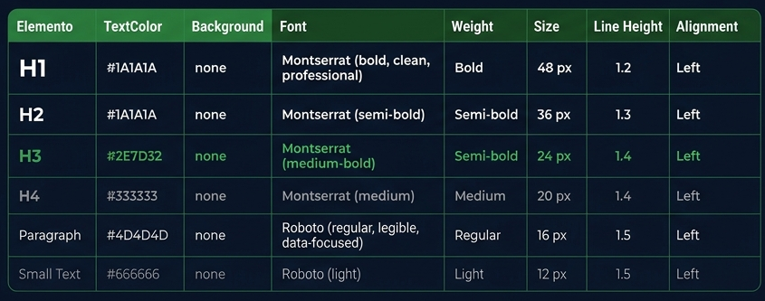

**Colors**

La paleta de colores de TerraTech fue seleccionada para reflejar los valores de sostenibilidad, innovación y prevención que definen a nuestro sistema agrícola. Los tonos predominantes, azul marino profundo y verdes vibrantes, junto con acentos en tonos tierra, evocan sensaciones de naturaleza, solidez y alta tecnología, elementos esenciales para una herramienta orientada al control y optimización de recursos hídricos. Esta combinación de colores refuerza la identidad visual del producto como una solución robusta, confiable y amigable para el usuario.

A continuación, se detallan los colores seleccionados para TerraTech:

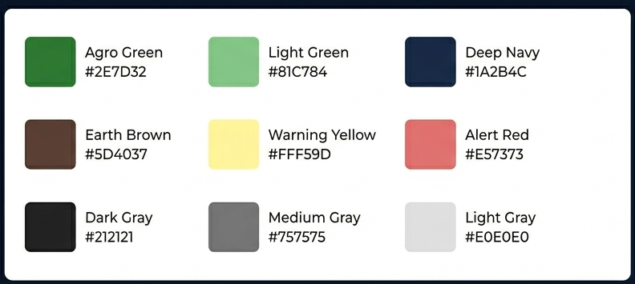

**Spacing**

El espaciado en TerraTech está cuidadosamente definido para garantizar una interfaz limpia, organizada y altamente táctil. Se emplea una separación uniforme y amplia entre elementos, lo que mejora la legibilidad de las métricas, evita errores de navegación en dispositivos móviles durante el trabajo de campo y aporta equilibrio visual al diseño.

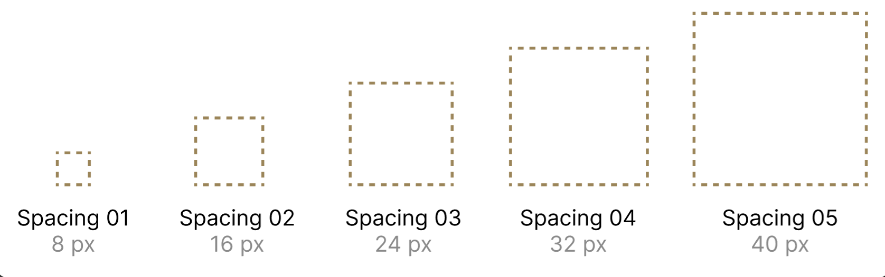

### 4.1.2. Web Style Guidelines

**TerraTech** cuenta con un diseño web adaptable para garantizar una experiencia fluida en cualquier dispositivo, permitiendo su uso tanto en oficinas de gestión como en dispositivos móviles directamente en el campo. Utilizamos el patrón de diseño en forma de Z, ideal para destacar funciones clave como el monitoreo IoT en tiempo real y el análisis predictivo de cultivos. El logotipo se ubica en la esquina superior izquierda para fortalecer la identidad de marca, mientras que la barra de navegación y el llamado a la acción para solicitar una demostración se sitúan a la derecha, guiando al agricultor de forma intuitiva hacia la adopción de nuestra tecnología.

## 4.2. Information Architecture

### 4.2.1. Organization Systems

1. ***Visual Organization***

Para facilitar la asimilación visual de la información, TerraTech aplicará los siguientes modelos de organización visual en distintas secciones de la plataforma:

- Se aplicará principalmente en el Dashboard de Monitoreo (US09) y la Landing Page. En el panel de control del agricultor, la información más crítica (como alertas rojas de "Riego Inmediato" o los indicadores actuales de N-P-K y Humedad) tendrá el mayor peso visual, ubicándose en la parte superior con tipografía de mayor tamaño y colores de acento. La información secundaria (como configuraciones de cuenta) tendrá un peso visual menor. En la Landing Page, la jerarquía guía el ojo desde la propuesta de valor principal (Hero Section) hacia los detalles (Características).

- Se empleará en los flujos operativos que requieren precisión para evitar la frustración del usuario. Esto incluye el proceso de Registro de Nuevo Usuario (US05), el flujo para Registrar un Nuevo Sensor IoT en la finca (US16) y el formulario de Solicitud de Demo (US03). La interfaz presentará pantallas o formularios divididos en pasos lógicos (ej. Paso 1: Datos personales -> Paso 2: Datos de la finca -> Paso 3: Conexión de sensores).

- Se utilizará para la visualización de datos cruzados y espaciales. Su principal aplicación será en el Mapa de Calor de Fertilidad (US12), donde el agricultor visualiza el estado del suelo cruzando variables espaciales (coordenadas X,Y del campo) con variables de salud (colores). También se aplicará en el Dashboard de la Cooperativa (US19), donde el administrador visualizará una tabla matricial cruzando filas (Socios/Lotes) con columnas (Rendimiento, Humedad, Alertas activas).
### 4.2.2. Labeling Systems

La aplicación utiliza un sistema de etiquetas y botones que ofrecen al usuario, dependiendo de si es un Agricultor individual o un Administrador de cooperativa, una manera de registrar, monitorear y gestionar sus campos de forma intuitiva.

- ***Para el visitante / usuario nuevo:*** Se utilizan botones de llamado a la acción directos en el Landing Page como "Solicitar Demo", junto con etiquetas claras para los formularios de registro (Nombre, Tamaño de terreno, etc).

- ***Para el Agricultor (Usuario principal):*** Se emplea terminología técnica pero accesible. Las métricas se etiquetan con sus unidades de medida claras: "Humedad (%)", "Nutrientes (N-P-K ppm)", y "Temperatura (°C)". Se utilizan botones de acción como "Agregar Sensor", "Ver historial" y selectores de rangos de fechas. Las alertas utilizan un lenguaje directo y accionable (ej. "Humedad excesiva en zona Sur").

- ***Para los Administradores de Cooperativa:*** Se tendrá una sección de "Reportes" y un "Dashboard Agregado". Las etiquetas cambian hacia un enfoque gerencial, mostrando columnas como "Promedio de rendimiento", "Hectáreas totales", y botones administrativos como "Exportar PDF", permitiendo comparar el rendimiento de múltiples lotes o socios.

### 4.2.3. SEO Tags and Meta Tags

Los SEO tags son etiquetas HTML que ayudan a los motores de búsqueda a entender y posicionar en los resultados. Los meta tags son etiquetas que proporcionan información sobre la página, como su descripción, palabras clave y autor, lo cual ayuda al ser buscado en el navegador. A continuación se presentan los SEO tags y meta tags que se utilizarán en la plataforma TerraTech:

***Title Tag:*** Este tag define el título de la página y es uno de los factores más importantes para el SEO. Debe ser único y contener palabras clave relevantes.

```html
<title>TerraTech - Monitoreo Inteligente y Agricultura de Precisión IoT</title>
```

***Meta Description:*** Este tag proporciona una breve descripción del contenido de la página. Permite a los usuarios entender de qué trata la página antes de hacer clic en el enlace. Debe ser conciso y atractivo.

```html
<meta name="description" content="TerraTech es una plataforma de agricultura inteligente que optimiza el riego y la fertilización mediante sensores IoT en tiempo real, mapas de fertilidad y análisis predictivo para agricultores.">
```

***Language tag:*** Este tag indica el idioma principal del contenido de la página. Es importante para la accesibilidad y el SEO.

```html
<meta http-equiv="Content-Language" content="es-PE">
```

***Robots tag:*** Este tag indica a los motores de búsqueda cómo deben indexar la página. Puede ser utilizado para evitar que ciertas páginas sean indexadas (por ejemplo, el dashboard interno).

```html
 <meta name="robots" content="index, follow">
```

***Author tag:*** Este tag indica el autor del contenido de la página. Es útil para dar crédito a los creadores de contenido.

```html
<meta name="author" content="NovaTech Agro Team">
```

***Meta Viewport:*** Este tag es esencial para que la página sea responsiva en dispositivos móviles (vital para agricultores en el campo). Mejora la experiencia del usuario y es un factor importante para el SEO técnico.

```html
<meta name="viewport" content="width=device-width, initial-scale=1.0">
```

***Canonical Tag:*** Este tag especifica la URL canónica de la página para evitar problemas de contenido duplicado en motores de búsqueda. Ayuda a consolidar el posicionamiento de una sola versión de la página.***

```html
<link rel="canonical" href="https://www.terratech-agro.com/">
```

### 4.2.4. Searching Systems

Para encontrar ciertas funcionalidades de nuestra aplicación, usamos varios botones y empleamos varios indicadores visuales para que el usuario sepa dónde encontrar lo que necesita. A continuación se muestran los ejemplos de los tipos de búsqueda que usaremos:

- ***Búsqueda de zonas y sensores:*** Para facilitar el monitoreo en fincas grandes, usamos una serie de filtros y un selector desplegable para que el agricultor pueda hallar exactamente la zona de cultivo o el sensor individual (ID) del cual desea ver los datos en tiempo real.

- ***Búsqueda en histórico de datos:*** Usamos filtros por rango de fechas y tipo de métrica (Humedad, Nitrógeno, Fósforo, Potasio o Temperatura) para que el agricultor pueda graficar las tendencias de los últimos días y detectar patrones en su suelo.

- ***Búsqueda de socios y reportes:*** Para los administradores de la cooperativa, se les da una forma de buscar rápidamente el rendimiento por socio o por lote específico, permitiéndoles acceder ágilmente al dashboard consolidado y a la exportación de reportes en PDF.

### 4.2.5. Navigation Systems

- ***Registro e Inicio de Sesión:*** Para poder entrar, el usuario ingresará sus credenciales y el sistema registrará qué tipo de usuario es: Agricultor, que busca monitorear sus sembríos y recibir recomendaciones de riego/fertilización, o Administrador de Cooperativa, que requiere visualizar métricas globales y reportes de todos los socios.

- ***Dashboard de Monitoreo:*** Permite a los usuarios visualizar los indicadores clave del suelo en tiempo real, ver el pronóstico del clima integrado y acceder rápidamente a las notificaciones y recomendaciones predictivas del sistema.

- ***Mapas y Análisis:*** Permite a los agricultores navegar de forma interactiva (zoom y desplazamiento) sobre el mapa de calor de fertilidad de su terreno y visualizar imágenes satelitales recientes para identificar áreas críticas.

- ***Gestión de Dispositivos:*** Una sección dedicada donde el agricultor puede registrar nuevos sensores físicos a su cuenta y configurar los umbrales personalizados de alerta para cada métrica.

- ***Mi perfil:***  Permite a los usuarios configurar sus preferencias personales, actualizar la información técnica de su finca o cooperativa, y cambiar su contraseña.

## 4.3. Landing Page UI Design

El diseño de la interfaz de usuario en la landing page de TerraTech será clave para causar una primera impresión positiva y transmitir la innovación tecnológica que respalda a nuestro equipo. Buscamos ofrecer una experiencia visual limpia, profesional y altamente funcional que inspire confianza e invite a los agricultores y administradores de cooperativas a solicitar una demostración y explorar nuestro ecosistema de monitoreo IoT.

### 4.3.1. Landing Page Wireframe

**Landing Page para Desktop Browser**

Boceto estructural de la sección principal (Hero Section), definiendo un diseño de dos columnas para ubicar la propuesta de valor a la izquierda y un elemento visual destacado a la derecha.

<p align="center">
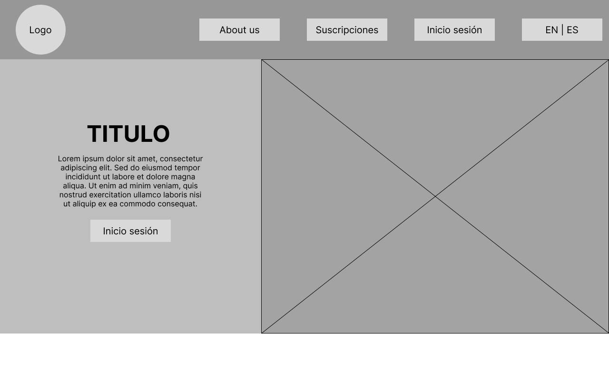
</p>

Diseño esquemático (layout) para la sección de características de la plataforma, utilizando un sistema de cuadrícula para distribuir equitativamente tres tarjetas informativas.

<p align="center">
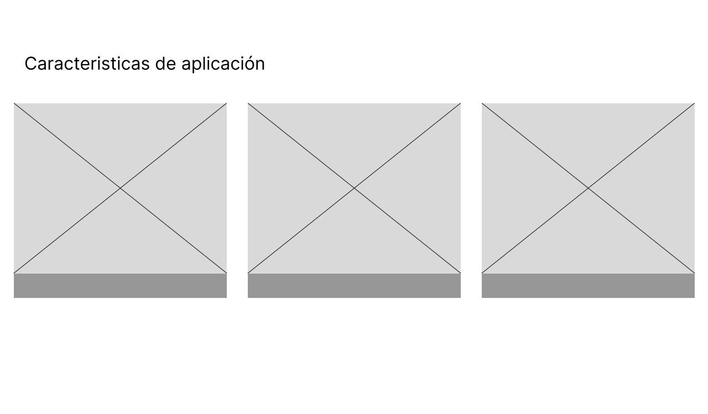
</p>

Estructura conceptual para la presentación de la startup. Define una cuadrícula adaptable (responsive grid) con cinco espacios reservados para las fotografías y perfiles del equipo desarrollador.

<p align="center">
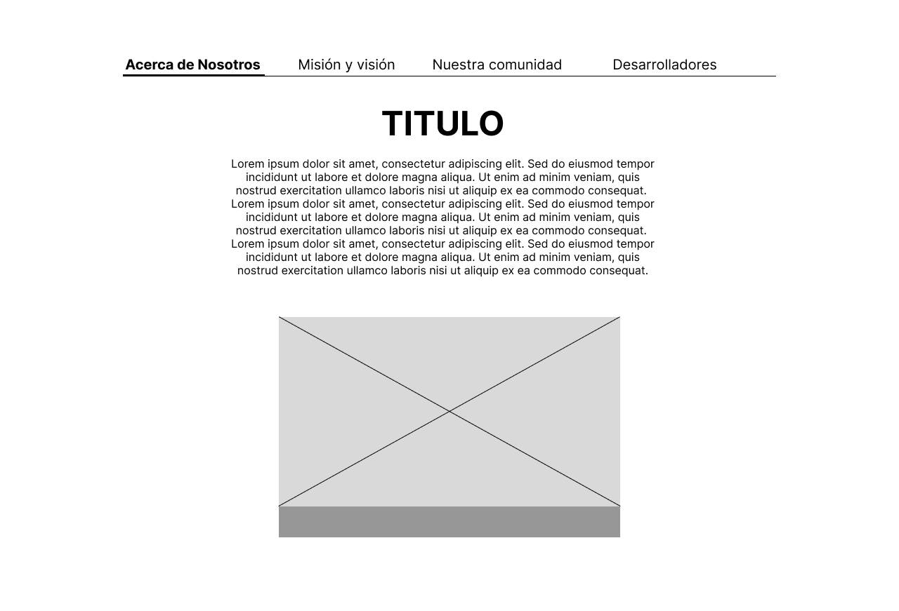
</p>

Maquetación básica para la sección de "Call to Action" (Llamado a la acción), mostrando un formulario centralizado para la solicitud de demostraciones y el bloque del pie de página.

<p align="center">
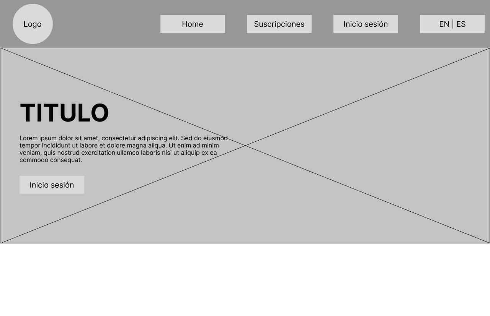
</p>

### 4.3.2. Landing Page Mock-up.

Interfaz final del Hero Section. Destaca la integración de la paleta de colores corporativa, tipografía moderna y la imagen de un agricultor interactuando con nodos IoT, logrando captar la atención del usuario inmediatamente.

<p align="center">
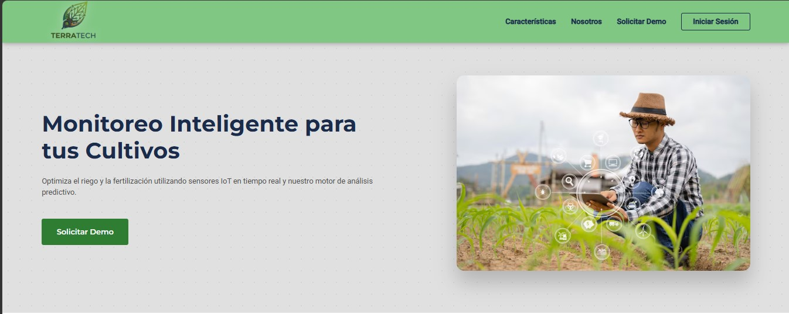
</p>

Implementación final de las tarjetas de servicio (Sensores IoT, Mapa de Fertilidad y Alertas Predictivas). Se incorporaron imágenes fotográficas de alta calidad y un diseño de tarjeta limpia (Clean UI) para facilitar la lectura.

<p align="center">
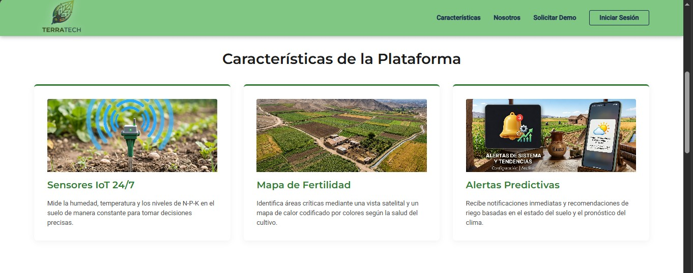
</p>

Resultado visual de la sección "Quiénes Somos". Presenta formalmente a los cinco ingenieros de software del equipo de TerraTech, transmitiendo transparencia, profesionalismo y confianza técnica al visitante.

<p align="center">
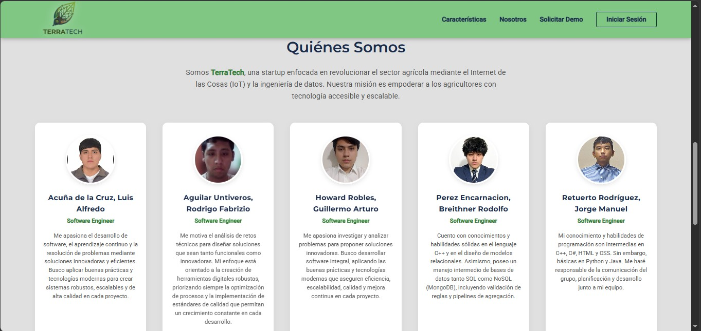
</p>

Versión construida del formulario "Únete a TerraTech". Utiliza el color azul oscuro de la marca para generar contraste y centrar la atención en los campos de entrada de datos, cerrando la página con un footer minimalista para enlaces legales.

<p align="center">
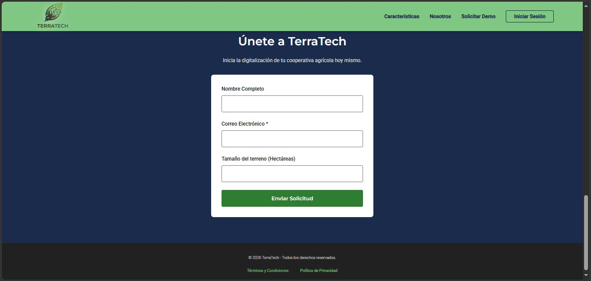
</p>

## 4.4. Web Applications UX/UI Design

El diseño de experiencia de usuario (UX) y diseño de interfaz de usuario en la plataforma web de TerraTech busca crear una herramienta digital intuitiva, accesible y altamente funcional para agricultores y administradores de cooperativas. La UX se enfoca en comprender las realidades del trabajo en el campo, diseñando flujos de interacción eficientes para monitorear cultivos y configurar sensores sin fricción. Por su parte, la UI se encarga del aspecto visual, estructurando de manera clara componentes complejos como los dashboards de indicadores en tiempo real, mapas de calor de fertilidad y sistemas de alertas predictivas. Un diseño UX/UI exitoso en TerraTech fusiona una estética tecnológica limpia con la practicidad operativa, ofreciendo una experiencia fluida que transforma datos IoT masivos en decisiones agrícolas rápidas y precisas.

### 4.4.1. Web Applications Wireframes

La pantalla de la izquierda sirve como menú inicial, permitiendo al visitante elegir entre iniciar sesión (US06) o crear una cuenta nueva. Al elegir la segunda opción, se accede a la pantalla de la derecha, que detalla el formulario de registro (US05) donde el agricultor debe ingresar de forma estructurada sus datos personales, información de contacto y credenciales de seguridad para darse de alta y acceder al sistema.

<p align="center">
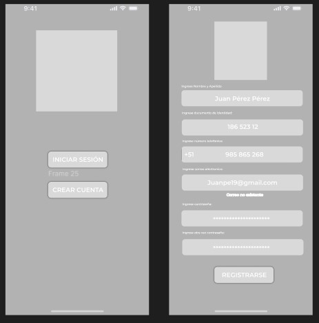
</p>

Estos wireframes ilustran el flujo seguro de Recuperación de Contraseña (US07). El proceso inicia en la pantalla de inicio de sesión, donde el usuario puede seleccionar la opción de recuperar su clave. A continuación, el sistema de "Encuentra tu cuenta" ofrece dos alternativas flexibles para validar la identidad del usuario: solicitar un código de verificación numérico enviado a su correo electrónico o recibirlo por mensaje de texto a su número de celular. Este diseño garantiza que el agricultor pueda restablecer su acceso de forma rápida y sin comprometer la seguridad de su información.

<p align="center">
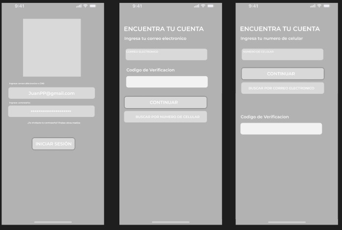
</p>

Estos wireframes representan el corazón operativo de TerraTech: el Dashboard Principal y el Panel de Monitoreo. La pantalla de la izquierda ilustra la vista general del agricultor, resumiendo el estado de los sensores, un gráfico histórico de humedad (US11) y botones de acción rápida para ver recomendaciones (US14) o registrar nuevos equipos (US16). La pantalla central muestra el sistema de navegación por listas, permitiendo al usuario buscar y seleccionar zonas específicas de su sembrío (US10) o acceder al mapa de fertilidad (US12). Finalmente, la vista de la derecha detalla la información de un lote en particular, integrando el pronóstico del clima local (US23) directamente junto a los indicadores en tiempo real de humedad, temperatura y nutrientes (US09)

<p align="center">
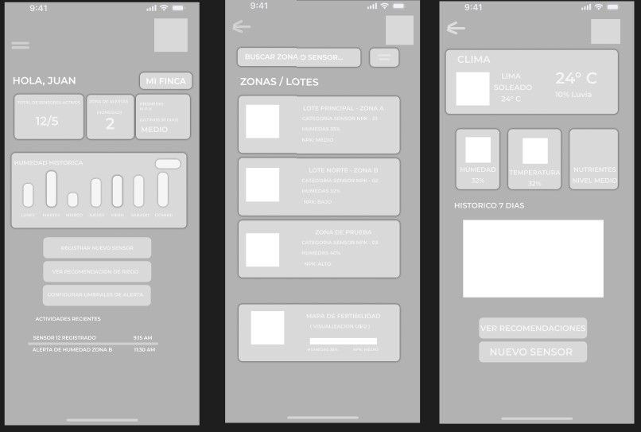
</p>

Estos wireframes detallan la sección de Perfil y Configuración Avanzada. La pantalla de la izquierda ilustra la visualización y edición del perfil del agricultor (US08), junto con la interfaz táctil para la Configuración de Umbrales de Alerta (US17). Aquí, el usuario puede ajustar manualmente los niveles mínimos de humedad y nutrientes permitidos antes de disparar una alarma, personalizándolos por zona específica. La pantalla de la derecha consolida la recepción de sugerencias del sistema, mostrando las alertas predictivas para riego (US14) y fertilización (US15). Además, en la parte inferior, se visualizan los accesos exclusivos para el rol de Administrador, desde donde se podrá exportar el reporte mensual de rendimiento en PDF (US18) y visualizar el dashboard consolidado de la cooperativa (US19).

<p align="center">
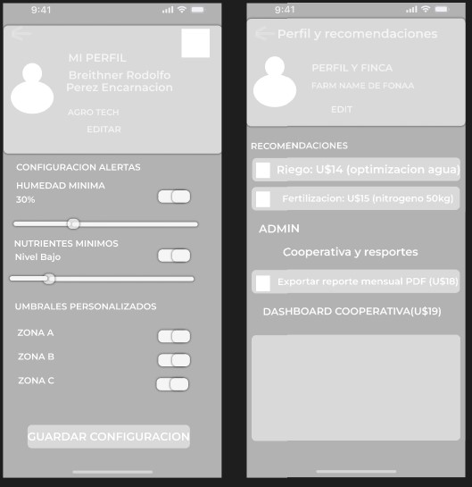
</p>

Esta imagen presenta el boceto de baja fidelidad (wireframe) de la página de bienvenida para la versión de escritorio de TerraTech. La estructura destaca una barra de navegación superior que incluye el acceso a secciones informativas como Características y Nosotros, junto a un botón de acción principal para Iniciar Sesión (US06). En el cuerpo central, el diseño prioriza la simplicidad mediante un panel enfocado que contiene el logotipo del sistema y ofrece al usuario las dos vías de acceso fundamentales: un botón para retomar su sesión activa (US06) y otro para el proceso de Crear cuenta (US05), asegurando una arquitectura de información equilibrada y una navegación intuitiva desde el primer contacto con la plataforma web.

<p align="center">
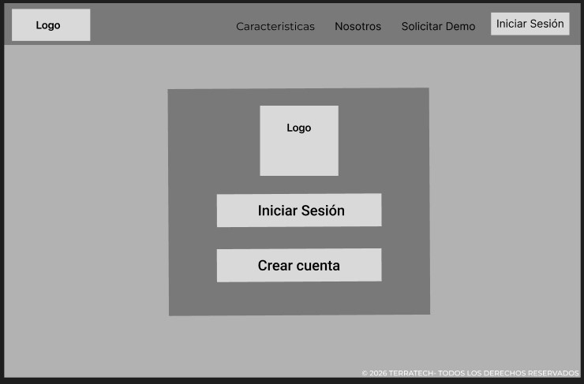
</p>

Esta imagen ilustra el boceto de baja fidelidad (wireframe) para la pantalla de Registro de Nuevo Usuario (US05) en la versión de escritorio de TerraTech. El diseño organiza un formulario completo a la izquierda, donde el agricultor puede ingresar de forma estructurada sus datos personales, documento de identidad, contacto telefónico y credenciales de seguridad. A la derecha, se equilibra la composición con el espacio para el logotipo y un botón de acción principal de gran formato para confirmar el registro. Al mantener la barra de navegación superior consistente con el resto del sitio, este wireframe asegura una transición fluida para el usuario, permitiéndole completar su alta en el sistema de manera clara antes de pasar a la interfaz de alta fidelidad.

<p align="center">
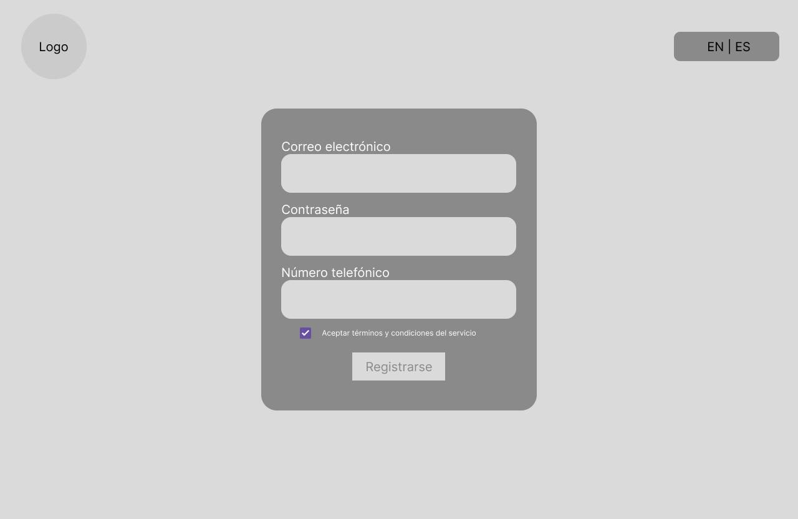
</p>

Esta imagen ilustra el boceto de baja fidelidad (wireframe) para la pantalla de Inicio de Sesión (US06) en la versión de escritorio de TerraTech. La interfaz presenta un panel central minimalista que prioriza la funcionalidad, solicitando de forma clara el correo electrónico y la contraseña del usuario. Bajo los campos de entrada, se incluye estratégicamente el enlace de Recuperación de Contraseña (US07) para asistir al agricultor en caso de extravío de sus credenciales. Al mantener la barra de navegación superior y el pie de página consistentes con el resto del diseño, este boceto garantiza que el flujo de acceso sea directo y familiar, facilitando una experiencia de usuario (UX) eficiente y sin distracciones antes de ingresar al dashboard principal.

<p align="center">
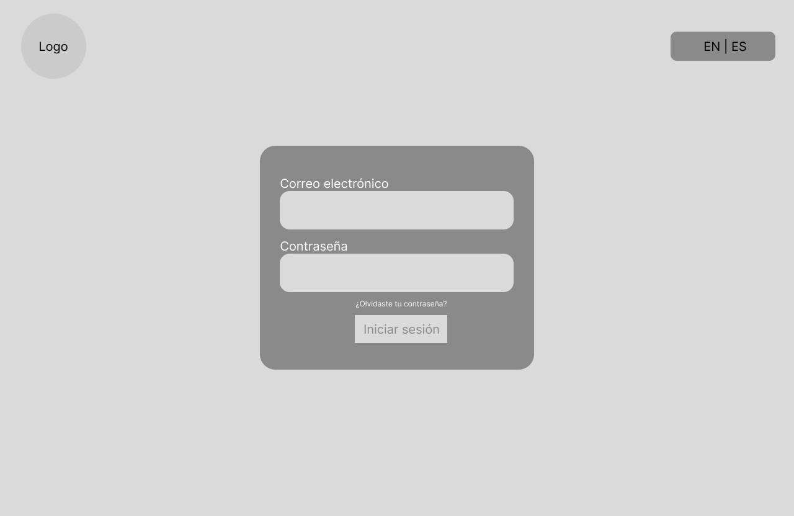
</p>

Esta imagen ilustra el boceto de baja fidelidad (wireframe) para la pantalla de Recuperación de Contraseña (US07) en la versión de escritorio de TerraTech. Bajo el encabezado "Encuentra tu cuenta", la interfaz presenta un panel central diseñado para guiar al agricultor en el restablecimiento de su acceso mediante la validación de su correo electrónico y el ingreso de un código de verificación. Un elemento clave en la arquitectura de información es la inclusión de un botón secundario que permite alternar el método de búsqueda hacia el número de celular, proporcionando flexibilidad y accesibilidad al usuario. Este diseño estructural mantiene la coherencia con la barra de navegación superior, asegurando que el proceso de recuperación sea intuitivo y esté integrado de forma lógica dentro del flujo de navegación principal de la plataforma.

<p align="center">
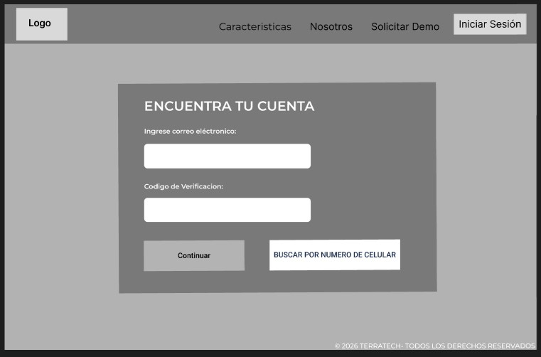
</p>

Esta imagen ilustra el boceto de baja fidelidad (wireframe) para la variante de escritorio del flujo de Recuperación de Contraseña (US07) mediante telefonía móvil. La interfaz mantiene el encabezado "Encuentra tu cuenta" y presenta un panel central estructurado para que el agricultor ingrese su número de celular y el código de verificación correspondiente. Como elemento de usabilidad clave, se incluye el botón "Volver a iniciar sesión", que permite al usuario desistir del proceso y regresar a la pantalla de acceso principal de forma rápida. Este diseño garantiza una arquitectura de información coherente y flexible, ofreciendo una alternativa de seguridad robusta y accesible integrada perfectamente en el ecosistema web de TerraTech.

<p align="center">
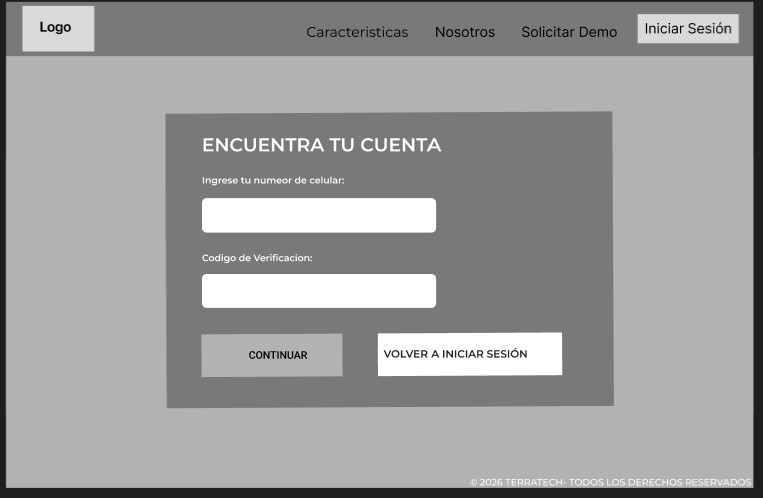
</p>

Esta imagen presenta el boceto de baja fidelidad (wireframe) del Dashboard Principal de Monitoreo para la versión de escritorio de TerraTech. La interfaz organiza la información crítica en una distribución de dos columnas para maximizar el uso del espacio: a la izquierda, se disponen contenedores para indicadores clave como el total de sensores, alertas vigentes y promedio de nutrientes, junto a un área dedicada al gráfico de humedad histórica (US11). A la derecha, se agrupan botones de acción directa para registrar nuevos sensores (US16), consultar recomendaciones de riego (US14) y configurar umbrales de alerta (US17), complementándose con un panel inferior de actividades recientes para el seguimiento operativo. Este diseño estructural garantiza que el agricultor visualice el estado general de su finca de forma jerarquizada y eficiente antes de la implementación de los elementos visuales finales.

<p align="center">
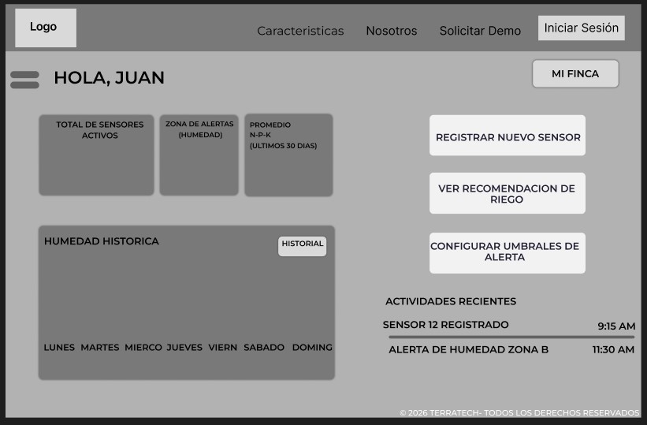
</p>

Esta imagen ilustra el boceto de baja fidelidad (wireframe) del panel de Gestión de Lotes y Visualización Espacial para la versión de escritorio de TerraTech. La arquitectura de información utiliza una disposición de dos columnas: a la izquierda, se presenta una lista navegable de las parcelas registradas (US10) con una barra de búsqueda para agilizar la localización de sensores específicos; a la derecha, se reserva un área de gran formato para la visualización del mapa de fertilidad (US12). Este diseño estructural permite al agricultor seleccionar un lote específico y visualizar simultáneamente su distribución de nutrientes y humedad, garantizando una experiencia de usuario (UX) funcional y organizada antes de la implementación de los elementos visuales de alta fidelidad.

<p align="center">
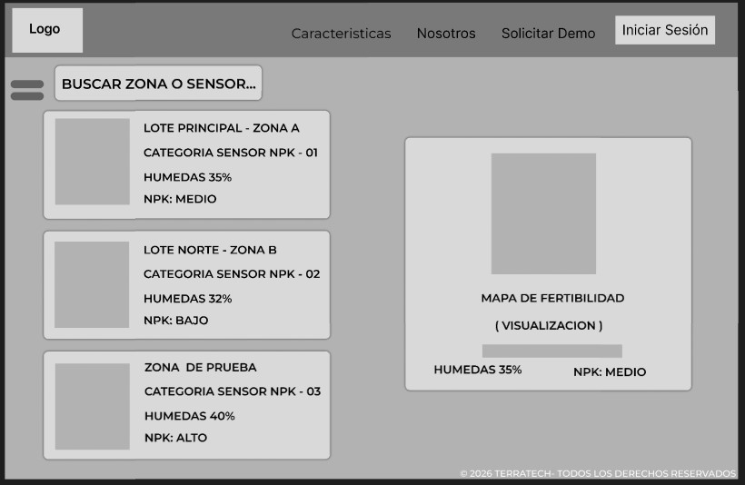
</p>

Esta imagen ilustra el boceto de baja fidelidad (wireframe) de la vista detallada de monitoreo para la versión de escritorio de TerraTech. La interfaz organiza los datos ambientales y del suelo en un diseño modular: en la parte superior izquierda se reserva el espacio para el pronóstico del clima (US23), mientras que a la derecha se disponen las tarjetas con los indicadores en tiempo real de humedad, temperatura y nutrientes (US09). En la sección inferior, la arquitectura prioriza el análisis de tendencias mediante un contenedor para el gráfico de histórico de 7 días (US11), acompañado de botones de acceso directo para consultar recomendaciones agronómicas y registrar nuevos sensores. Este diseño estructural centraliza todas las variables críticas en una sola pantalla, garantizando que el agricultor cuente con una base informativa sólida para la toma de decisiones antes de la implementación final.

<p align="center">
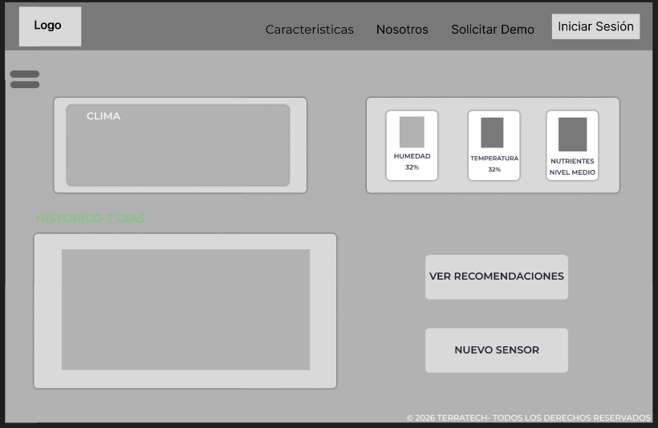
</p>

Esta imagen presenta el boceto de baja fidelidad (wireframe) para la pantalla de Perfil y Configuración de Alertas en la versión de escritorio de TerraTech. La arquitectura de información destaca en el panel principal la sección de Gestión de Perfil (US08) con un área para la fotografía y datos del usuario, seguida de un módulo interactivo para establecer los Umbrales de Alerta (US17). En este apartado, el diseño estructural incorpora sliders para el ajuste de humedad y nutrientes mínimos, junto con interruptores (toggles) para habilitar notificaciones personalizadas por zonas. A la derecha, se sitúa un botón de gran formato para guardar la configuración, asegurando una jerarquía visual clara que facilita al agricultor la personalización del sistema IoT antes de su implementación final en alta fidelidad.

<p align="center">
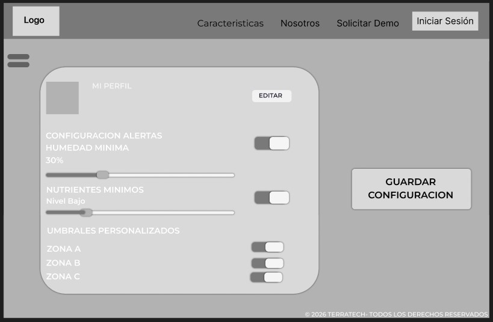
</p>

Esta imagen ilustra el boceto de baja fidelidad (wireframe) para el panel de Perfil, Recomendaciones y Administración en la versión de escritorio de TerraTech. La arquitectura de información se divide en dos bloques principales: a la izquierda, se integra la gestión del perfil de usuario (US08) junto con una sección de notificaciones inteligentes para recomendaciones de riego (US14) y fertilización (US15), incluyendo además las funciones administrativas para la exportación de reportes mensuales en PDF (US18). A la derecha, el diseño reserva un espacio predominante para el Dashboard de la Cooperativa (US19), con un contenedor destinado a la visualización de gráficos comparativos de rendimiento. Este esquema estructural centraliza eficientemente la configuración personal y la analítica grupal, garantizando una navegación fluida y una toma de decisiones informada antes de avanzar a la etapa de alta fidelidad.

<p align="center">
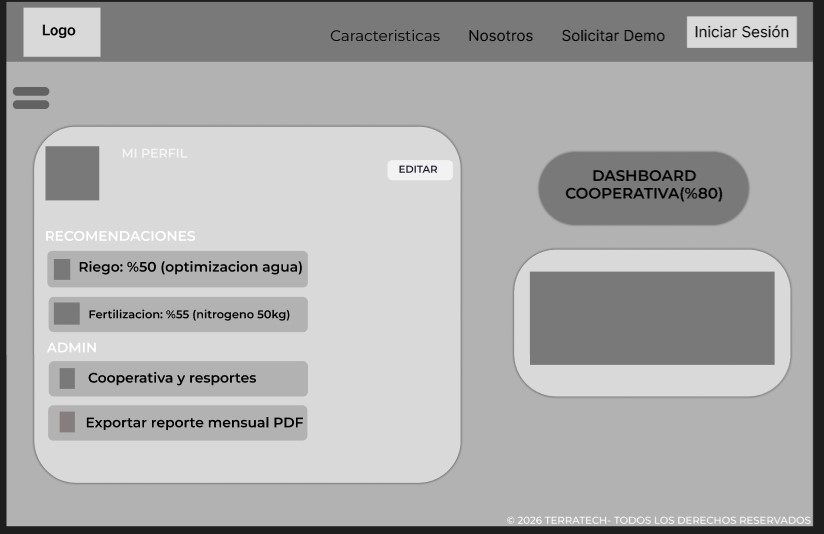
</p>

### 4.4.2. Web Applications Wireflow Diagrams

Esta imagen representa el Web Application Wireflow Diagram de TerraTech, una herramienta avanzada de diseño que fusiona la disposición de los elementos de interfaz con la lógica de navegación. A través de este esquema, se visualiza el recorrido dinámico del agricultor por la plataforma, utilizando flechas de interconexión que vinculan puntos de contacto específicos con sus respectivas pantallas de destino. El diagrama detalla desde los procesos críticos de autenticación y recuperación de credenciales hasta la transición hacia el núcleo operativo del sistema, donde se ramifican las funciones de monitoreo satelital, configuración de sensores IoT, análisis de gráficos históricos y gestión administrativa de la cooperativa. Al presentar las interfaces en alta fidelidad dentro del flujo, este Wireflow garantiza que la arquitectura de información sea coherente, permitiendo validar la experiencia de usuario y la eficiencia de la navegación en todo el ecosistema digital antes de su fase de desarrollo final.

<p align="center">
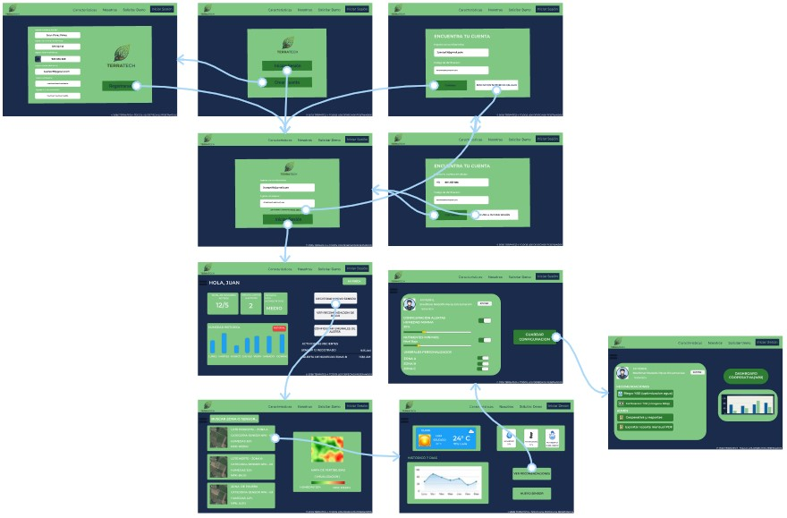
</p>

<p align="center">
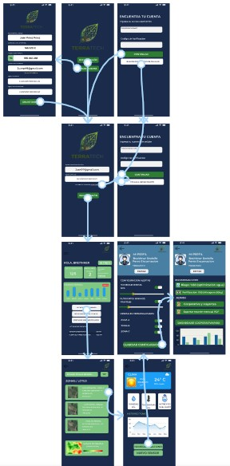
</p>

### 4.4.3. Web Applications Mock-ups

Esta imagen presenta el diseño de interfaz de usuario (UI) en alta fidelidad para el flujo de acceso inicial a TerraTech, donde ya se aplica la identidad visual definitiva de la marca. La pantalla izquierda muestra la vista de bienvenida con el fondo azul oscuro corporativo y el logotipo integrado, ofreciendo botones de alto contraste en verde para guiar al usuario hacia el inicio de sesión (US06) o la creación de cuenta. La pantalla derecha ilustra el formulario de registro (US05) con un diseño limpio; los campos de entrada en blanco resaltan claramente sobre el fondo oscuro, mejorando la legibilidad y la experiencia del usuario (UX) al momento de ingresar sus datos personales y credenciales.

<p align="center">
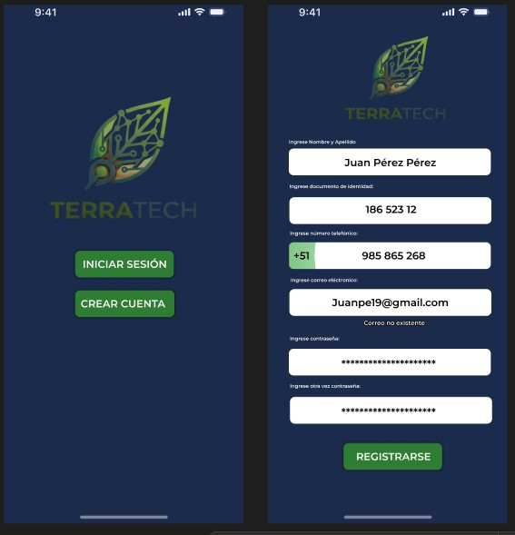
</p>

Esta imagen ilustra el diseño de interfaz en alta fidelidad para el flujo de Inicio de Sesión (US06) y Recuperación de Contraseña (US07). La pantalla de la izquierda muestra el formulario de acceso principal, el cual incluye un enlace estratégico para los usuarios que han olvidado sus credenciales. Al hacer clic, el sistema dirige al agricultor a las pantallas de recuperación (centro y derecha), ofreciendo un proceso flexible y seguro: el usuario puede elegir validar su identidad recibiendo un código de verificación ya sea a través de su correo electrónico o mediante su número de celular. Todo el flujo mantiene una coherencia visual impecable con la paleta de colores corporativa (azul oscuro y verde) de TerraTech, garantizando una experiencia de usuario (UX) intuitiva y reduciendo la frustración durante el restablecimiento del acceso.

<p align="center">
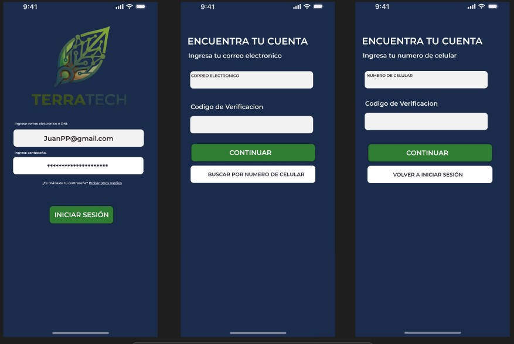
</p>

Esta imagen presenta el diseño en alta fidelidad del Dashboard de Monitoreo de TerraTech, estructurado en tres vistas clave bajo la paleta corporativa para facilitar la lectura de datos IoT. De izquierda a derecha, la interfaz ofrece un panel de control general con el estado de los sensores y accesos rápidos (izquierda), una sección de gestión para buscar lotes específicos y visualizar el mapa de fertilidad (centro), y una vista detallada que integra el pronóstico del clima con los indicadores en tiempo real del suelo (humedad, temperatura y N-P-K) junto con sus tendencias semanales (derecha).

<p align="center">
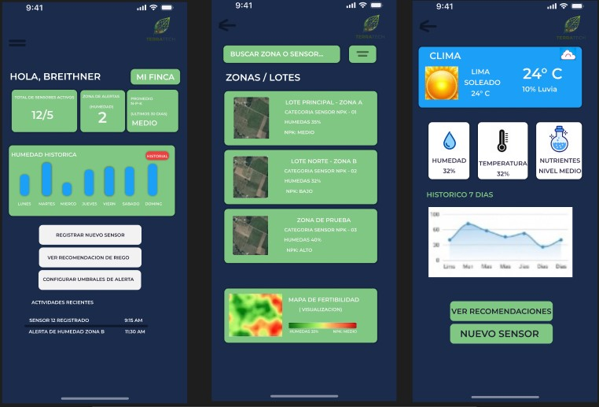
</p>

Esta imagen detalla el diseño en alta fidelidad de la sección de Perfil y Configuración Avanzada. En la pantalla izquierda, se visualiza tu información personal como usuario principal (Breithner Rodolfo Perez Encarnacion) junto con controles interactivos para establecer umbrales personalizados de alertas (US17), permitiendo ajustar mediante sliders y botones los niveles mínimos de humedad y nutrientes por zona. La pantalla derecha exhibe los módulos de acción, mostrando las notificaciones de recomendaciones predictivas de riego y fertilización, e integrando en la parte inferior las herramientas exclusivas para el rol de Administrador, desde donde es posible exportar reportes mensuales en PDF (US18) y acceder al gráfico del dashboard consolidado de la cooperativa (US19).

<p align="center">
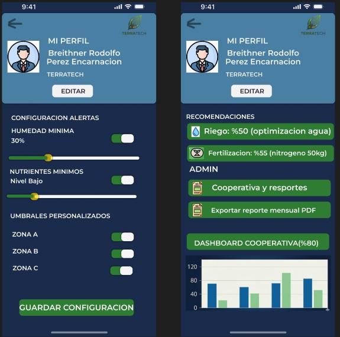
</p>

Esta imagen muestra el diseño de alta fidelidad para la versión de escritorio de la pantalla de bienvenida y acceso a la plataforma. Manteniendo la coherencia con el diseño móvil y la Landing Page, la interfaz presenta una barra de navegación superior completa y un bloque central destacado en verde sobre el fondo azul corporativo. Este panel central incluye el logotipo de TerraTech y proporciona dos botones de acción principal, guiando claramente al usuario hacia el flujo de "Iniciar Sesión" (US06) o de "Crear cuenta" (US05), cerrando la composición visual con el pie de página de derechos reservados en la parte inferior.

<p align="center">
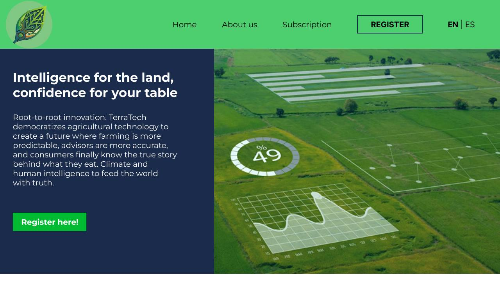
</p>

Esta imagen ilustra el diseño en alta fidelidad de la pantalla de Registro de Nuevo Usuario (US05) optimizada para la versión de escritorio. Manteniendo la barra de navegación superior, la interfaz presenta un amplio panel central verde sobre el fondo azul corporativo, dividido visualmente en dos secciones. A la izquierda se disponen de manera estructurada los campos del formulario (nombre, documento, teléfono, correo y contraseña) con fondos blancos para maximizar la legibilidad. A la derecha, equilibrando el diseño, destaca el logotipo de TerraTech junto al botón principal de "Registrarse", ofreciendo una experiencia de usuario (UX) cómoda y balanceada para quienes se dan de alta desde una computadora.

<p align="center">
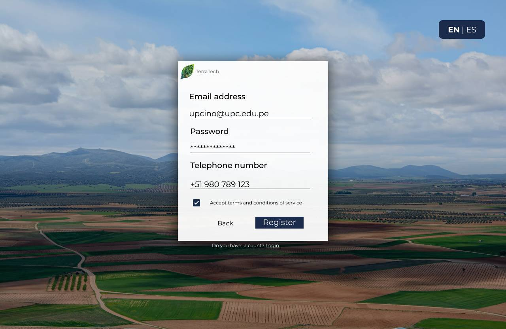
</p>

Esta imagen presenta el diseño de alta fidelidad para la pantalla de Inicio de Sesión (US06) en su versión de escritorio. Manteniendo la coherencia visual con el resto de la plataforma, la interfaz utiliza un panel central de color verde claro sobre el fondo azul oscuro corporativo para enfocar la atención del usuario en la tarea principal. El formulario es directo y minimalista, solicitando únicamente el correo electrónico y la contraseña mediante campos de alto contraste. Además, justo debajo de los campos de entrada, se incluye estratégicamente el enlace para la Recuperación de Contraseña (US07) ("¿Te olvidaste tu contraseña?"), asegurando un acceso rápido a las opciones de soporte sin saturar el diseño limpio de la interfaz.

<p align="center">
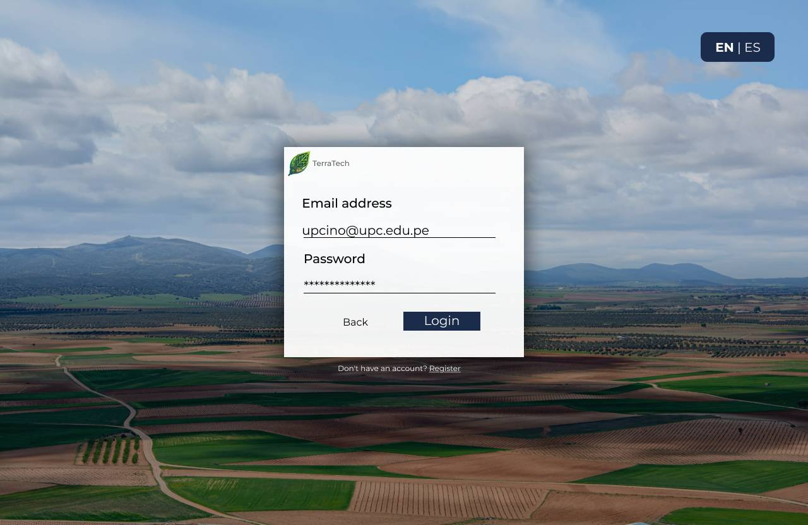
</p>

Esta imagen muestra el diseño de alta fidelidad para la versión de escritorio del flujo de Recuperación de Contraseña (US07). Bajo el título "Encuentra tu cuenta", el panel central verde guía al usuario a través del proceso de validación de seguridad. La interfaz solicita el ingreso del correo electrónico asociado y el código de verificación enviado al usuario para autorizar el restablecimiento de sus credenciales. Un detalle importante en la experiencia de usuario (UX) es la inclusión de un botón secundario ("Buscar por número de celular"), el cual ofrece una alternativa clara y accesible en caso de que el agricultor prefiera recibir su código de recuperación vía mensaje de texto (SMS) en lugar de usar el correo electrónico. Todo esto manteniendo la consistencia visual de la plataforma.

<p align="center">
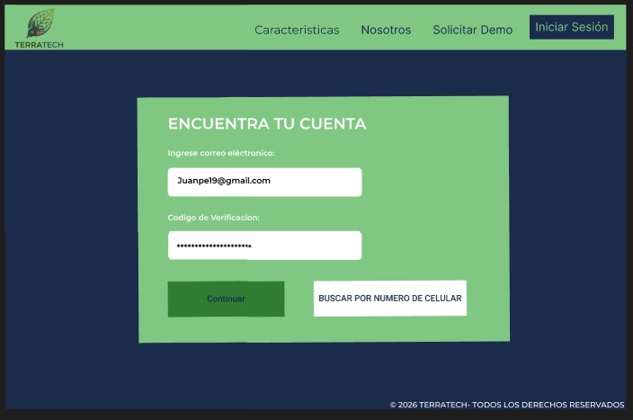
</p>

Esta imagen ilustra la interfaz alternativa en alta fidelidad (versión de escritorio) para el flujo de Recuperación de Contraseña (US07). A diferencia de la pantalla anterior basada en el correo electrónico, esta vista permite al usuario validar su identidad y restablecer el acceso utilizando su número de teléfono móvil. El formulario incluye un campo estructurado con el prefijo de país (+51) y otro para ingresar el código de verificación recibido por SMS. A nivel de experiencia de usuario (UX), ofrecer esta segunda vía es una excelente práctica de accesibilidad, ideal para agricultores que prefieren la gestión a través del celular. Además, el botón secundario "Volver a iniciar sesión" proporciona una salida clara del proceso, permitiendo al usuario regresar rápidamente a la pantalla principal si así lo desea.

<p align="center">
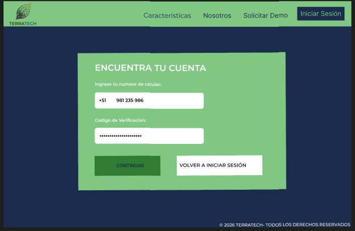
</p>

Esta imagen presenta el diseño en alta fidelidad del Dashboard Principal de TerraTech en su versión de escritorio. Aprovechando el formato panorámico, la interfaz distribuye estratégicamente a la izquierda un panel de indicadores clave (estado de sensores, alertas y promedio N-P-K) junto a un gráfico interactivo del histórico de humedad semanal (US11). En la sección derecha, agrupa accesos directos mediante botones de alto contraste para registrar nuevo hardware (US16), consultar sugerencias predictivas de riego (US14) y ajustar umbrales de alerta (US17), complementándose en la parte inferior con un registro de las últimas actividades del sistema. Este diseño ofrece al agricultor un centro de control integral que resume el estado de su finca en un solo vistazo, priorizando la claridad de los datos IoT mediante el uso de la paleta corporativa.

<p align="center">
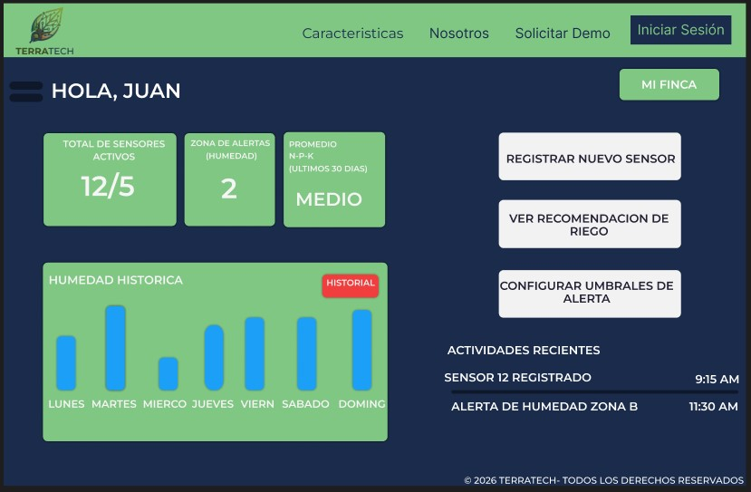
</p>

Esta imagen ilustra el diseño en alta fidelidad para la versión de escritorio del panel de gestión de zonas y visualización espacial de TerraTech. En la sección izquierda, la interfaz ofrece una barra de búsqueda y una lista de tarjetas de los lotes monitoreados (US10), donde cada ítem resume los datos capturados por el sensor IoT (humedad y nivel N-P-K) junto a una vista satelital miniatura. Paralelamente, la amplia sección derecha está dedicada a destacar el mapa de calor de fertilidad (US12), apoyado por una escala cromática intuitiva (verde a rojo) para interpretar las condiciones del terreno. Esta disposición a doble columna aprovecha el formato panorámico para optimizar la experiencia de usuario (UX), permitiendo al agricultor seleccionar una parcela específica en el menú lateral y analizar inmediatamente su distribución espacial de nutrientes en la pantalla principal de forma fluida y simultánea.

<p align="center">
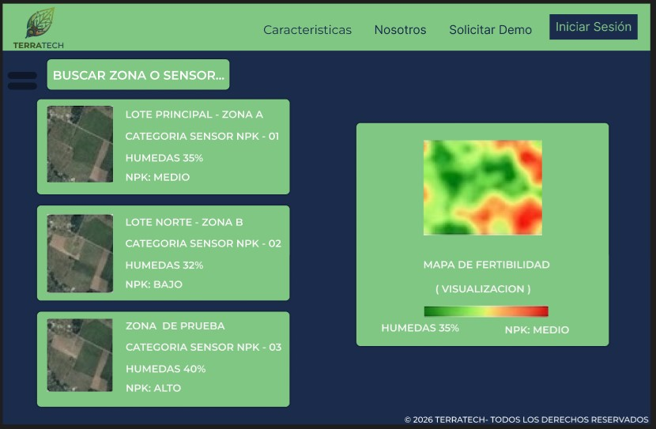
</p>

Esta imagen presenta el diseño en alta fidelidad de la vista detallada de monitoreo en su versión de escritorio, destacando por su distribución limpia y modular. En la parte superior, la interfaz integra visualmente el pronóstico meteorológico mediante una API de clima (US23) a la izquierda, y lo contrasta a la derecha con los indicadores IoT en tiempo real del suelo, mostrando los niveles actuales de humedad, temperatura y nutrientes (US09). En la sección inferior, el usuario puede analizar las tendencias a través del gráfico histórico de los últimos 7 días (US11), acompañado de botones de acción estratégicamente ubicados para consultar recomendaciones agronómicas o dar de alta un nuevo sensor. Este diseño UI/UX es clave, ya que centraliza las variables ambientales e internas del cultivo en una sola pantalla para agilizar la toma de decisiones del agricultor.

<p align="center">
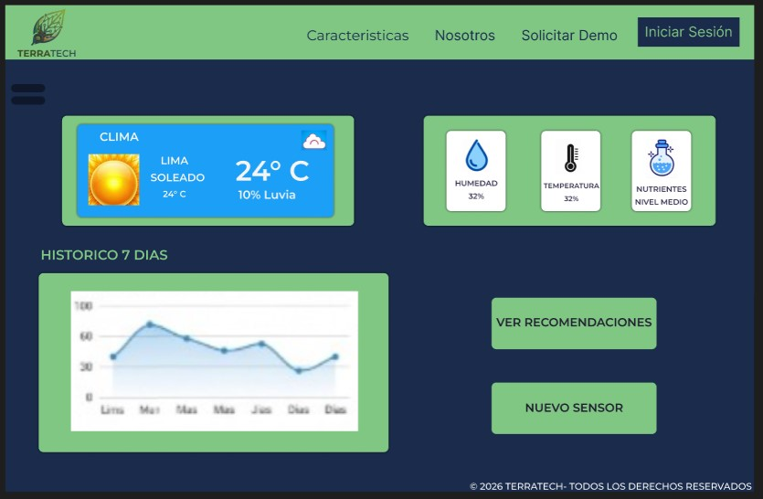
</p>

Esta imagen muestra el diseño en alta fidelidad de la versión de escritorio para la pantalla de Perfil y Configuración de Alertas. En el panel principal, la interfaz destaca la visualización del perfil del usuario (US08), mostrando los datos de Breithner Rodolfo Perez Encarnacion de forma clara y accesible para su edición. Inmediatamente debajo, se despliega un panel de control interactivo destinado a la Configuración de Umbrales de Alerta (US17); aquí, el agricultor dispone de sliders (deslizadores) y botones de activación para ajustar de forma granular los niveles mínimos de humedad y nutrientes, permitiendo además habilitar o deshabilitar notificaciones para parcelas específicas (Zonas A, B y C). El diseño se consolida visualmente con un botón de gran tamaño a la derecha ("Guardar Configuración"), asegurando una experiencia de usuario (UX) directa y sin confusiones al momento de personalizar los parámetros del sistema IoT.

<p align="center">
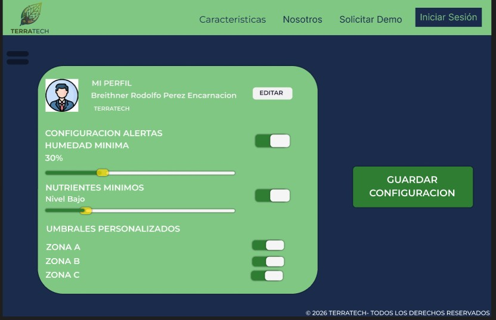
</p>

Esta imagen ilustra la versión de escritorio del panel integrado de configuración y analítica. En el bloque izquierdo, permite la gestión de tu perfil de usuario (US08) y muestra las notificaciones inteligentes con recomendaciones para riego (US14) y fertilización (US15). Debajo, se incluyen los accesos exclusivos de Administrador para la exportación de reportes mensuales en PDF (US18). En la sección derecha, el diseño aprovecha el espacio para desplegar el Dashboard Agregado de la Cooperativa (US19) mediante un gráfico comparativo, logrando una interfaz (UX/UI) que centraliza eficientemente la configuración personal, las decisiones agronómicas y la visión global del sistema.

<p align="center">
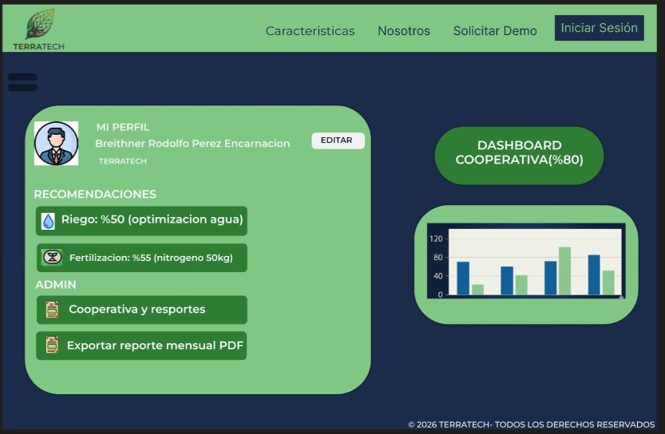
</p>

### 4.4.4. Web Applications User Flow Diagrams

El diagrama de flujo de usuario es una representación visual de las acciones secuenciales que un agricultor realiza al interactuar con el ecosistema digital de TerraTech. A continuación se presentan tres diagramas específicos para los User Goals más críticos de la plataforma, cada uno incluyendo el **Happy Path** (camino exitoso) y **flujos alternativos** (errores, cancelaciones, casos borde como email inválido, contraseña débil, código de sensor inválido, sensor sin batería, y falta de datos del sensor).

---

**User Flow 1: Registro y Activación de Cuenta**

**User Stories relacionadas:** US05, US06

**Flujos incluidos:** Happy Path, email inválido, contraseña débil, email ya registrado, contraseñas no coinciden, cancelación, enlace expirado.

<p align="center">

</p>

---

**User Flow 2: Configuración de un Nuevo Sensor IoT**

**User Stories relacionadas:** US16

**Flujos incluidos:** Happy Path, código de sensor inválido, código ya registrado, sensor sin batería o sin conexión, cancelación, campos incompletos.

<p align="center">

</p>

---

**User Flow 3: Consulta de Recomendación de Riego**

**User Stories relacionadas:** US14

**Flujos incluidos:** Happy Path, no hay datos del sensor (sensor sin conexión), humedad óptima, humedad excesiva, usuario descarta recomendación, usuario modifica umbrales, usuario consulta historial.

<p align="center">

</p>

## 4.5. Web Applications Prototyping
El prototipo adjunta la representación visual de los mock-ups anteriormente mostrados y diseños interactivos, pero no cuenta con código real detrás.

Para este proyecto usamos la herramienta de Figma. Véase el anexo 3 para mayor información

## 4.6. Domain-Driven Software Architecture

### 4.6.1. Design-Level Event Storming
Para definir la arquitectura de TerraTech orientada al dominio (DDD), se llevó a cabo un proceso iterativo de Design-Level Event Storming siguiendo la metodología de 10 pasos. Este análisis nos permitió alinear la lógica del negocio agrícola con la implementación tecnológica. A continuación, se detalla la evolución del modelo:

**Step 1: Unstructured Exploration**

Durante esta fase inicial, se identificaron y representaron cronológicamente todos los eventos que modifican el estado dentro del ecosistema de la plataforma. Estos eventos fueron redactados en tiempo pasado (representados simbólicamente en post-its naranjas), cubriendo el flujo completo desde la interacción del hardware hasta la analítica de datos. Entre los eventos más relevantes identificados se encuentran:
<p align="center">
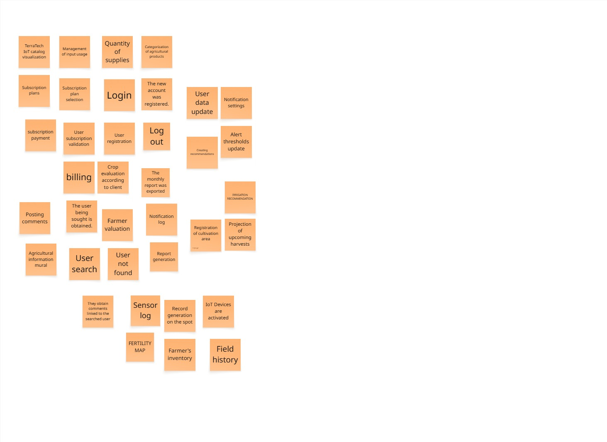
</p>

**Step 2: Chronology**

Se ordenaron los eventos del dominio de forma cronológica de izquierda a derecha, estableciendo el flujo del ciclo de vida del monitoreo agrícola.
<p align="center">
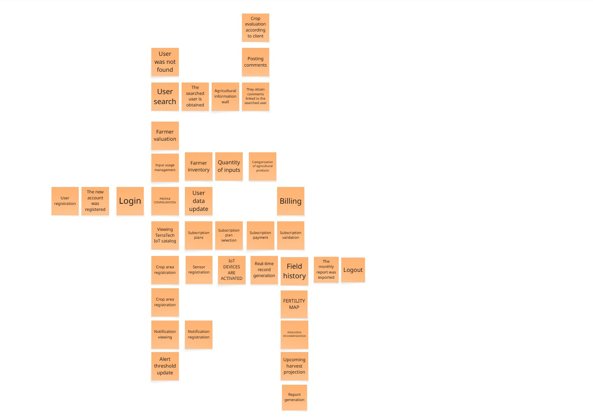
</p>

**Step 3: Pain Points**

Se identificaron los puntos críticos y riesgos técnicos del negocio mediante rombos rosas, enfocándose en desafíos como la determinación exacta de dispositivos necesarios por zona de cultivo, la simplificación de procesos para evitar pasos innecesarios y la optimización de los reportes para que entreguen solo datos de alto valor. Asimismo, se cuestionó la fiabilidad del historial frente a irregularidades del terreno para asegurar que las proyecciones de cosecha sean precisas y útiles para el agricultor.
<p align="center">
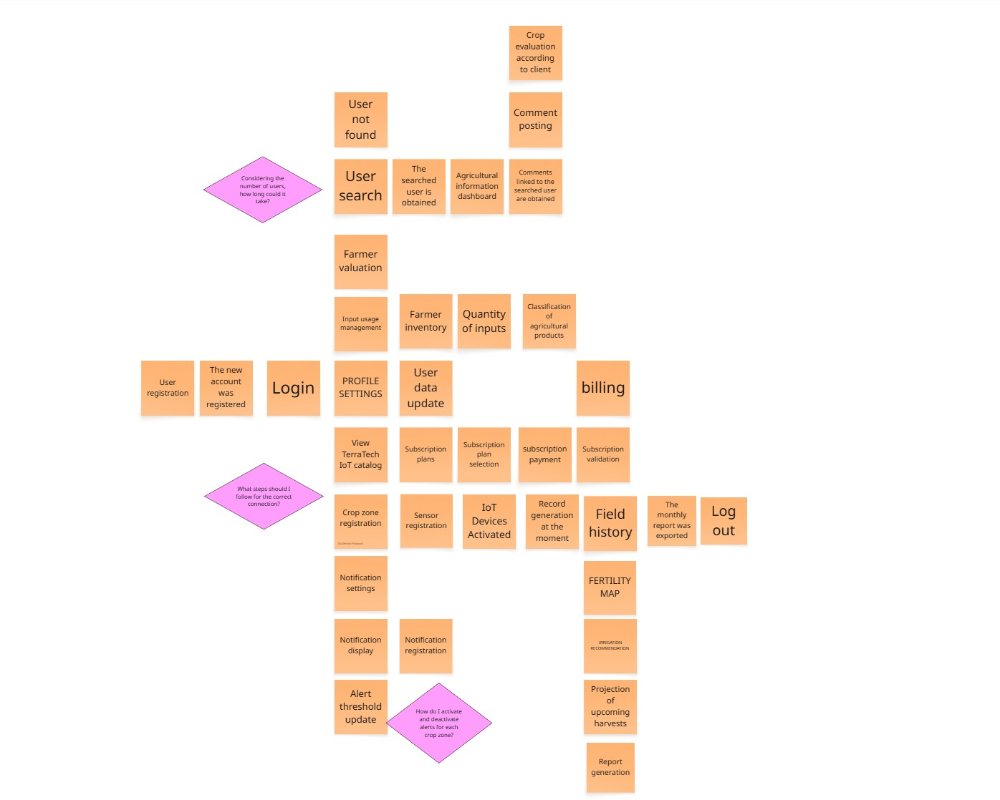
</p>

**Step 4: Pivotal Points**

Se definieron los eventos pivote que marcan cambios significativos en el estado del sistema, dividiendo el flujo en fases claras: el Registro de cuenta y el Pago de suscripción como hitos iniciales, seguidos por la Activación de dispositivos IoT que da inicio al monitoreo, y finalmente la Generación de reportes y Proyección de cosechas, que consolidan la entrega de valor predictivo para el agricultor.

<p align="center">
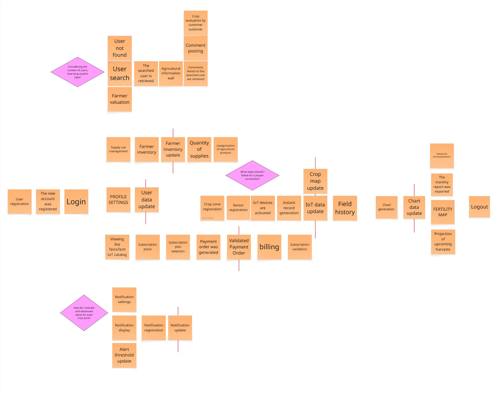
</p>

**Step 5: Commands**

Se identificaron los comandos (post-its azules) que representan las intenciones de los usuarios para provocar cambios en el sistema, junto con los actores (post-its amarillos) responsables de ejecutarlos. Los actores principales definidos son el Agricultor, el Proveedor y el Cliente final, quienes interactúan mediante acciones clave como Registrar usuario, Seleccionar plan de suscripción, Registrar zona de cultivo y Exportar reporte.
<p align="center">
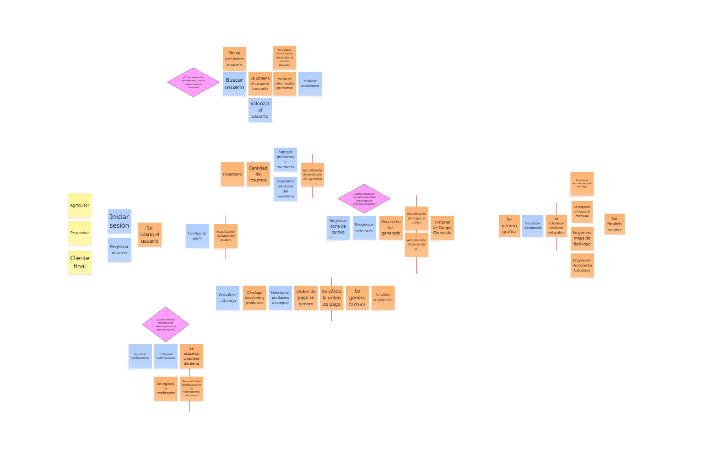
</p>

**Step 6: Policies**

Se incorporaron las reglas de negocio reactivas (post-its lilas) que automatizan la respuesta del sistema ante eventos específicos. Entre las políticas definidas destacan la Verificación de datos válidos tras el inicio de sesión, la validación del Seguro vigente al realizar el pago, y la automatización de alertas cuando se superan los umbrales de humedad o nutrientes en el historial de campo.
<p align="center">
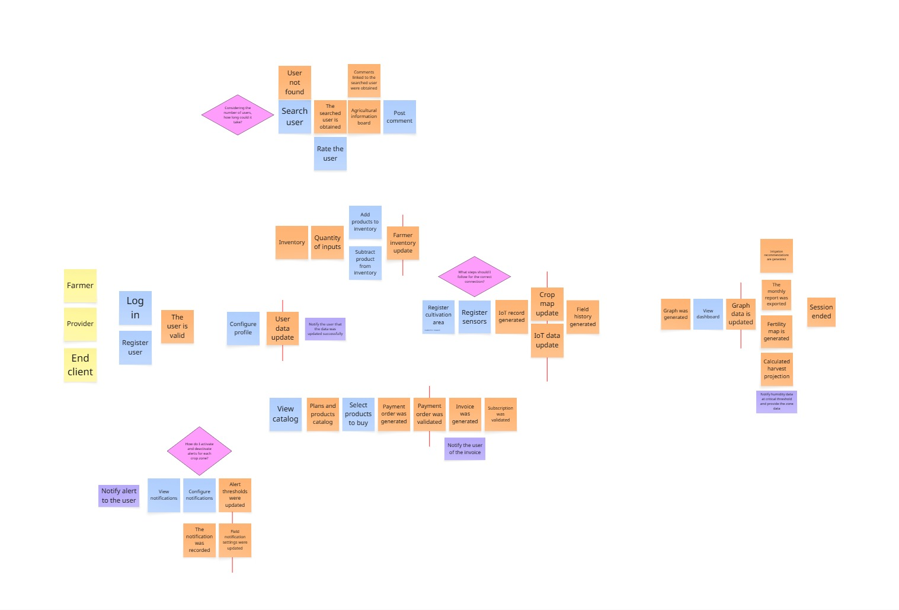
</p>

**Step 7: Read Models**

Se mapearon los Read Models (post-its verdes), que representan las vistas e interfaces de datos necesarias para que los actores tomen decisiones informadas. Entre los modelos de lectura clave se encuentran la Lista de planes disponibles, la Búsqueda de usuarios, el Estado del sensor en tiempo real y el Dashboard de indicadores del campo, los cuales permiten al agricultor visualizar la información crítica antes de ejecutar cualquier comando de gestión o riego.
<p align="center">
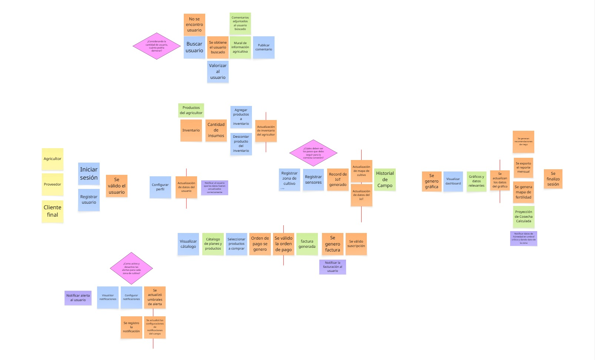
</p>

**Step 8: External Systems**

Se identificaron los sistemas externos (post-its rosados rectangulares) que interactúan con TerraTech para completar el flujo de procesos. Entre ellos destacan el Sistema de métodos de pago para procesar las suscripciones de los usuarios y el Sistema de mapas (como Google Maps o Mapbox), indispensable para la geolocalización de las zonas de cultivo y la visualización de los indicadores sobre el terreno.

<p align="center">
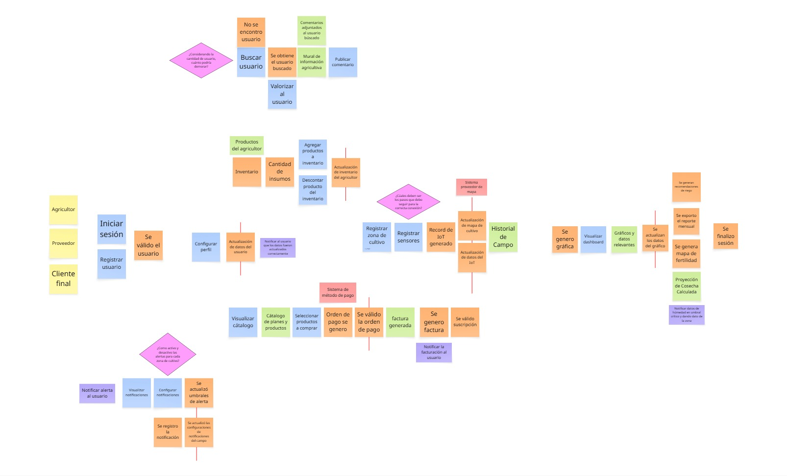
</p>

**Step 9: Aggregates**

Se incrementó el nivel de abstracción agrupando los comandos, eventos y reglas de negocio alrededor de las entidades principales del dominio (Aggregates, representados en post-its amarillos grandes). Para TerraTech, se definieron agregados clave como Usuario, Plan de Suscripción, Notificaciones, Zona, IoT y Report, los cuales encapsulan la lógica y aseguran la consistencia del estado del sistema en cada etapa del monitoreo agrícola.
<p align="center">
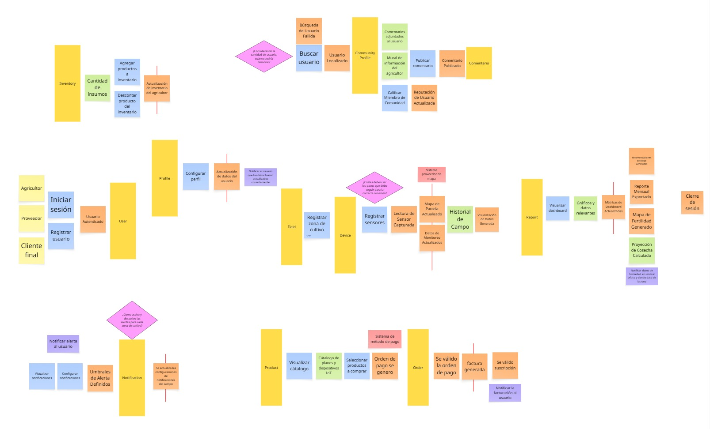
</p>

**Step 10: Bounded Contexts**

Finalmente, se delimitaron los límites semánticos y transaccionales del dominio mediante la definición de Bounded Contexts, agrupando los agregados y procesos relacionados en bloques independientes. Para TerraTech, la arquitectura se consolidó en tres contextos principales: IAM (Identity and Access Management) para la gestión de usuarios y seguridad, Payment para el control de planes y facturación, y Monitoring para el núcleo del negocio que abarca el control de zonas, dispositivos IoT, historial de campo y proyecciones agrícolas.
<p align="center">
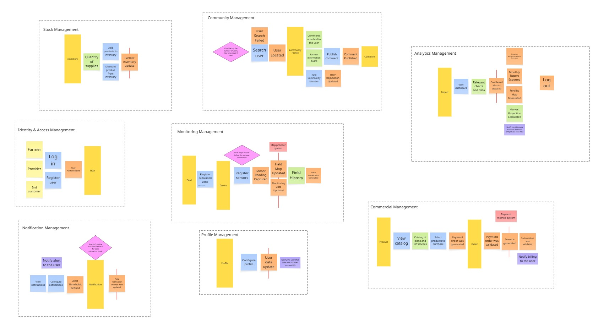
</p>

### 4.6.2. Software Architecture Context Diagram

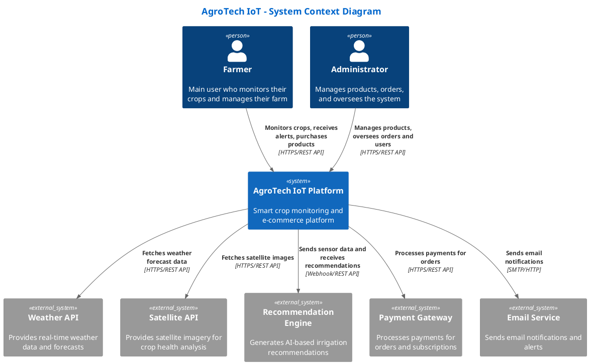
```plantuml
@startuml
!include <C4/C4_Context.puml>

' ==================== LIGHT THEME CONFIGURATION ====================
skinparam backgroundColor #FFFFFF
skinparam defaultFontColor #333333
skinparam classFontColor #1A1A1A
skinparam class {
    BackgroundColor #F8F9FA
    BorderColor #DEE2E6
    HeaderBackgroundColor #E9ECEF
    HeaderFontColor #0066CC
    FontColor #1A1A1A
}

title <color:#0066CC><size:18>AgroTech IoT - System Context Diagram</size></color>

' ==================== PERSONS ====================
Person(farmer, "Farmer", "Main user who monitors their crops and manages their farm")
Person(admin, "Administrator", "Manages products, orders, and oversees the system")

' ==================== MAIN SYSTEM ====================
System(agrotech, "AgroTech IoT Platform", "Smart crop monitoring and e-commerce platform")

' ==================== EXTERNAL SYSTEMS ====================
System_Ext(weatherApi, "Weather API", "Provides real-time weather data and forecasts")
System_Ext(satelliteApi, "Satellite API", "Provides satellite imagery for crop health analysis")
System_Ext(recommendationEngine, "Recommendation Engine", "Generates AI-based irrigation recommendations")
System_Ext(paymentGateway, "Payment Gateway", "Processes payments for orders and subscriptions")
System_Ext(emailService, "Email Service", "Sends email notifications and alerts")

' ==================== RELATIONSHIPS ====================
Rel(farmer, agrotech, "Monitors crops, receives alerts, purchases products", "HTTPS/REST API")
Rel(admin, agrotech, "Manages products, oversees orders and users", "HTTPS/REST API")

Rel(agrotech, weatherApi, "Fetches weather forecast data", "HTTPS/REST API")
Rel(agrotech, satelliteApi, "Fetches satellite images", "HTTPS/REST API")
Rel(agrotech, recommendationEngine, "Sends sensor data and receives recommendations", "Webhook/REST API")
Rel(agrotech, paymentGateway, "Processes payments for orders", "HTTPS/REST API")
Rel(agrotech, emailService, "Sends email notifications", "SMTP/HTTP")

@enduml
```

### 4.6.3. Software Architecture Container Diagrams

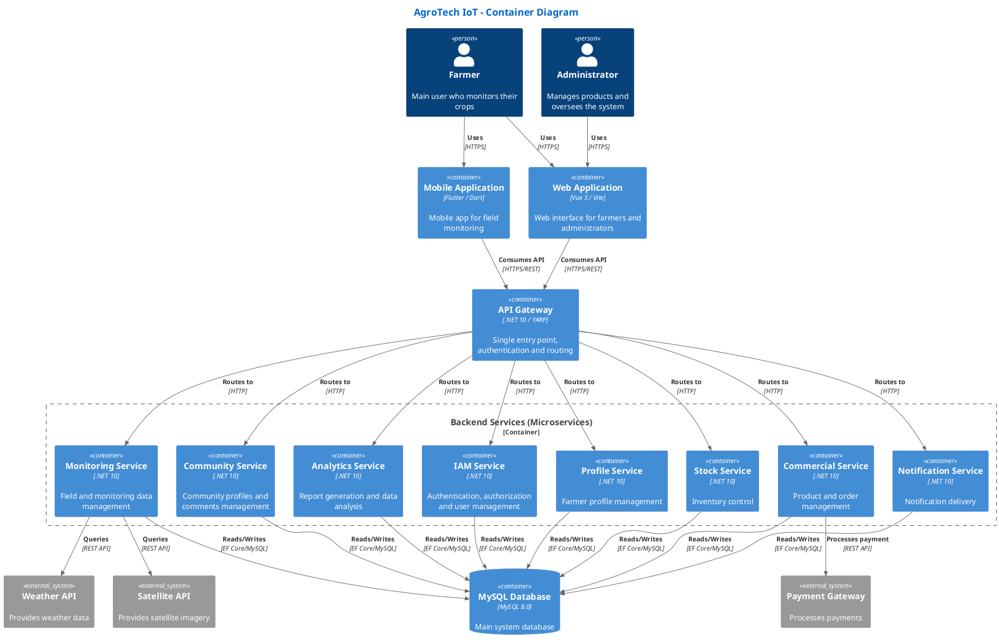
```plantuml
@startuml
!include <C4/C4_Container.puml>

' ==================== LIGHT THEME CONFIGURATION ====================
skinparam backgroundColor #FFFFFF
skinparam defaultFontColor #333333
skinparam classFontColor #1A1A1A
skinparam class {
    BackgroundColor #F8F9FA
    BorderColor #DEE2E6
    HeaderBackgroundColor #E9ECEF
    HeaderFontColor #0066CC
    FontColor #1A1A1A
}

title <color:#0066CC><size:18>AgroTech IoT - Container Diagram</size></color>

' ==================== PERSONS ====================
Person(farmer, "Farmer", "Main user who monitors their crops")
Person(admin, "Administrator", "Manages products and oversees the system")

' ==================== CONTAINERS ====================
Container(webApp, "Web Application", "Vue 3 / Vite", "Web interface for farmers and administrators")
Container(mobileApp, "Mobile Application", "Flutter / Dart", "Mobile app for field monitoring")
Container(apiGateway, "API Gateway", ".NET 10 / YARP", "Single entry point, authentication and routing")

Container_Boundary(backend, "Backend Services (Microservices)") {
    Container(iamService, "IAM Service", ".NET 10", "Authentication, authorization and user management")
    Container(profileService, "Profile Service", ".NET 10", "Farmer profile management")
    Container(commercialService, "Commercial Service", ".NET 10", "Product and order management")
    Container(monitoringService, "Monitoring Service", ".NET 10", "Field and monitoring data management")
    Container(stockService, "Stock Service", ".NET 10", "Inventory control")
    Container(notificationService, "Notification Service", ".NET 10", "Notification delivery")
    Container(communityService, "Community Service", ".NET 10", "Community profiles and comments management")
    Container(analyticsService, "Analytics Service", ".NET 10", "Report generation and data analysis")
}

ContainerDb(mysqlDb, "MySQL Database", "MySQL 8.0", "Main system database")

' ==================== EXTERNAL SYSTEMS ====================
System_Ext(weatherApi, "Weather API", "Provides weather data")
System_Ext(satelliteApi, "Satellite API", "Provides satellite imagery")
System_Ext(paymentGateway, "Payment Gateway", "Processes payments")

' ==================== RELATIONSHIPS ====================
Rel(farmer, webApp, "Uses", "HTTPS")
Rel(farmer, mobileApp, "Uses", "HTTPS")
Rel(admin, webApp, "Uses", "HTTPS")

Rel(webApp, apiGateway, "Consumes API", "HTTPS/REST")
Rel(mobileApp, apiGateway, "Consumes API", "HTTPS/REST")

Rel(apiGateway, iamService, "Routes to", "HTTP")
Rel(apiGateway, profileService, "Routes to", "HTTP")
Rel(apiGateway, commercialService, "Routes to", "HTTP")
Rel(apiGateway, monitoringService, "Routes to", "HTTP")
Rel(apiGateway, stockService, "Routes to", "HTTP")
Rel(apiGateway, notificationService, "Routes to", "HTTP")
Rel(apiGateway, communityService, "Routes to", "HTTP")
Rel(apiGateway, analyticsService, "Routes to", "HTTP")

Rel(iamService, mysqlDb, "Reads/Writes", "EF Core/MySQL")
Rel(profileService, mysqlDb, "Reads/Writes", "EF Core/MySQL")
Rel(commercialService, mysqlDb, "Reads/Writes", "EF Core/MySQL")
Rel(monitoringService, mysqlDb, "Reads/Writes", "EF Core/MySQL")
Rel(stockService, mysqlDb, "Reads/Writes", "EF Core/MySQL")
Rel(notificationService, mysqlDb, "Reads/Writes", "EF Core/MySQL")
Rel(communityService, mysqlDb, "Reads/Writes", "EF Core/MySQL")
Rel(analyticsService, mysqlDb, "Reads/Writes", "EF Core/MySQL")

Rel(monitoringService, weatherApi, "Queries", "REST API")
Rel(monitoringService, satelliteApi, "Queries", "REST API")
Rel(commercialService, paymentGateway, "Processes payment", "REST API")

@enduml
```

### 4.6.4. Software Architecture Components Diagrams

#### 4.6.4.1 Business Services

```plantuml
@startuml
!include <C4/C4_Component.puml>

' ==================== CONFIGURACIÓN ====================
skinparam backgroundColor #FFFFFF
skinparam defaultFontColor #333333
skinparam classFontColor #1A1A1A
skinparam class {
    BackgroundColor #F8F9FA
    BorderColor #DEE2E6
    HeaderBackgroundColor #E9ECEF
    HeaderFontColor #0066CC
    FontColor #1A1A1A
}

skinparam componentStyle rectangle
skinparam rectangle {
    BackgroundColor #F8F9FA
    BorderColor #DEE2E6
    FontColor #0066CC
}

title <color:#0066CC><size:18>AgroTech IoT - Components Diagram (Part 1: Business Services)</size></color>

' ==================== SERVICIOS DE NEGOCIO ====================
Container_Boundary(backend, "Backend Services") {
    
    Container_Boundary(iam, "IAM Service") {
        Component(iamApi, "REST API", "ASP.NET Core", "AuthenticationController, UsersController")
        Component(userCommand, "UserCommandService", ".NET Service", "Handles SignIn and SignUp commands")
        Component(userQuery, "UserQueryService", ".NET Service", "Handles user queries")
        Component(facade, "IamContextFacade", ".NET Service", "ACL Facade for other contexts")
        Component(tokenService, "TokenService", "JWT Service", "Generates and validates JWT tokens")
        Component(hashingService, "HashingService", "BCrypt Service", "Hashes and verifies passwords")
        Component(userRepository, "UserRepository", "EF Core", "User data access")
    }
    
    Container_Boundary(profile, "Profile Service") {
        Component(profileApi, "REST API", "ASP.NET Core", "ProfilesController")
        Component(profileCommand, "ProfileCommandService", ".NET Service", "Handles profile commands")
        Component(profileQuery, "ProfileQueryService", ".NET Service", "Handles profile queries")
        Component(profileRepository, "ProfileRepository", "EF Core", "Profile data access")
    }
    
    Container_Boundary(commercial, "Commercial Service") {
        Component(commercialApi, "REST API", "ASP.NET Core", "OrdersController, ProductsController")
        Component(orderService, "OrderService", ".NET Service", "Order management")
        Component(productService, "ProductService", ".NET Service", "Product management")
        Component(orderRepository, "OrderRepository", "EF Core", "Order data access")
        Component(productRepository, "ProductRepository", "EF Core", "Product data access")
    }
    
    Container_Boundary(monitoring, "Monitoring Service") {
        Component(monitoringApi, "REST API", "ASP.NET Core", "FieldsController, DevicesController")
        Component(fieldCommand, "FieldCommandService", ".NET Service", "Handles field commands")
        Component(fieldQuery, "FieldQueryService", ".NET Service", "Handles field queries")
        Component(deviceCommand, "DeviceCommandService", ".NET Service", "Handles device commands")
        Component(deviceQuery, "DeviceQueryService", ".NET Service", "Handles device queries")
        Component(fieldRepository, "FieldRepository", "EF Core", "Field data access")
        Component(deviceRepository, "DeviceRepository", "EF Core", "Device data access")
    }
}

' ==================== BASE DE DATOS ====================
ContainerDb(mysqlDb, "MySQL Database", "MySQL 8.0", "Main system database")

' ==================== EXTERNOS ====================
System_Ext(client, "Client", "Web/Mobile Frontend")
System_Ext(weatherApi, "Weather API", "External service")
System_Ext(satelliteApi, "Satellite API", "External service")
System_Ext(paymentGateway, "Payment Gateway", "External service")

' ==================== RELACIONES - CLIENTES ====================
Rel(client, iamApi, "Authenticates", "HTTPS/REST")
Rel(client, profileApi, "Manages profile", "HTTPS/REST")
Rel(client, commercialApi, "Manages orders and products", "HTTPS/REST")
Rel(client, monitoringApi, "Manages fields and devices", "HTTPS/REST")

' ==================== RELACIONES - IAM ====================
Rel(iamApi, userCommand, "Delegates to", "Internal")
Rel(iamApi, userQuery, "Delegates to", "Internal")
Rel(facade, userCommand, "Uses", "Internal")
Rel(facade, userQuery, "Uses", "Internal")
Rel(userCommand, hashingService, "Uses", "Internal")
Rel(userCommand, tokenService, "Uses", "Internal")
Rel(userCommand, userRepository, "Uses", "Internal")
Rel(userQuery, userRepository, "Uses", "Internal")

' ==================== RELACIONES - PROFILE ====================
Rel(profileApi, profileCommand, "Delegates to", "Internal")
Rel(profileApi, profileQuery, "Delegates to", "Internal")
Rel(profileCommand, profileRepository, "Uses", "Internal")
Rel(profileQuery, profileRepository, "Uses", "Internal")

' ==================== RELACIONES - COMMERCIAL ====================
Rel(commercialApi, orderService, "Delegates to", "Internal")
Rel(commercialApi, productService, "Delegates to", "Internal")
Rel(orderService, orderRepository, "Uses", "Internal")
Rel(orderService, productRepository, "Uses", "Internal")
Rel(productService, productRepository, "Uses", "Internal")
Rel(orderService, paymentGateway, "Processes payment", "REST API")

' ==================== RELACIONES - MONITORING ====================
Rel(monitoringApi, fieldCommand, "Delegates to", "Internal")
Rel(monitoringApi, fieldQuery, "Delegates to", "Internal")
Rel(monitoringApi, deviceCommand, "Delegates to", "Internal")
Rel(monitoringApi, deviceQuery, "Delegates to", "Internal")
Rel(fieldCommand, fieldRepository, "Uses", "Internal")
Rel(fieldQuery, fieldRepository, "Uses", "Internal")
Rel(deviceCommand, deviceRepository, "Uses", "Internal")
Rel(deviceQuery, deviceRepository, "Uses", "Internal")
Rel(fieldCommand, weatherApi, "Gets weather data", "REST API")
Rel(fieldCommand, satelliteApi, "Gets satellite images", "REST API")

' ==================== RELACIONES - BASE DE DATOS ====================
Rel(userRepository, mysqlDb, "Reads/Writes", "EF Core")
Rel(profileRepository, mysqlDb, "Reads/Writes", "EF Core")
Rel(orderRepository, mysqlDb, "Reads/Writes", "EF Core")
Rel(productRepository, mysqlDb, "Reads/Writes", "EF Core")
Rel(fieldRepository, mysqlDb, "Reads/Writes", "EF Core")
Rel(deviceRepository, mysqlDb, "Reads/Writes", "EF Core")

@enduml
```

#### 4.6.4.1 Support Services
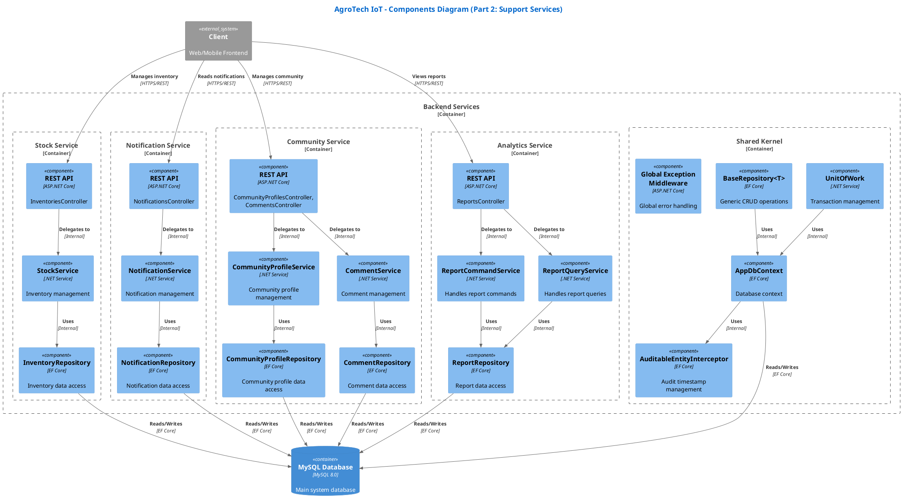
```plantuml
@startuml
!include <C4/C4_Component.puml>

' ==================== CONFIGURACIÓN ====================
skinparam backgroundColor #FFFFFF
skinparam defaultFontColor #333333
skinparam classFontColor #1A1A1A
skinparam class {
    BackgroundColor #F8F9FA
    BorderColor #DEE2E6
    HeaderBackgroundColor #E9ECEF
    HeaderFontColor #0066CC
    FontColor #1A1A1A
}

skinparam componentStyle rectangle
skinparam rectangle {
    BackgroundColor #F8F9FA
    BorderColor #DEE2E6
    FontColor #0066CC
}

title <color:#0066CC><size:18>AgroTech IoT - Components Diagram (Part 2: Support Services)</size></color>

' ==================== SERVICIOS DE SOPORTE ====================
Container_Boundary(backend, "Backend Services") {
    
    Container_Boundary(stock, "Stock Service") {
        Component(stockApi, "REST API", "ASP.NET Core", "InventoriesController")
        Component(stockService, "StockService", ".NET Service", "Inventory management")
        Component(inventoryRepository, "InventoryRepository", "EF Core", "Inventory data access")
    }
    
    Container_Boundary(notification, "Notification Service") {
        Component(notificationApi, "REST API", "ASP.NET Core", "NotificationsController")
        Component(notificationService, "NotificationService", ".NET Service", "Notification management")
        Component(notificationRepository, "NotificationRepository", "EF Core", "Notification data access")
    }
    
    Container_Boundary(community, "Community Service") {
        Component(communityApi, "REST API", "ASP.NET Core", "CommunityProfilesController, CommentsController")
        Component(communityProfileService, "CommunityProfileService", ".NET Service", "Community profile management")
        Component(commentService, "CommentService", ".NET Service", "Comment management")
        Component(communityProfileRepository, "CommunityProfileRepository", "EF Core", "Community profile data access")
        Component(commentRepository, "CommentRepository", "EF Core", "Comment data access")
    }

    Container_Boundary(analytics, "Analytics Service") {
        Component(analyticsApi, "REST API", "ASP.NET Core", "ReportsController")
        Component(reportCommand, "ReportCommandService", ".NET Service", "Handles report commands")
        Component(reportQuery, "ReportQueryService", ".NET Service", "Handles report queries")
        Component(reportRepository, "ReportRepository", "EF Core", "Report data access")
    }

    Container_Boundary(shared, "Shared Kernel") {
        Component(appDbContext, "AppDbContext", "EF Core", "Database context")
        Component(unitOfWork, "UnitOfWork", ".NET Service", "Transaction management")
        Component(baseRepository, "BaseRepository<T>", "EF Core", "Generic CRUD operations")
        Component(auditableInterceptor, "AuditableEntityInterceptor", "EF Core", "Audit timestamp management")
        Component(middleware, "Global Exception Middleware", "ASP.NET Core", "Global error handling")
    }
}

' ==================== BASE DE DATOS ====================
ContainerDb(mysqlDb, "MySQL Database", "MySQL 8.0", "Main system database")

' ==================== EXTERNOS ====================
System_Ext(client, "Client", "Web/Mobile Frontend")

' ==================== RELACIONES - CLIENTES ====================
Rel(client, stockApi, "Manages inventory", "HTTPS/REST")
Rel(client, notificationApi, "Reads notifications", "HTTPS/REST")
Rel(client, communityApi, "Manages community", "HTTPS/REST")
Rel(client, analyticsApi, "Views reports", "HTTPS/REST")

' ==================== RELACIONES - STOCK ====================
Rel(stockApi, stockService, "Delegates to", "Internal")
Rel(stockService, inventoryRepository, "Uses", "Internal")

' ==================== RELACIONES - NOTIFICATION ====================
Rel(notificationApi, notificationService, "Delegates to", "Internal")
Rel(notificationService, notificationRepository, "Uses", "Internal")

' ==================== RELACIONES - COMMUNITY ====================
Rel(communityApi, communityProfileService, "Delegates to", "Internal")
Rel(communityApi, commentService, "Delegates to", "Internal")
Rel(communityProfileService, communityProfileRepository, "Uses", "Internal")
Rel(commentService, commentRepository, "Uses", "Internal")

' ==================== RELACIONES - ANALYTICS ====================
Rel(analyticsApi, reportCommand, "Delegates to", "Internal")
Rel(analyticsApi, reportQuery, "Delegates to", "Internal")
Rel(reportCommand, reportRepository, "Uses", "Internal")
Rel(reportQuery, reportRepository, "Uses", "Internal")

' ==================== RELACIONES - SHARED KERNEL ====================
Rel(appDbContext, auditableInterceptor, "Uses", "Internal")
Rel(baseRepository, appDbContext, "Uses", "Internal")
Rel(unitOfWork, appDbContext, "Uses", "Internal")
Rel(appDbContext, mysqlDb, "Reads/Writes", "EF Core")

' ==================== RELACIONES - BASE DE DATOS ====================
Rel(inventoryRepository, mysqlDb, "Reads/Writes", "EF Core")
Rel(notificationRepository, mysqlDb, "Reads/Writes", "EF Core")
Rel(communityProfileRepository, mysqlDb, "Reads/Writes", "EF Core")
Rel(commentRepository, mysqlDb, "Reads/Writes", "EF Core")
Rel(reportRepository, mysqlDb, "Reads/Writes", "EF Core")

@enduml
```

## 4.7. Software Object-Oriented Design

### 4.7.1. Class Diagrams

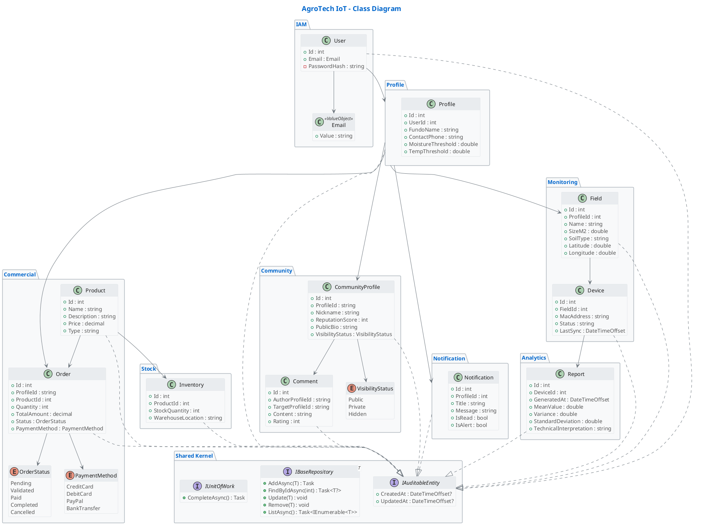
```plantuml
@startuml
skinparam backgroundColor #FFFFFF
skinparam defaultFontColor #333333
skinparam classFontColor #1A1A1A
skinparam classAttributeFontColor #555555
skinparam class {
    BackgroundColor #F8F9FA
    BorderColor #DEE2E6
    HeaderBackgroundColor #E9ECEF
    HeaderFontColor #0066CC
    FontColor #1A1A1A
}

skinparam arrow {
    Color #6C757D
    FontColor #495057
    Thickness 1
}

skinparam package {
    BackgroundColor #F8F9FA
    BorderColor #ADB5BD
    FontColor #0066CC
}

title <color:#0066CC><size:18>AgroTech IoT - Class Diagram</size></color>

hide empty members

' ==================== SHARED KERNEL ====================
package "Shared Kernel" {
    interface IAuditableEntity {
        + CreatedAt : DateTimeOffset?
        + UpdatedAt : DateTimeOffset?
    }
    interface IBaseRepository<T> {
        + AddAsync(T) : Task
        + FindByIdAsync(int) : Task<T?>
        + Update(T) : void
        + Remove(T) : void
        + ListAsync() : Task<IEnumerable<T>>
    }
    interface IUnitOfWork {
        + CompleteAsync() : Task
    }
}

' ==================== IAM ====================
package "IAM" {
    class User {
        + Id : int
        + Email : Email
        - PasswordHash : string
    }
    class Email <<ValueObject>> {
        + Value : string
    }
}

' ==================== PROFILE ====================
package "Profile" {
    class Profile {
        + Id : int
        + UserId : int
        + FundoName : string
        + ContactPhone : string
        + MoistureThreshold : double
        + TempThreshold : double
    }
}

' ==================== MONITORING ====================
package "Monitoring" {
    class Field {
        + Id : int
        + ProfileId : int
        + Name : string
        + SizeM2 : double
        + SoilType : string
        + Latitude : double
        + Longitude : double
    }
    class Device {
        + Id : int
        + FieldId : int
        + MacAddress : string
        + Status : string
        + LastSync : DateTimeOffset
    }
}

' ==================== COMMERCIAL ====================
package "Commercial" {
    class Order {
        + Id : int
        + ProfileId : string
        + ProductId : int
        + Quantity : int
        + TotalAmount : decimal
        + Status : OrderStatus
        + PaymentMethod : PaymentMethod
    }
    class Product {
        + Id : int
        + Name : string
        + Description : string
        + Price : decimal
        + Type : string
    }
    enum OrderStatus {
        Pending
        Validated
        Paid
        Completed
        Cancelled
    }
    enum PaymentMethod {
        CreditCard
        DebitCard
        PayPal
        BankTransfer
    }
}

' ==================== STOCK ====================
package "Stock" {
    class Inventory {
        + Id : int
        + ProductId : int
        + StockQuantity : int
        + WarehouseLocation : string
    }
}

' ==================== NOTIFICATION ====================
package "Notification" {
    class Notification {
        + Id : int
        + ProfileId : int
        + Title : string
        + Message : string
        + IsRead : bool
        + IsAlert : bool
    }
}

' ==================== COMMUNITY ====================
package "Community" {
    class CommunityProfile {
        + Id : int
        + ProfileId : string
        + Nickname : string
        + ReputationScore : int
        + PublicBio : string
        + VisibilityStatus : VisibilityStatus
    }
    class Comment {
        + Id : int
        + AuthorProfileId : string
        + TargetProfileId : string
        + Content : string
        + Rating : int
    }
    enum VisibilityStatus {
        Public
        Private
        Hidden
    }
}

' ==================== ANALYTICS ====================
package "Analytics" {
    class Report {
        + Id : int
        + DeviceId : int
        + GeneratedAt : DateTimeOffset
        + MeanValue : double
        + Variance : double
        + StandardDeviation : double
        + TechnicalInterpretation : string
    }
}

' ==================== RELATIONSHIPS ===================
User --> Email
User ..|> IAuditableEntity
User --> Profile

Profile ..|> IAuditableEntity
Profile --> Field
Profile --> Order
Profile --> Notification
Profile --> CommunityProfile

Field ..|> IAuditableEntity
Device ..|> IAuditableEntity
Field --> Device

Order ..|> IAuditableEntity
Product ..|> IAuditableEntity
Order --> OrderStatus
Order --> PaymentMethod
Product --> Order
Product --> Inventory

Inventory ..|> IAuditableEntity

Notification ..|> IAuditableEntity

CommunityProfile ..|> IAuditableEntity
Comment ..|> IAuditableEntity
CommunityProfile --> VisibilityStatus
CommunityProfile --> Comment

Report ..|> IAuditableEntity
Device --> Report

@enduml
```

### 4.7.2. Class Dictionary

<table border="1">
<thead>
<tr>
<th>Class</th>
<th>Definition</th>
</tr>
</thead>
<tbody>
<tr>
<td><code>User</code></td>
<td>Entidad que representa un usuario del sistema, con información como email, contraseña cifrada y fechas de creación/actualización. Permite autenticación y gestión de credenciales.</td>
</tr>
<tr>
<td><code>Email</code></td>
<td>Value Object que encapsula la dirección de correo electrónico del usuario, garantizando su formato y validez.</td>
</tr>
<tr>
<td><code>Profile</code></td>
<td>Entidad que representa el perfil agrícola de un usuario, incluyendo nombre del fundo, teléfono de contacto y umbrales configurados de humedad y temperatura para alertas.</td>
</tr>
<tr>
<td><code>Field</code></td>
<td>Entidad que representa una parcela o terreno agrícola, con datos de ubicación (latitud, longitud), nombre, tamaño en metros cuadrados y tipo de suelo.</td>
</tr>
<tr>
<td><code>Device</code></td>
<td>Entidad que representa un dispositivo IoT instalado en una parcela, con dirección MAC, estado operativo y fecha de última sincronización.</td>
</tr>
<tr>
<td><code>Report</code></td>
<td>Entidad que almacena reportes estadísticos generados a partir de datos de dispositivos IoT, incluyendo promedio, varianza, desviación estándar e interpretación técnica.</td>
</tr>
<tr>
<td><code>Product</code></td>
<td>Entidad que define los productos y servicios ofrecidos por la plataforma, incluyendo nombre, descripción, precio y tipo de producto.</td>
</tr>
<tr>
<td><code>Order</code></td>
<td>Entidad que registra las órdenes de compra realizadas por los perfiles, incluyendo producto adquirido, estado del pedido, método de pago y monto total.</td>
</tr>
<tr>
<td><code>OrderStatus</code></td>
<td>Enumeración que define los posibles estados de una orden: Pendiente, Validado, Pagado, Completado o Cancelado.</td>
</tr>
<tr>
<td><code>PaymentMethod</code></td>
<td>Enumeración que define los métodos de pago disponibles: Tarjeta de Crédito, Tarjeta de Débito, PayPal o Transferencia Bancaria.</td>
</tr>
<tr>
<td><code>Inventory</code></td>
<td>Entidad que gestiona el inventario disponible de cada producto, incluyendo cantidad en stock y ubicación del almacén.</td>
</tr>
<tr>
<td><code>Notification</code></td>
<td>Entidad que registra las notificaciones y alertas enviadas a los perfiles, incluyendo título, mensaje, indicador de alerta y estado de lectura.</td>
</tr>
<tr>
<td><code>CommunityProfile</code></td>
<td>Entidad que representa el perfil público del agricultor dentro de la comunidad, incluyendo apodo, biografía, puntuación de reputación y configuración de visibilidad.</td>
</tr>
<tr>
<td><code>Comment</code></td>
<td>Entidad que registra los comentarios realizados entre perfiles de la comunidad, almacenando autor, destinatario, contenido y calificación.</td>
</tr>
<tr>
<td><code>VisibilityStatus</code></td>
<td>Enumeración que define el estado de visibilidad de un perfil comunitario: Público, Privado u Oculto.</td>
</tr>
<tr>
<td><code>IAuditableEntity</code></td>
<td>Interfaz que define las propiedades de auditoría para las entidades, incluyendo fechas de creación y actualización.</td>
</tr>
<tr>
<td><code>IBaseRepository&lt;T&gt;</code></td>
<td>Interfaz que define las operaciones básicas de repositorio para una entidad: agregar, buscar por ID, actualizar, eliminar y listar.</td>
</tr>
<tr>
<td><code>IUnitOfWork</code></td>
<td>Interfaz que implementa el patrón Unit of Work para gestionar transacciones y persistencia de datos.</td>
</tr>
</tbody>
</table>

## 4.8. Database Design

### 4.8.1. Database Diagram

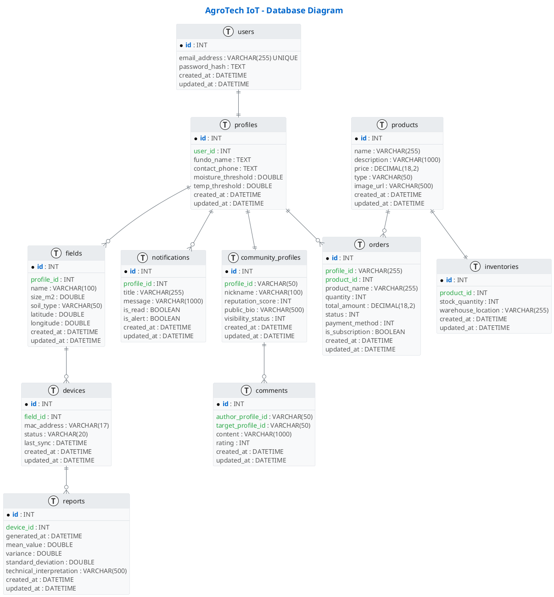
```plantuml
@startuml
' ==================== LIGHT THEME CONFIGURATION ====================
skinparam backgroundColor #FFFFFF
skinparam defaultFontColor #333333
skinparam classFontColor #1A1A1A
skinparam classAttributeFontColor #555555
skinparam class {
    BackgroundColor #F8F9FA
    BorderColor #DEE2E6
    HeaderBackgroundColor #E9ECEF
    HeaderFontColor #0066CC
    FontColor #1A1A1A
}

skinparam stereotype {
    BackgroundColor #FFFFFF
    BorderColor #ADB5BD
    FontColor #0066CC
}

skinparam arrow {
    Color #6C757D
    FontColor #495057
    Thickness 1
}

title <color:#0066CC><size:18>AgroTech IoT - Database Diagram</size></color>

!define table(x) class x << (T,#F8F9FA) >>
!define primary_key(x) <b><color:#0066CC>x</color></b>
!define foreign_key(x) <color:#28A745>x</color>

hide methods
hide stereotypes

table(users) {
  * primary_key(id) : INT
  --
  email_address : VARCHAR(255) UNIQUE
  password_hash : TEXT
  created_at : DATETIME
  updated_at : DATETIME
}

table(profiles) {
  * primary_key(id) : INT
  --
  foreign_key(user_id) : INT
  fundo_name : TEXT
  contact_phone : TEXT
  moisture_threshold : DOUBLE
  temp_threshold : DOUBLE
  created_at : DATETIME
  updated_at : DATETIME
}

table(fields) {
  * primary_key(id) : INT
  --
  foreign_key(profile_id) : INT
  name : VARCHAR(100)
  size_m2 : DOUBLE
  soil_type : VARCHAR(50)
  latitude : DOUBLE
  longitude : DOUBLE
  created_at : DATETIME
  updated_at : DATETIME
}

table(devices) {
  * primary_key(id) : INT
  --
  foreign_key(field_id) : INT
  mac_address : VARCHAR(17)
  status : VARCHAR(20)
  last_sync : DATETIME
  created_at : DATETIME
  updated_at : DATETIME
}

table(reports) {
  * primary_key(id) : INT
  --
  foreign_key(device_id) : INT
  generated_at : DATETIME
  mean_value : DOUBLE
  variance : DOUBLE
  standard_deviation : DOUBLE
  technical_interpretation : VARCHAR(500)
  created_at : DATETIME
  updated_at : DATETIME
}

table(products) {
  * primary_key(id) : INT
  --
  name : VARCHAR(255)
  description : VARCHAR(1000)
  price : DECIMAL(18,2)
  type : VARCHAR(50)
  image_url : VARCHAR(500)
  created_at : DATETIME
  updated_at : DATETIME
}

table(orders) {
  * primary_key(id) : INT
  --
  foreign_key(profile_id) : VARCHAR(255)
  foreign_key(product_id) : INT
  product_name : VARCHAR(255)
  quantity : INT
  total_amount : DECIMAL(18,2)
  status : INT
  payment_method : INT
  is_subscription : BOOLEAN
  created_at : DATETIME
  updated_at : DATETIME
}

table(inventories) {
  * primary_key(id) : INT
  --
  foreign_key(product_id) : INT
  stock_quantity : INT
  warehouse_location : VARCHAR(255)
  created_at : DATETIME
  updated_at : DATETIME
}

table(notifications) {
  * primary_key(id) : INT
  --
  foreign_key(profile_id) : INT
  title : VARCHAR(255)
  message : VARCHAR(1000)
  is_read : BOOLEAN
  is_alert : BOOLEAN
  created_at : DATETIME
  updated_at : DATETIME
}

table(community_profiles) {
  * primary_key(id) : INT
  --
  foreign_key(profile_id) : VARCHAR(50)
  nickname : VARCHAR(100)
  reputation_score : INT
  public_bio : VARCHAR(500)
  visibility_status : INT
  created_at : DATETIME
  updated_at : DATETIME
}

table(comments) {
  * primary_key(id) : INT
  --
  foreign_key(author_profile_id) : VARCHAR(50)
  foreign_key(target_profile_id) : VARCHAR(50)
  content : VARCHAR(1000)
  rating : INT
  created_at : DATETIME
  updated_at : DATETIME
}

' ==================== RELATIONSHIPS ====================
users ||--|| profiles
profiles ||--o{ fields
profiles ||--o{ orders
profiles ||--o{ notifications
profiles ||--|| community_profiles
community_profiles ||--o{ comments

products ||--o{ orders
products ||--|| inventories

fields ||--o{ devices
devices ||--o{ reports

@enduml
```

### 4.8.2. Class Dictionary
<table border="1">
<thead>
<tr>
<th>Entity</th>
<th>Definition</th>
</tr>
</thead>
<tbody>
<tr>
<td><code>users</code></td>
<td>Almacena las credenciales principales de acceso al sistema, incluyendo dirección de correo electrónico única y contraseña cifrada de cada usuario registrado.</td>
</tr>

<tr>
<td><code>profiles</code></td>
<td>Contiene la información del perfil agrícola asociado a cada usuario, como nombre del fundo, teléfono de contacto y los umbrales configurados de humedad y temperatura para alertas.</td>
</tr>

<tr>
<td><code>community_profiles</code></td>
<td>Representa el perfil público del agricultor dentro de la comunidad, incluyendo apodo, biografía, puntuación de reputación y configuración de visibilidad.</td>
</tr>

<tr>
<td><code>comments</code></td>
<td>Registra los comentarios realizados entre perfiles de la comunidad, almacenando autor, destinatario, contenido, calificación y fecha de creación.</td>
</tr>

<tr>
<td><code>products</code></td>
<td>Define los productos y servicios ofrecidos por la plataforma, incluyendo nombre, descripción, precio, tipo de producto e imagen URL.</td>
</tr>

<tr>
<td><code>orders</code></td>
<td>Registra las órdenes de compra realizadas por los perfiles, incluyendo producto adquirido, nombre del producto, cantidad, monto total, estado, método de pago e indicador de suscripción.</td>
</tr>

<tr>
<td><code>inventories</code></td>
<td>Gestiona el inventario disponible de cada producto, incluyendo cantidad en stock y ubicación del almacén.</td>
</tr>

<tr>
<td><code>fields</code></td>
<td>Almacena los terrenos o parcelas agrícolas administradas por cada perfil, incluyendo nombre, tamaño en metros cuadrados, tipo de suelo y ubicación geográfica (latitud y longitud).</td>
</tr>

<tr>
<td><code>devices</code></td>
<td>Registra los dispositivos IoT instalados en cada parcela, con dirección MAC, estado operativo y fecha de última sincronización.</td>
</tr>

<tr>
<td><code>reports</code></td>
<td>Almacena los reportes estadísticos generados a partir de los datos de los dispositivos IoT, incluyendo promedio, varianza, desviación estándar e interpretación técnica.</td>
</tr>

<tr>
<td><code>notifications</code></td>
<td>Registra las notificaciones y alertas enviadas a los perfiles, incluyendo título, mensaje, indicador de alerta y estado de lectura.</td>
</tr>
</tbody>
</table>

