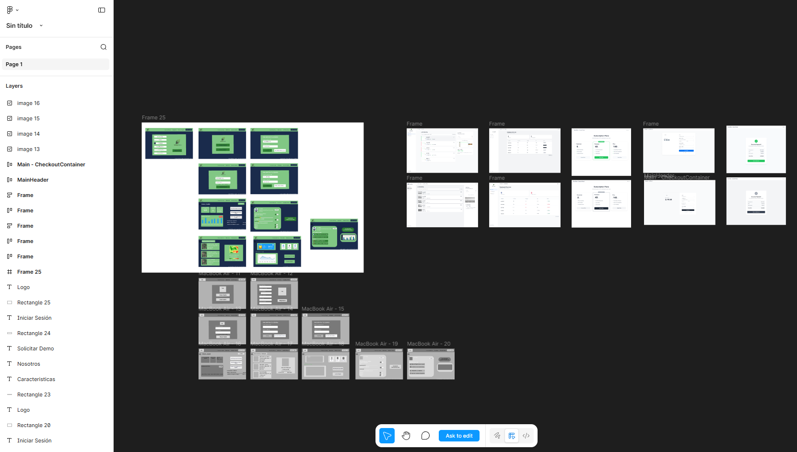
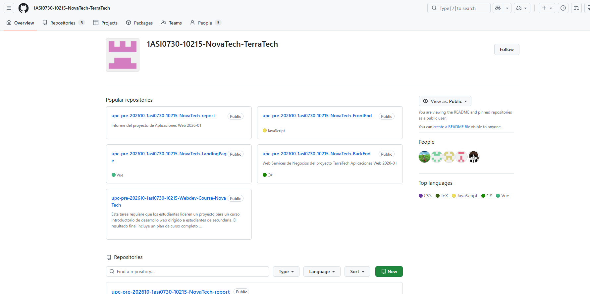

# Anexos

***Anexo A. Figma de diseños***

- Link de Figma de diseño de la plataforma: https://tinyurl.com/4wttn9pw

***Anexo B. Trello***

***Anexo C. Organización y repositorios de GitHub***

El proyecto NovaTech y su producto TerraTech se encuentra alojado bajo la organización de GitHub 1ASI0730-10215-NovaTech-TerraTech. A continuación se detallará la URL de los repositorios utilizados:

- Repositorio de organización: https://github.com/1ASI0730-10215-NovaTech-TerraTech
- Repositorio de informe: https://github.com/1ASI0730-10215-NovaTech-TerraTech/upc-pre-202610-1asi0730-10215-NovaTech-report
- Repositorio de Landing Page: https://github.com/1ASI0730-10215-NovaTech-TerraTech/upc-pre-202610-1asi0730-10215-NovaTech-LandingPage

***Anexo D. Registro de entrevista***

Para las entrevistas las subimos en la nube para facilitar el acceso:

URL de entrevistas: https://upcedupe-my.sharepoint.com/personal/u202222275_upc_edu_pe/_layouts/15/stream.aspx?id=%2Fpersonal%2Fu202222275%5Fupc%5Fedu%5Fpe%2FDocuments%2FEntrevista%2DGrupo02%2DNovaTech%2Emp4&nav=eyJyZWZlcnJhbEluZm8iOnsicmVmZXJyYWxBcHAiOiJTdHJlYW1XZWJBcHAiLCJyZWZlcnJhbFZpZXciOiJTaGFyZURpYWxvZy1MaW5rIiwicmVmZXJyYWxBcHBQbGF0Zm9ybSI6IldlYiIsInJlZmVycmFsTW9kZSI6InZpZXcifSwicGxheWJhY2tPcHRpb25zIjp7InN0YXJ0VGltZUluU2Vjb25kcyI6NC40OX19&ga=1&referrer=StreamWebApp%2EWeb&referrerScenario=AddressBarCopied%2Eview%2Eb9b26aa8%2D47c5%2D4f35%2Da54a%2D3ae9c4b440dd

***Anexo E. Deployment del proyecto***

Para el despliegue de nuestra aplicación hemos usado diversos proveedores:

- GitHubPage para el deploy de Landing Page: https://1asi0730-10215-novatech-terratech.github.io/upc-pre-202610-1asi0730-10215-NovaTech-LandingPage/

***Anexo F. About The Team***

***Anexo G. About The Product***

***Video de Exposiciones***

**Av01**

**TB01**

**Av02**

