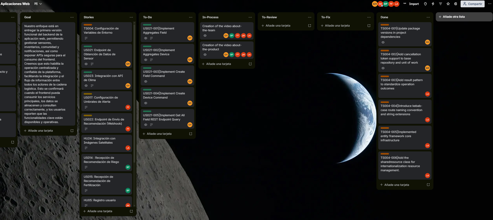
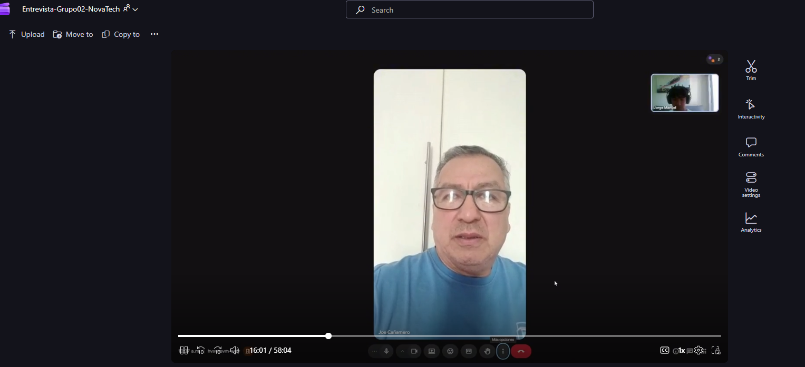
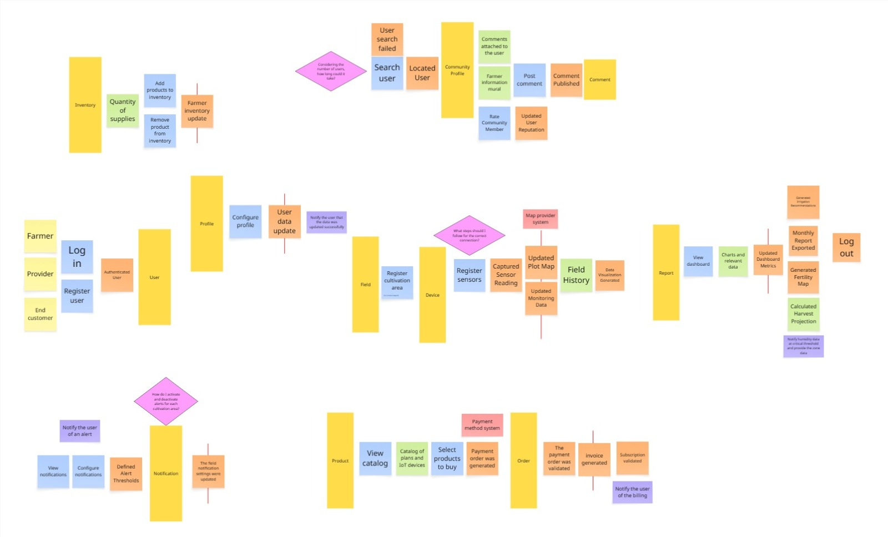
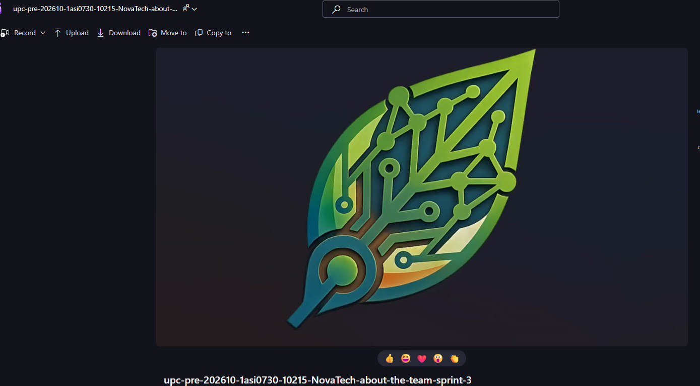
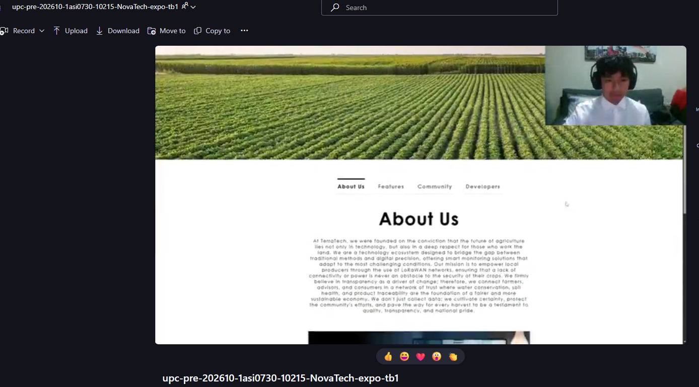
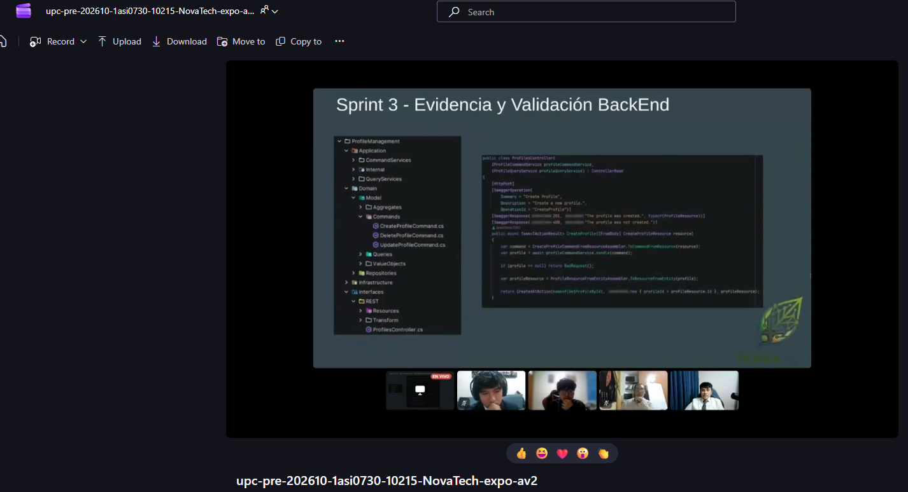

# Anexos

***Anexo A. Figma de diseños***

- Link de Figma de diseño de la plataforma: [https://tinyurl.com/4wttn9pw](https://tinyurl.com/4wttn9pw)

***Anexo B. Trello***

- Link de Trello para la gestión del proyecto: [https://trello.com/b/sLQ8KGVG](https://trello.com/b/sLQ8KGVG)

***Anexo C. Organización y repositorios de GitHub***

El proyecto NovaTech y su producto TerraTech se encuentra alojado bajo la organización de GitHub 1ASI0730-10215-NovaTech-TerraTech. A continuación se detallará la URL de los repositorios utilizados:

- Repositorio de organización: [https://tinyurl.com/3bu5ebv4](https://tinyurl.com/3bu5ebv4)
- Repositorio de informe: [https://tinyurl.com/r77hmcwn](https://tinyurl.com/r77hmcwn)
- Repositorio de Landing Page: [https://tinyurl.com/yjyufpvz](https://tinyurl.com/yjyufpvz)
- Repositorio de FrontEnd: [https://tinyurl.com/3dm2avv8](https://tinyurl.com/3dm2avv8)
- Repositorio de BackEnd: [https://tinyurl.com/ted7m4cu](https://tinyurl.com/ted7m4cu)

***Anexo D. Registro de entrevista***

Para las entrevistas las subimos en la nube para facilitar el acceso:

Link de las entrevistas: [https://tinyurl.com/5cphvez4](https://tinyurl.com/5cphvez4)

Duración: 00:00 - 58:04

***Anexo E. Event Storming***

Link del Event Storming: [https://tinyurl.com/nnf8kf3c](https://tinyurl.com/nnf8kf3c)

***Anexo F. About The Team***

Link del video About the Team: [https://tinyurl.com/5e4k6vas](https://tinyurl.com/5e4k6vas)

Duración: 00:00 - 08:34

***Anexo G. About The Product***

Link del video About the Product: [https://tinyurl.com/m88tcphe](https://tinyurl.com/m88tcphe)

Duración: 00:00 - 07:57

## Videos de Exposición

***TB01***

Link del video del TB01: [https://tinyurl.com/3wwzdc2w](https://tinyurl.com/3wwzdc2w)

Duración: 00:00 - 20:35

***Av02***

Link del video del AV02: [https://tinyurl.com/mrxyzszz](https://tinyurl.com/mrxyzszz)

Duración: 00:00 - 17:26

