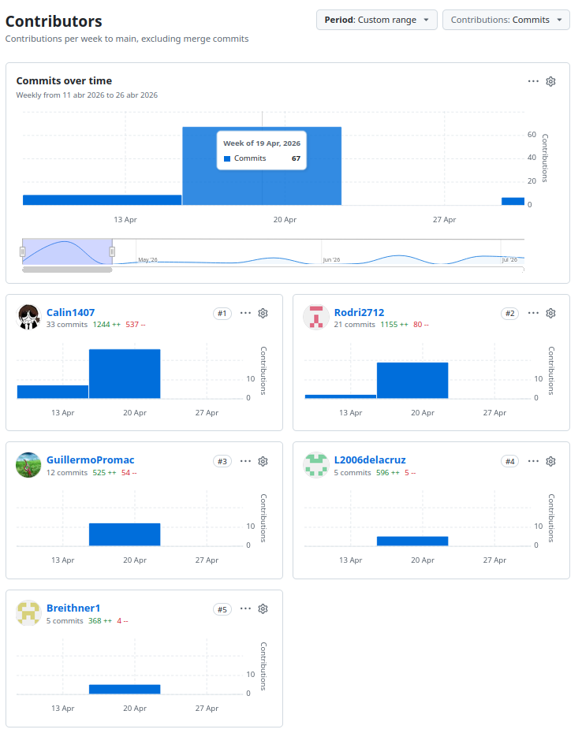
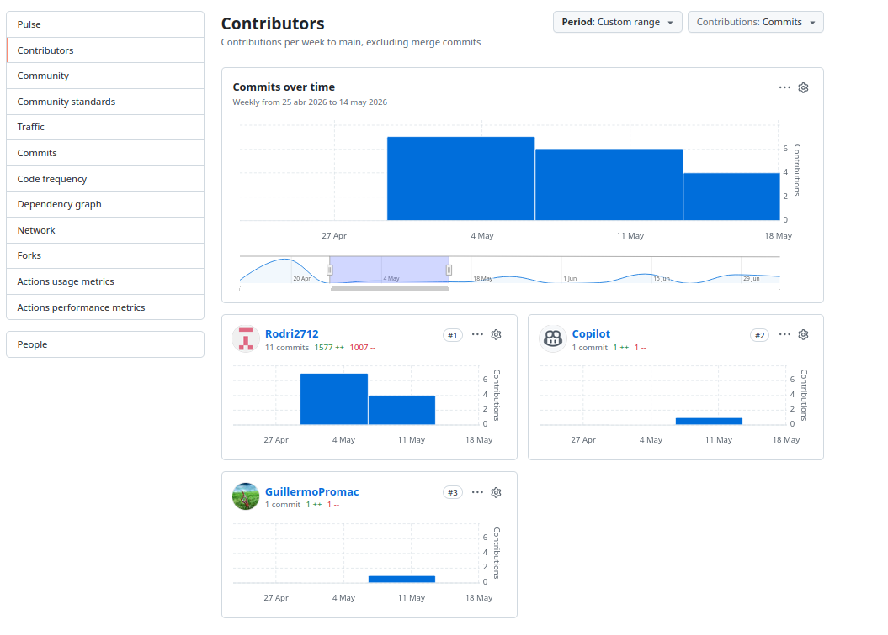
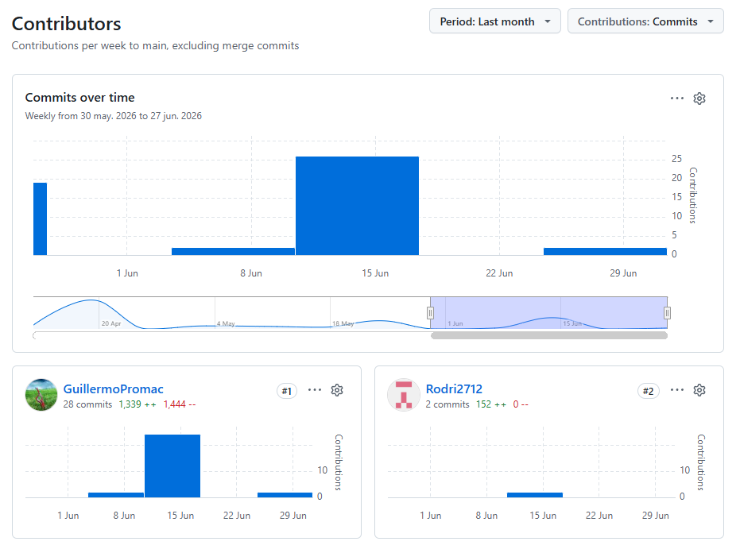

Universidad Peruana De Ciencias Aplicadas

Carrera de Ingeniería de Software

**1ASI030**

**Aplicaciones Web**

NRC  
**10215**

**Informe del Trabajo Final**

Docente  
**Velásquez Núñez, Ángel Augusto**

Equipo  
**NovaTech**

Proyecto  
**TerraTech**

**Integrantes**

<table style="margin: 0 auto; border-collapse: collapse; text-align: left;">
  <thead>
    <tr>
      <th style="padding: 8px 16px;">Código</th>
      <th style="padding: 8px 16px;">Apellidos y Nombres</th>
    </tr>
  </thead>
  <tbody>
    <tr>
      <td style="padding: 8px 16px;">U202417228</td>
      <td style="padding: 8px 16px;">Acuña de la Cruz, Luis Alfredo</td>
    </tr>
    <tr>
      <td style="padding: 8px 16px;">U202318309</td>
      <td style="padding: 8px 16px;;">Aguilar Untiveros, Rodrigo Fabrizio</td>
    </tr>
    <tr>
      <td style="padding: 8px 16px;">U202222275</td>
      <td style="padding: 8px 16px;">Howard Robles, Guillermo Arturo</td>
    </tr>
    <tr>
      <td style="padding: 8px 16px;">U202418577</td>
      <td style="padding: 8px 16px;">Pérez Encarnación, Breithner Rodolfo</td>
    </tr>
    <tr>
      <td style="padding: 8px 16px;">U202318612</td>
      <td style="padding: 8px 16px;">Retuerto Rodríguez, Jorge Manuel</td>
    </tr>
  </tbody>
</table>

**Período 202610**

**Julio 2026**

## Registro de Versiones del Informe

| Versión |    Fecha    | Autor                                | Descripción de modificación                                                         |
|:-------:|:-----------:|--------------------------------------|-------------------------------------------------------------------------------------|
|   0.1   | 02/04/2026  | Retuerto Rodríguez, Jorge Manuel     | Creación de la organización en GitHub de 1ASI0730-10215-NovaTech-TerraTech          |
|   0.2   | 02/04/2026  | Retuerto Rodríguez, Jorge Manuel     | Creación del repositorio upc-pre-202610-1asi0730-10215-NovaTech-report              |
|   0.3   | 02/04/2026  | Retuerto Rodríguez, Jorge Manuel     | Creación de ramas para la división de los capítulos del reporte                     |
|   0.4   | 09/04/2026  | Retuerto Rodríguez, Jorge Manuel     | Desarrollo del startup-profile                                                      |
|   0.5   | 09/04/2026  | Retuerto Rodríguez, Jorge Manuel     | Desarrollo del solution-profile                                                     |
|   0.6   | 09/04/2026  | Aguilar Untiveros, Rodrigo Fabrizio  | Desarrollo de los user stories y el product backlog                                 |
|   0.7   | 10/04/2026  | Retuerto Rodríguez, Jorge Manuel     | Desarrollo del lean ux process                                                      |
|   0.8   | 10/04/2026  | Perez Encarnacion, Breithner Rodolfo | Desarrollo del style guidelines y web style guidelines                              |
|   0.9   | 10/04/2026  | Howard Robles, Guillermo Arturo      | Desarrollo del análisis de competidores y needfinding                               |
|  0.10   | 11/04/2026  | Howard Robles, Guillermo Arturo      | Desarrollo de los segmentos objetivos                                               |
|  0.11   | 11/04/2026  | Howard Robles, Guillermo Arturo      | Desarrollo de los user persona y los task matrix                                    |
|  0.12   | 11/04/2026  | Aguilar Untiveros, Rodrigo Fabrizio  | Desarrollo del impact mapping                                                       |
|  0.13   | 12/04/2026  | Howard Robles, Guillermo Arturo      | Desarrollo del empathy mapping                                                      |
|   1.0   | 16/04/2026  | Acuña de la Cruz, Luis Alfredo       | Desarrollo del Sprint 1                                                             |
|   1.1   | 24/04/2026  | Aguilar Untiveros, Rodrigo Fabrizio  | Desarrollo del Sprint 2                                                             |
|   2.0   | 28/04/2026  | Retuerto Rodríguez, Jorge Manuel     | Corrección del Event Storming                                                       |
|   2.1   | 22/05/2026  | Retuerto Rodríguez, Jorge Manuel     | Corrección en la estructura de orden del reporte                                    |
|   2.2   | 11/06/2026  | Howard Robles, Guillermo Arturo      | Desarrollo del Sprint Backlog                                                       |
|   2.3   | 14/06/2026  | Howard Robles, Guillermo Arturo      | Desarrollo del Sprint Planning 3                                                    |
|   2.4   | 17/06/2026  | Howard Robles, Guillermo Arturo      | Desarrollo del Aspect Leaders and Collaborators                                     |
|   2.5   | 17/06/2026  | Howard Robles, Guillermo Arturo      | Desarrollo del Sprint Backlog 3                                                     |
|   2.6   | 17/06/2026  | Howard Robles, Guillermo Arturo      | Desarrollo del Development Evidence for Sprint Review                               |
|   2.7   | 17/06/2026  | Howard Robles, Guillermo Arturo      | Desarrollo del Diseño de Entrevistas del Validation Interviews                      |
|   2.8   | 17/06/2026  | Aguilar Untiveros, Rodrigo Fabrizio  | Adición de Commits en el Development Evidence for Sprint Review                     |
|   2.9   | 18/06/2026  | Howard Robles, Guillermo Arturo      | Desarrollo del Execution Evidence for Sprint Review                                 |
|  2.10   | 18/06/2026  | Howard Robles, Guillermo Arturo      | Desarrollo del Services Documentation Evidence for Sprint Review                    |
|  2.11   | 18/06/2026  | Howard Robles, Guillermo Arturo      | Adición del video about the product                                                 |
|  2.12   | 18/06/2026  | Howard Robles, Guillermo Arturo      | Adición de contenido adicional en la bibliografía                                   |
|  2.13   | 18/06/2026  | Howard Robles, Guillermo Arturo      | Adición del Software Deployment Evidence for Sprint Review                          |
|   3.0   | 19/06/2026  | Howard Robles, Guillermo Arturo      | Adición del outcome del av2                                                         |
|   3.1   | 30/06/2026  | Howard Robles, Guillermo Arturo      | Corrección del outcome y recuperación del contenido del av1                         |
|   3.2   | 30/06/2026  | Howard Robles, Guillermo Arturo      | Adición del Project Report Collaboration Insights del av2                           |
|   3.3   | 01/07/2026  | Howard Robles, Guillermo Arturo      | Adición y organización de la Tabla de contenido del archivo README.md               |
|   3.4   | 01/07/2026  | Howard Robles, Guillermo Arturo      | Ajuste del contenido del Student Outcome 5 y actualización de la tabla de versiones |
|   3.5   | 04/07/2026  | Aguilar Untiveros, Rodrigo Fabrizio  | Ajuste del contenido de las conclusiones                                            |
|   3.6   | 05/07/2026  | Perez Encarnacion, Breithner Rodolfo | Ajuste del big picture event storming                                               |
|   3.7   | 05/07/2026  | Howard Robles, Guillermo Arturo      | Añadido de nuevas user stories.                                                     |
|   3.8   | 05/07/2026  | Howard Robles, Guillermo Arturo      | Correción del tamaño de los textos en el readme                                     |
|   3.9   | 06/07/2026  | Aguilar Untiveros, Rodrigo Fabrizio  | Actualización de Validation Interviews y evaluación heurística                      |
|  3.10   | 06/07/2026  | Retuerto Rodriguez, Jorge Manuel     | Corrección de Lean Ux Process y Lean Ux Canvas                                      |
|  3.11   | 06/07/2026  | Howard Robles, Guillermo Arturo      | Corrección de los user stories.                                                     |

---

## Project Report Collaboration Insights

Esta sección detalla cómo el equipo colaboró para construir el **Final Project Documentation Report** del sistema TerraTech, mostrando evidencia de trabajo conjunto mediante commits, revisiones, herramientas de organización y resultados integrados en el informe final. Se refleja la contribución de cada integrante en la planificación, desarrollo, documentación y presentación de la solución.

**Repositorio del informe del proyecto:**  
https://github.com/1ASI0730-10215-NovaTech-TerraTech

- **Total de commits:** 136
- **Autores contribuyentes:**
    - Luis Acuña (`L2006delacruz`)
    - Rodrigo Aguilar (`Rodri2712`)
    - Guillermo Howard (`GuillermoPromac`)
    - Breithner Pérez (`Breithner1`)
    - Jorge Retuerto (`Calin1407`)
- Actividad distribuida por ramas correspondientes a cada sección del informe.
- Todos los miembros participaron activamente en la redacción y revisión del contenido.

## AV1 - Desarrollo de producto y Landing Page
*Periodo:* 6 de abril – 24 de abril de 2026

En el informe se documentó el trabajo realizado durante el **Sprint 1**. 
La meta de este sprint es el desarrollo de conceptos del producto como 
diagrama de clases, diagrama de base de datos, event storming, etc.  

- **Contribuciones destacadas del informe:**
  - Definición de conceptos del proyecto usando Lean UX.
  - Desarrollo de entrevistas y análisis de usuario, implementando los user persona para identificar necesidades del usuario.
  - Desarrollo de requisitos del negocio y priorización.
  - Desarrollo del diseño del producto: diagramas, wireframes y mockups.
  - Validación e implementación del producto.
    
- **Luis Acuña (`L2006delacruz`)**: 5 commits, 595 adicciones, 5 eliminaciones 
- **Rodrigo Aguilar (`Rodri2712`)**: 21 commits, 1155 adicciones, 80 eliminaciones
- **Guillermo Howard (`GuillermoPromac`)**: 12 commits, 525 adicciones, 54 eliminaciones
- **Breithner Pérez (`Breithner1`)**: 5 commits, 368 adicciones, 4 eliminaciones 
- **Jorge Retuerto (`Calin1407`)**: 33 commits, 1244 adicciones, 537 eliminaciones
- **Total de commits en AV1:** 76 

## TB1 - Frontend, mejoras e integración 
*Periodo:* 25 de abril – 13 de mayo de 2026

En el informe se documentó el trabajo realizado durante el **Sprint 2**. 
La meta de este sprint fue el desarrollo del frontend, usando una fake api,
y correcciones de observaciones del docente: lean ux.

- **Contribuciones destacadas del informe:**
    - Corecciones del chapter 01 - lean ux.
    - Descripción actualizada de la organización para el desarrollo del front end.
    - Registro de trabajo realizado en el Sprint 2, incluyendo sprint planning y backlog.
- **Guillermo Howard (`GuillermoPromac`)**: 1 commits, 1 adicción, 1 eliminación.
- **Rodrigo Aguilar (`Rodri2712`)**: 11 commits, 1577 adicciones, 1007 eliminaciones
- **Total de commits en AV2:** 30

## AV2 – Backend, mejoras e integración
*Periodo:* 15 de mayo – 19 de junio de 2026

En el informe se documentó el trabajo realizado durante el **Sprint 3**, incluyendo el avance del *Product Backlog*, la implementación y despliegue de los primeros servicios del sistema.

- **Contribuciones destacadas del informe:**
    - Correcciones de la carátula del informe.
    - Descripción actualizada de la organización por boundeds del backend.
    - Registro del trabajo realizado en el Sprint 3, incluyendo backlog, implementación de servicios y despliegue.

- **Guillermo Howard (`GuillermoPromac`)**: 28 commits, 1,339 adiciones, 1,444 eliminaciones
- **Rodrigo Aguilar (`Rodri2712`)**: 2 commits, 152 adiciones
- **Total de commits en AV2:** 30

La colaboración fue continua y estratégica, con aportes clave en aspectos críticos del backend y del informe final.

## TB2 – Integración final, autenticación y despliegue
*Periodo:* 21 de junio – 06 de julio de 2026

## Tabla de contenido

- [Chapter I: Introduction](02-cap1-introduction.md#chapter-i-introduction)
    - [1.1. Startup Profile](02-cap1-introduction.md#11-startup-profile)
        - [1.1.1 Descripción de la Startup](02-cap1-introduction.md#111-descripción-de-la-startup)
        - [1.1.2 Perfiles de integrantes del equipo](02-cap1-introduction.md#112-perfiles-de-integrantes-del-equipo)
    - [1.2 Solution Profile](02-cap1-introduction.md#12-solution-profile)
        - [1.2.1 Antecedentes y problemática](02-cap1-introduction.md#121-antecedentes-y-problemática)
        - [1.2.2 Lean UX Process](02-cap1-introduction.md#122-lean-ux-process)
            - [1.2.2.1. Lean UX Problem Statements](02-cap1-introduction.md#1221-lean-ux-problem-statements)
            - [1.2.2.2. Lean UX Assumptions](02-cap1-introduction.md#1222-lean-ux-assumptions)
            - [1.2.2.3. Lean UX Hypothesis Statements](02-cap1-introduction.md#1223-lean-ux-hypothesis-statements)
            - [1.2.2.4. Lean UX Canvas](02-cap1-introduction.md#1224-lean-ux-canvas)
    - [1.3. Segmentos Objetivo](02-cap1-introduction.md#13-segmentos-objetivo)
- [Chapter II: Requirements Elicitation \& Analysis](03-cap2-requirements-elicitation-and-analysis.md#chapter-ii-requirements-elicitation--analysis)
    - [2.1. Competidores](03-cap2-requirements-elicitation-and-analysis.md#21-competidores)
        - [2.1.1. Análisis competitivo](03-cap2-requirements-elicitation-and-analysis.md#211-análisis-competitivo)
        - [2.1.2. Estrategias y tácticas frente a competidores](03-cap2-requirements-elicitation-and-analysis.md#212-estrategias-y-tácticas-frente-a-competidores)
    - [2.2. Entrevistas](03-cap2-requirements-elicitation-and-analysis.md#22-entrevistas)
        - [2.2.1. Diseño de entrevistas](03-cap2-requirements-elicitation-and-analysis.md#221-diseño-de-entrevistas)
        - [2.2.2. Registro de entrevistas](03-cap2-requirements-elicitation-and-analysis.md#222-registro-de-entrevistas)
        - [2.2.3. Análisis de entrevistas](03-cap2-requirements-elicitation-and-analysis.md#223-análisis-de-entrevistas)
    - [2.3. Needfinding](03-cap2-requirements-elicitation-and-analysis.md#23-needfinding)
        - [2.3.1. User Personas](03-cap2-requirements-elicitation-and-analysis.md#231-user-personas)
        - [2.3.2. User Task Matrix](03-cap2-requirements-elicitation-and-analysis.md#232-user-task-matrix)
        - [2.3.3. User Journey Mapping](03-cap2-requirements-elicitation-and-analysis.md#233-user-journey-mapping)
        - [2.3.4. Empathy Mapping](03-cap2-requirements-elicitation-and-analysis.md#234-empathy-mapping)
        - [2.4. Big Picture Event Storming](03-cap2-requirements-elicitation-and-analysis.md#24-big-picture-event-storming)
        - [2.5. Ubiquitous Language](03-cap2-requirements-elicitation-and-analysis.md#25-ubiquitous-language)
- [Chapter III: Requirements Specification](04-cap3-requirements-specification.md#chapter-iii-requirements-specification)
    - [3.1. User Stories](04-cap3-requirements-specification.md#31-user-stories)
    - [EPIC01: Landing Page \& Marketing](04-cap3-requirements-specification.md#epic01-landing-page--marketing)
    - [3.2. Impact Mapping](04-cap3-requirements-specification.md#32-impact-mapping)
    - [3.3. Product Backlog](04-cap3-requirements-specification.md#33-product-backlog)
- [Chapter IV: Product Design](05-cap4-product-design.md#chapter-iv-product-design)
    - [4.1. Style Guidelines](05-cap4-product-design.md#41-style-guidelines)
        - [4.1.1. General Style Guidelines](05-cap4-product-design.md#411-general-style-guidelines)
        - [4.1.2. Web Style Guidelines](05-cap4-product-design.md#412-web-style-guidelines)
    - [4.2. Information Architecture](05-cap4-product-design.md#42-information-architecture)
        - [4.2.1. Organization Systems](05-cap4-product-design.md#421-organization-systems)
        - [4.2.2. Labeling Systems](05-cap4-product-design.md#422-labeling-systems)
        - [4.2.3. SEO Tags and Meta Tags](05-cap4-product-design.md#423-seo-tags-and-meta-tags)
        - [4.2.4. Searching Systems](05-cap4-product-design.md#424-searching-systems)
        - [4.2.5. Navigation Systems](05-cap4-product-design.md#425-navigation-systems)
    - [4.3. Landing Page UI Design](05-cap4-product-design.md#43-landing-page-ui-design)
        - [4.3.1. Landing Page Wireframe](05-cap4-product-design.md#431-landing-page-wireframe)
        - [4.3.2. Landing Page Mock-up.](05-cap4-product-design.md#432-landing-page-mock-up)
    - [4.4. Web Applications UX/UI Design](05-cap4-product-design.md#44-web-applications-uxui-design)
        - [4.4.1. Web Applications Wireframes](05-cap4-product-design.md#441-web-applications-wireframes)
        - [4.4.2. Web Applications Wireflow Diagrams](05-cap4-product-design.md#442-web-applications-wireflow-diagrams)
        - [4.4.3. Web Applications Mock-ups](05-cap4-product-design.md#443-web-applications-mock-ups)
        - [4.4.4. Web Applications User Flow Diagrams](05-cap4-product-design.md#444-web-applications-user-flow-diagrams)
    - [4.5. Web Applications Prototyping](05-cap4-product-design.md#45-web-applications-prototyping)
    - [4.6. Domain-Driven Software Architecture](05-cap4-product-design.md#46-domain-driven-software-architecture)
        - [4.6.1. Design-Level Event Storming](05-cap4-product-design.md#461-design-level-event-storming)
        - [4.6.2. Software Architecture Context Diagram](05-cap4-product-design.md#462-software-architecture-context-diagram)
        - [4.6.3. Software Architecture Container Diagrams](05-cap4-product-design.md#463-software-architecture-container-diagrams)
        - [4.6.4. Software Architecture Components Diagrams](05-cap4-product-design.md#464-software-architecture-components-diagrams)
        - [4.6.4.1. Business Services](05-cap4-product-design.md#4641-business-services)
        - [4.6.4.2. Support Services](05-cap4-product-design.md#4642-support-services)
    - [4.7. Software Object-Oriented Design](05-cap4-product-design.md#47-software-object-oriented-design)
        - [4.7.1. Class Diagrams](05-cap4-product-design.md#471-class-diagrams)
        - [4.7.2. Class Dictionary](05-cap4-product-design.md#472-class-dictionary)
    - [4.8. Database Design](05-cap4-product-design.md#48-database-design)
        - [4.8.1. Database Diagram](05-cap4-product-design.md#481-database-diagram)
        - [4.8.2. Class Dictionary](05-cap4-product-design.md#482-class-dictionary)
- [Capítulo V: Product Implementation, Validation \& Deployment](06-cap5-prod-implementation-validation-deployment.md#capítulo-v-product-implementation-validation--deployment)
    - [5.1. Software Configuration Management](06-cap5-prod-implementation-validation-deployment.md#51-software-configuration-management)
        - [5.1.1. Software Development Environment Configuration](06-cap5-prod-implementation-validation-deployment.md#511-software-development-environment-configuration)
        - [5.1.2. Source Code Management](06-cap5-prod-implementation-validation-deployment.md#512-source-code-management)
        - [5.1.3. Source Code Style Guide \& Conventions](06-cap5-prod-implementation-validation-deployment.md#513-source-code-style-guide--conventions)
        - [5.1.4. Software Deployment Configuration](06-cap5-prod-implementation-validation-deployment.md#514-software-deployment-configuration)
    - [5.2. Landing Page, Services \& Applications Implementation](06-cap5-prod-implementation-validation-deployment.md#52-landing-page-services--applications-implementation)
        - [5.2.1. Sprint 1](06-cap5-prod-implementation-validation-deployment.md#521-sprint-1)
            - [5.2.1.1. Sprint Planning 1](06-cap5-prod-implementation-validation-deployment.md#5211-sprint-planning-1)
            - [5.2.1.2 Aspect Leaders and Collaborators](06-cap5-prod-implementation-validation-deployment.md#5212-aspect-leaders-and-collaborators)
            - [5.2.1.3 Sprint 1 Backlog](06-cap5-prod-implementation-validation-deployment.md#5213-sprint-1-backlog)
            - [5.2.1.4. Development Evidence for Sprint Review](06-cap5-prod-implementation-validation-deployment.md#5214-development-evidence-for-sprint-review)
            - [5.2.1.5. Execution Evidence for Sprint Review](06-cap5-prod-implementation-validation-deployment.md#5215-execution-evidence-for-sprint-review)
            - [5.2.1.6. Services Documentation Evidence for Sprint Review](06-cap5-prod-implementation-validation-deployment.md#5216-services-documentation-evidence-for-sprint-review)
            - [5.2.1.7. Software Deployment Evidence for Sprint Review](06-cap5-prod-implementation-validation-deployment.md#5217-software-deployment-evidence-for-sprint-review)
            - [5.2.1.8. Team Collaboration Insights during Sprint](06-cap5-prod-implementation-validation-deployment.md#5218-team-collaboration-insights-during-sprint)
        - [5.2.2. Sprint 2](06-cap5-prod-implementation-validation-deployment.md#522-sprint-2)
            - [5.2.2.1. Sprint Planning 2](06-cap5-prod-implementation-validation-deployment.md#5221-sprint-planning-2)
            - [5.2.2.2. Aspect Leaders and Collaborators](06-cap5-prod-implementation-validation-deployment.md#5222-aspect-leaders-and-collaborators)
            - [5.2.2.3. Sprint Backlog 2](06-cap5-prod-implementation-validation-deployment.md#5223-sprint-backlog-2)
            - [5.2.2.4. Development Evidence for Sprint Review](06-cap5-prod-implementation-validation-deployment.md#5224-development-evidence-for-sprint-review)
            - [5.2.2.5. Execution Evidence for Sprint Review](06-cap5-prod-implementation-validation-deployment.md#5225-execution-evidence-for-sprint-review)
            - [5.2.2.6. Services Documentation Evidence for Sprint Review](06-cap5-prod-implementation-validation-deployment.md#5226-services-documentation-evidence-for-sprint-review)
            - [5.2.2.7. Software Deployment Evidence for Sprint Review](06-cap5-prod-implementation-validation-deployment.md#5227-software-deployment-evidence-for-sprint-review)
            - [5.2.2.8. Team Collaboration Insights during Sprint](06-cap5-prod-implementation-validation-deployment.md#5228-team-collaboration-insights-during-sprint)
        - [5.2.3. Sprint 3](06-cap5-prod-implementation-validation-deployment.md#523-sprint-3)
            - [5.2.3.1. Sprint Planning 3.](06-cap5-prod-implementation-validation-deployment.md#5231-sprint-planning-3)
            - [5.2.3.2. Aspect Leaders and Collaborators](06-cap5-prod-implementation-validation-deployment.md#5232-aspect-leaders-and-collaborators)
            - [5.2.3.3. Sprint Backlog 3](06-cap5-prod-implementation-validation-deployment.md#5233-sprint-backlog-3)
            - [5.2.3.4. Development Evidence for Sprint Review](06-cap5-prod-implementation-validation-deployment.md#5234-development-evidence-for-sprint-review)
            - [5.2.3.5. Execution Evidence for Sprint Review](06-cap5-prod-implementation-validation-deployment.md#5235-execution-evidence-for-sprint-review)
            - [5.2.3.6. Services Documentation Evidence for Sprint Review](06-cap5-prod-implementation-validation-deployment.md#5236-services-documentation-evidence-for-sprint-review)
            - [5.2.3.7. Software Deployment Evidence for Sprint Review](06-cap5-prod-implementation-validation-deployment.md#5237-software-deployment-evidence-for-sprint-review)
            - [5.2.3.8. Team Collaboration Insights during Sprint](06-cap5-prod-implementation-validation-deployment.md#5238-team-collaboration-insights-during-sprint)
        - [5.2.4. Sprint 4](06-cap5-prod-implementation-validation-deployment.md#524-sprint-4)
            - [5.2.4.1. Sprint Planning 4](06-cap5-prod-implementation-validation-deployment.md#5241-sprint-planning-4)
            - [5.2.4.2. Aspect Leaders and Collaborators](06-cap5-prod-implementation-validation-deployment.md#5242-aspect-leaders-and-collaborators)
    - [5.3. Validation Interviews.](06-cap5-prod-implementation-validation-deployment.md#53-validation-interviews)
        - [5.3.1. Diseño de Entrevistas.](06-cap5-prod-implementation-validation-deployment.md#531-diseño-de-entrevistas)
        - [5.3.2. Registro de Entrevistas.](06-cap5-prod-implementation-validation-deployment.md#532-registro-de-entrevistas)
        - [5.3.3. Evaluación según heurísticas.](06-cap5-prod-implementation-validation-deployment.md#533-evaluación-según-heurísticas)
    - [5.4. Video About-the-Product.](06-cap5-prod-implementation-validation-deployment.md#54-video-about-the-product)
- [Conclusiones y Recomendaciones](07-conclusions.md#conclusiones-y-recomendaciones)
- [Bibliografía](08-bibliography.md#bibliografía)
- [Anexos](09-annexes.md#anexos)

## Student Outcome 5

**Criterio:** La capacidad de funcionar efectivamente en un equipo cuyos miembros juntos proporcionan liderazgo, crean un entorno de colaboración e inclusivo, establecen objetivos, planifican tareas y cumplen objetivos.

<table border="1" style="width: 100%; border-collapse: collapse;">
<thead>
    <tr>
        <th style="padding: 20px; text-align: left; width: 18%;">Criterio específico</th>
        <th style="padding: 20px; text-align: left; width: 50%;">Acciones realizadas</th>
        <th style="padding: 20px; text-align: left; width: 32%;">Conclusiones</th>
    </tr>
</thead>
<tbody>
    <tr>
        <td style="padding: 15px; text-align: left; vertical-align: top; font-weight: bold;">Trabaja en equipo para proporcionar liderazgo en forma conjunta</td>
        <td style="padding: 15px; text-align: left; vertical-align: top;">
            <strong>Retuerto Rodríguez, Jorge Manuel</strong> 
            <strong>AV1:</strong> Lideró la definición de la visión del producto y los objetivos del proyecto. Participó en la elaboración de la descripción de la startup, misión y visión, y coordinó la asignación de roles iniciales. 
            <strong>TB1:</strong> Lideró el desarrollo frontend de IAM y Commercial Management (autenticación, gestión de productos y pedidos). 
            <strong>AV2:</strong> Lideró el backend de IAM y Commercial (agregados User, Product, Order; autenticación JWT y controladores REST). 
            <strong>TB2:</strong> Lideró la integración final de IAM, Analytics y Commercial. Coordinó la implementación de endpoints de Analytics y preparó la sustentación final.  
            <strong>Howard Robles, Guillermo Arturo</strong> 
            <strong>AV1:</strong> Lideró el análisis de competidores, needfinding y participó en el event storming. 
            <strong>TB1:</strong> Lideró el frontend de Monitoring y Analytics (dashboard, gráficos, mapa de fertilidad). 
            <strong>AV2:</strong> Lideró el backend de Monitoring y Analytics (agregados Field, Device, Report; endpoints y filtros). 
            <strong>TB2:</strong> Lideró la integración final de Monitoring, gestionó el tablero Trello y actualizó el Capítulo 3.  
            <strong>Perez Encarnacion, Breithner Rodolfo</strong> 
            <strong>AV1:</strong> Lideró el diseño UX de la landing page y aplicación web (wireframes, mockups). 
            <strong>TB1:</strong> Lideró el frontend de Profile y Community (perfiles, configuración de umbrales, comunidad). 
            <strong>AV2:</strong> Lideró el backend de Profile y Community (agregados Profile, CommunityProfile, Comment; lógica de reputación). 
            <strong>TB2:</strong> Lideró la integración final de Profile y Community. Actualizó el Capítulo 2 y refinó el Big Picture EventStorming.  
            <strong>Aguilar Untiveros, Rodrigo Fabrizio</strong> 
            <strong>AV1:</strong> Documentó reuniones y acuerdos. Participó en event storming y colaboró en historias de usuario. 
            <strong>TB1:</strong> Lideró el frontend de Notification y Stock (notificaciones, gestión de inventario). 
            <strong>AV2:</strong> Lideró el backend de Notification y Stock (agregados Notification, Inventory; endpoints y lógica de stock). 
            <strong>TB2:</strong> Lideró la integración final de Notification y Stock. Actualizó el Capítulo 4 y preparó la sustentación final.
        </td>
        <td style="padding: 15px; text-align: left; vertical-align: top;">
            <strong>AV1:</strong> Se definió la visión del producto y objetivos mediante la participación del Product Owner y el equipo. Se elaboraron historias de usuario, análisis de competidores y needfinding. Se aplicó event storming y se diseñaron interfaces UX.  
            <strong>TB1:</strong> El equipo consolidó un modelo de liderazgo compartido con autogestión de Bounded Contexts, asegurando la alineación con los objetivos del Sprint y la integración fluida entre componentes.  
            <strong>AV2:</strong> Se consolidó un modelo de liderazgo distribuido donde cada líder coordinó frontend y backend de su módulo. Se organizaron sprints internos y se resolvieron dependencias cruzadas.  
            <strong>TB2:</strong> El equipo demostró liderazgo conjunto en la integración final, organización de la sustentación y coordinación interdependiente de módulos. Cada miembro explicó su módulo y su contribución al ecosistema global.
        </td>
    </tr>
    <tr>
        <td style="padding: 15px; text-align: left; vertical-align: top; font-weight: bold;">Crea un entorno colaborativo e inclusivo, establece metas, planifica tareas y cumple objetivos</td>
        <td style="padding: 15px; text-align: left; vertical-align: top;">
            <strong>Retuerto Rodríguez, Jorge Manuel</strong> 
            <strong>AV1:</strong> Estableció metas semanales y promovió la participación equitativa en reuniones de planificación. 
            <strong>TB1:</strong> Aplicó conventional commits y gitflow. Actuó como enlace entre frontend y backend. 
            <strong>AV2:</strong> Continuó con las prácticas de conventional commits y supervisó la integración de endpoints de IAM y Commercial. 
            <strong>TB2:</strong> Finalizó la integración de IAM, Analytics y Commercial. Actualizó el Capítulo 1 y participó en la sustentación.  
            <strong>Howard Robles, Guillermo Arturo</strong> 
            <strong>AV1:</strong> Configuró el repositorio en GitHub y definió la estructura del proyecto y el flujo GitFlow. 
            <strong>TB1:</strong> Trabajó con conventional commits y colaboró en documentación técnica e integración continua. 
            <strong>AV2:</strong> Continuó con las prácticas de conventional commits y supervisó la integración de endpoints de Monitoring y Analytics. 
            <strong>TB2:</strong> Finalizó la integración de Monitoring, gestionó el tablero Trello, actualizó el Capítulo 3 y participó en la sustentación.  
            <strong>Perez Encarnacion, Breithner Rodolfo</strong> 
            <strong>AV1:</strong> Planificó tareas de diseño UX y fomentó un entorno inclusivo recopilando ideas de todos los miembros. 
            <strong>TB1:</strong> Trabajó con conventional commits y colaboró en la creación de recursos y transformadores para la API. 
            <strong>AV2:</strong> Continuó con las prácticas de conventional commits y supervisó la integración de endpoints de Profile y Community. 
            <strong>TB2:</strong> Finalizó la integración de Profile y Community. Actualizó el Capítulo 2 y refinó el Big Picture EventStorming.  
            <strong>Aguilar Untiveros, Rodrigo Fabrizio</strong> 
            <strong>AV1:</strong> Contribuyó a la planificación de tareas de inventario y notificaciones. Participó en retrospectivas. 
            <strong>TB1:</strong> Trabajó con conventional commits y aseguró la sincronización de datos entre frontend y backend. 
            <strong>AV2:</strong> Continuó con las prácticas de conventional commits y supervisó la integración de endpoints de Notification y Stock. 
            <strong>TB2:</strong> Finalizó la integración de Notification y Stock. Actualizó el Capítulo 4 y participó en la sustentación.
        </td>
        <td style="padding: 15px; text-align: left; vertical-align: top;">
            <strong>AV1:</strong> Se estableció un flujo de trabajo basado en Gitflow y conventional commits. Se definieron metas semanales y se promovió la participación equitativa. El equipo cumplió con los objetivos del hito.  
            <strong>TB1:</strong> Se fomentó un entorno inclusivo mediante la rotación de responsabilidades. Se definieron metas con un Sprint Backlog detallado, entregando un producto funcional desplegado en múltiples plataformas.  
            <strong>AV2:</strong> Se fomentó la colaboración con reuniones diarias, rotación en revisiones de código y un Sprint Backlog priorizado. Se utilizaron GitHub Projects y CI para validar cambios, entregando todos los bounded contexts implementados.  
            <strong>TB2:</strong> Se consolidó la colaboración con sesiones de integración conjunta y revisión cruzada de código. Se utilizó Trello para seguimiento y se realizaron reuniones diarias de sincronización. El equipo entregó un producto completo, con todos los bounded contexts integrados, documentación actualizada y un video About-the-Product. Se cumplieron los plazos y estándares de calidad.
        </td>
    </tr>
</tbody>
</table>