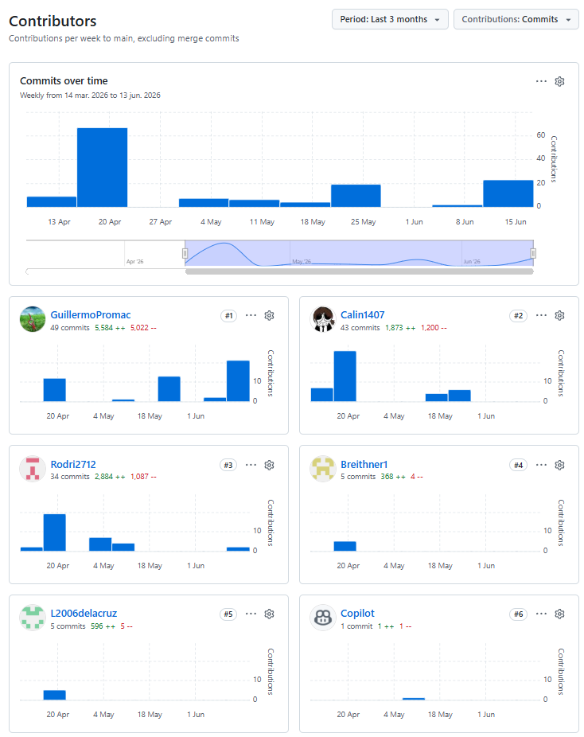

    
      
    
UNIVERSIDAD PERUANA DE CIENCIAS APLICADAS

    
Facultad de Ingeniería

    
Carrera: Ingeniería de Software

    
Periodo: 2026-10

    
Curso: Aplicaciones Web

    
Código del curso: 1ASI0730

    
NRC: 10215

    
Profesor: Velásquez Nuñez, Ángel Augusto

    
Informe de Trabajo Final

    
Startup: NovaTech

    
Producto: TerraTech

     
    
Miembros de grupo:

    
Acuña de la Cruz, Luis Alfredo - U202417228

    
Aguilar Untiveros, Rodrigo Fabrizio - U202318309

    
Howard Robles, Guillermo Arturo - U202222275

    
Perez Encarnación, Breithner Rodolfo - U202418577

    
Retuerto Rodríguez, Jorge Manuel - U202318612

     
    
abril de 2026

  

---

## Registro de Versiones del Informe

| Versión | Fecha      | Autor                                 | Descripción de modificación                                                |
|:-------:|------------|---------------------------------------|----------------------------------------------------------------------------|
|   0.1   | 02/04/2026 | Retuerto Rodríguez, Jorge Manuel      | Creación de la organización en github de 1ASI0730-10215-NovaTech-TerraTech |
|   0.2   | 02/04/2026 | Retuerto Rodríguez, Jorge Manuel      | Creación del repositorio  upc-pre-202610-1asi0730-10215-NovaTech-report    |
|   0.3   | 02/04/2026 | Retuerto Rodríguez, Jorge Manuel      | Creación de ramas para la división de los capítulos del report             |   
|   0.4   | 09/04/2026 | Retuerto Rodríguez, Jorge Manuel      | Desarrollo del startup-profile                                             |
|   0.5   | 09/04/2026 | Retuerto Rodríguez, Jorge Manuel      | Desarrollo del solution-profile                                            |
|   0.6   | 09/04/2026 | Aguilar Untiveros, Rodrigo Fabrizio   | Desarrollo de los user stories y el product backlog                        |
|   0.7   | 10/04/2026 | Retuerto Rodríguez, Jorge Manuel      | Desarrollo del lean ux process                                             |
|   0.8   | 10/04/2026 | Perez Encarnacion, Breithner Rodolfo  | Desarrollo del style guidelines and web style guidelines                   |
|   0.9   | 10/04/2026 | Howard Robles, Guillermo Arturo       | Desarrollo del análisis de competidores y needfinding                      |
|  0.10   | 11/04/2026 | Howard Robles, Guillermo Arturo       | Desarrollo de los segmentos objetivos                                      |
|  0.11   | 11/04/2026 | Howard Robles, Guillermo Arturo       | Desarrollo de los user persona y los task matrix                           |
|  0.12   | 11/04/2026 | Aguilar Untiveros, Rodrigo Fabrizio   | Desarrollo del impact mapping                                              |
|  0.13   | 12/04/2026 | Howard Robles, Guillermo Arturo       | Desarrollo del empathy mapping                                             |
|   1.0   | 16/04/2026 | Acuña de la Cruz, Luis Alfredo        | Desarrollo del Sprint 1                                                    |
|   1.1   | 24/04/2026 | Aguilar Untiveros, Rodrigo Fabrizio   | Desarrollo del Sprint 2                                                    |
|   2.0   | 28/04/2026 | Retuerto Rodríguez, Jorge Manuel      | Corrección del Event Storming                                              |
|   2.1   | 22/05/2026 | Retuerto Rodríguez, Jorge Manuel      | Corrección en la estructura de orden del reporte                           |
|   2.2   | 11/06/2026 | Howard Robles, Guillermo Arturo       | Desarrollo del Sprint blacklog                                             |
|   2.3   | 14/06/2026 | Howard Robles, Guillermo Arturo       | Desarrollo deL Sprint Planning 3                                           |
|   2.4   | 17/06/2026 | Howard Robles, Guillermo Arturo       | Desarrollo del Aspect Leaders and Collaborators                            |
|   2.5   | 17/06/2026 | Howard Robles, Guillermo Arturo       | Desarrollo del Sprint Backlog 3                                            |
|   2.6   | 17/06/2026 | Howard Robles, Guillermo Arturo       | Desarrollo del Development Evidence for Sprint Review                      |

---

## Project Report Collaboration Insights

  
 
  
Para el desarrollo del Project Report, se utilizó un repositorio dentro de la organización del equipo en GitHub. A continuación, se presenta la evidencia de colaboración correspondiente, en coherencia con el Registro de Versiones del Informe.

  
Link Github: https://github.com/1ASI0730-10215-NovaTech-TerraTech

  
Entrega Nº3: AV2

  
Para la elaboración del informe, se crearon ramas específicas para cada sección del documento, permitiendo a los integrantes trabajar de manera simultánea y organizada, facilitando la integración de los contenidos.

  

  
Total de commits: 76

  
Autores contribuyentes:

  
Luis Acuña (`L2006delacruz`)

  
Rodrigo Aguilar (`Rodri2712`)

  
Guillermo Howard (`GuillermoPromac`)

  
Breithner Perez (`Breithner1`)

  
Jorge Retuerto (`Calin1407`)

  

---

## Tabla de contenido

- [Chapter I: Introduction](02-cap1-introduction.md#chapter-i-introduction)
    - [1.1. Startup Profile](#11-startup-profile)
        - [1.1.1 Descripción de la Startup](#111-descripción-de-la-startup)
        - [1.1.2 Perfiles de integrantes del equipo](#112-perfiles-de-integrantes-del-equipo)
    - [1.2 Solution Profile](#12-solution-profile)
        - [1.2.1 Antecedentes y problemática](#121-antecedentes-y-problemática)
        - [1.2.2 Lean UX Process](#122-lean-ux-process)
            - [1.2.2.1. Lean UX Problem Statements](#1221-lean-ux-problem-statements)
            - [1.2.2.2. Lean UX Assumptions](#1222-lean-ux-assumptions)
            - [1.2.2.3. Lean UX Hypothesis Statements](#1223-lean-ux-hypothesis-statements)
            - [1.2.2.4. Lean UX Canvas](#1224-lean-ux-canvas)
    - [1.3. Segmentos Objetivo](#13-segmentos-objetivo)
- [Chapter II: Requirements Elicitation \& Analysis](03-cap2-requirements-elicitation-and-analysis.md#chapter-ii-requirements-elicitation--analysis)
    - [2.1. Competidores](#21-competidores)
        - [2.1.1. Análisis competitivo](#211-análisis-competitivo)
        - [2.1.2. Estrategias y tácticas frente a competidores](#212-estrategias-y-tácticas-frente-a-competidores)
    - [2.2. Entrevistas](#22-entrevistas)
        - [2.2.1. Diseño de entrevistas](#221-diseño-de-entrevistas)
        - [2.2.2. Registro de entrevistas](#222-registro-de-entrevistas)
        - [2.2.3. Análisis de entrevistas](#223-análisis-de-entrevistas)
    - [2.3. Needfinding](#23-needfinding)
        - [2.3.1. User Personas](#231-user-personas)
        - [2.3.2. User Task Matrix](#232-user-task-matrix)
        - [2.3.3. User Journey Mapping](#233-user-journey-mapping)
        - [2.3.4. Empathy Mapping](#234-empathy-mapping)
        - [2.4. Big Picture Event Storming](#24-big-picture-event-storming)
        - [2.5. Ubiquitous Language](#25-ubiquitous-language)
- [Chapter III: Requirements Specification](04-cap3-requirements-specification.md#chapter-iii-requirements-specification)
    - [3.1. User Stories](#31-user-stories)
    - [3.2. Impact Mapping](#32-impact-mapping)
    - [3.3. Product Backlog](#33-product-backlog)
- [Chapter IV: Product Design](05-cap4-product-design.md#chapter-iv-product-design)
    - [4.1. Style Guidelines](#41-style-guidelines)
        - [4.1.1. General Style Guidelines](#411-general-style-guidelines)
        - [4.1.2. Web Style Guidelines](#412-web-style-guidelines)
    - [4.2. Information Architecture](#42-information-architecture)
        - [4.2.1. Organization Systems](#421-organization-systems)
        - [4.2.2. Labeling Systems](#422-labeling-systems)
        - [4.2.3. SEO Tags and Meta Tags](#423-seo-tags-and-meta-tags)
        - [4.2.4. Searching Systems](#424-searching-systems)
        - [4.2.5. Navigation Systems](#425-navigation-systems)
    - [4.3. Landing Page UI Design](#43-landing-page-ui-design)
        - [4.3.1. Landing Page Wireframe](#431-landing-page-wireframe)
        - [4.3.2. Landing Page Mock-up.](#432-landing-page-mock-up)
    - [4.4. Web Applications UX/UI Design](#44-web-applications-uxui-design)
        - [4.4.1. Web Applications Wireframes](#441-web-applications-wireframes)
        - [4.4.2. Web Applications Wireflow Diagrams](#442-web-applications-wireflow-diagrams)
        - [4.4.3. Web Applications Mock-ups](#443-web-applications-mock-ups)
        - [4.4.4. Web Applications User Flow Diagrams](#444-web-applications-user-flow-diagrams)
    - [4.5. Web Applications Prototyping](#45-web-applications-prototyping)
    - [4.6. Domain-Driven Software Architecture](#46-domain-driven-software-architecture)
        - [4.6.1. Design-Level Event Storming](#461-design-level-event-storming)
        - [4.6.2. Software Architecture Context Diagram](#462-software-architecture-context-diagram)
        - [4.6.3. Software Architecture Container Diagrams](#463-software-architecture-container-diagrams)
        - [4.6.4. Software Architecture Components Diagrams](#464-software-architecture-components-diagrams)
    - [4.7. Software Object-Oriented Design](#47-software-object-oriented-design)
        - [4.7.1. Class Diagrams](#471-class-diagrams)
        - [4.7.2. Class Dictionary](#472-class-dictionary)
    - [4.8. Database Design](#48-database-design)
        - [4.8.1. Database Diagram](#481-database-diagram)
        - [4.8.2. Class Dictionary](#482-class-dictionary)
- [Capítulo V: Product Implementation, Validation \& Deployment](06-cap5-prod-implementation-validation-deployment.md#capítulo-v-product-implementation-validation--deployment)
    - [5.1. Software Configuration Management](#51-software-configuration-management)
        - [5.1.1. Software Development Environment Configuration](#511-software-development-environment-configuration)
        - [5.1.2. Source Code Management](#512-source-code-management)
        - [5.1.3. Source Code Style Guide \& Conventions](#513-source-code-style-guide--conventions)
        - [5.1.4. Software Deployment Configuration](#514-software-deployment-configuration)
    - [5.2. Landing Page, Services \& Applications Implementation](#52-landing-page-services--applications-implementation)
        - [5.2.1. Sprint 1](#521-sprint-1)
            - [5.2.1.1. Sprint Planning 1](#5211-sprint-planning-1)
            - [5.2.1.2 Aspect Leaders and Collaborators](#5212-aspect-leaders-and-collaborators)
            - [5.2.1.3 Sprint 1 Backlog](#5213-sprint-1-backlog)
            - [5.2.1.4. Development Evidence for Sprint Review](#5214-development-evidence-for-sprint-review)
            - [5.2.1.5. Execution Evidence for Sprint Review](#5215-execution-evidence-for-sprint-review)
            - [5.2.1.6. Services Documentation Evidence for Sprint Review](#5216-services-documentation-evidence-for-sprint-review)
            - [5.2.1.7. Software Deployment Evidence for Sprint Review](#5217-software-deployment-evidence-for-sprint-review)
            - [5.2.1.8. Team Collaboration Insights during Sprint](#5218-team-collaboration-insights-during-sprint)
        - [5.2.2. Sprint 2](#522-sprint-2)
            - [5.2.2.1. Sprint Planning 2](#5221-sprint-planning-2)
            - [5.2.2.2. Aspect Leaders and Collaborators](#5222-aspect-leaders-and-collaborators)
            - [5.2.2.3. Sprint Backlog 2](#5223-sprint-backlog-2)
            - [5.2.2.4. Development Evidence for Sprint Review](#5224-development-evidence-for-sprint-review)
            - [5.2.2.5. Execution Evidence for Sprint Review](#5225-execution-evidence-for-sprint-review)
            - [5.2.2.6. Services Documentation Evidence for Sprint Review](#5226-services-documentation-evidence-for-sprint-review)
            - [5.2.2.7. Software Deployment Evidence for Sprint Review](#5227-software-deployment-evidence-for-sprint-review)
            - [5.2.2.8. Team Collaboration Insights during Sprint](#5228-team-collaboration-insights-during-sprint)
- [Conclusiones y Recomendaciones](07-conclusions.md#conclusiones-y-recomendaciones)
- [Bibliografía](08-bibliography.md#bibliografía)
- [Anexos](09-annexes.md#anexos)

## Student Outcome 5

Criterio: La capacidad de funcionar efectivamente en un equipo cuyos miembros juntos proporcionan liderazgo, crean un entorno de colaboración e inclusivo, establecen objetivos, planifican tareas y cumplen objetivos.
En el siguiente cuadro se describe las acciones realizadas y enunciados de conclusiones por parte del grupo, que permiten sustentar el haber alcanzado el logro del ABET – EAC - Student Outcome 5.

<table border="1" style="width: 100%; border-collapse: collapse;">
<thead>
    <tr>
        <th style="padding: 30px;">Criterio específico</th>
        <th style="padding: 60px;">Acciones realizadas</th>
        <th style="padding: 30px;">Conclusiones</th>
    </tr>
</thead>
<tbody>
    <tr>
        <th style="padding: 30px;">Trabaja en equipo para proporcionar liderazgo enforma conjunta</th>
        <th style="padding: 60px;">
        Acuña de la Cruz, Luis Alfredo Rol de developer, documentación de reuniones y configuraciones del software  
        Aguilar Untiveros, Rodrigo Fabrizio Rol de developer, colaboración en generación de stories y escenarios de usuarios  
        Howard Robles, Guillermo Arturo Rol de developer, análisis de competidores, needfinding y big picture event storming  
        Perez Encarnacion, Breithner Rodolfo Rol de developer, diseño UX de landing page y página web  
        Retuerto Rodriguez, Jorge Manuel Rol de product owner, descripción de producto y startup  
        </th>
        <th style="padding: 30px;">
        av1: Se definió la visión del producto y sus objetivos mediante la participación del Product Owner y el equipo de desarrollo.
        Se elaboraron historias de usuario y escenarios, permitiendo establecer metas claras para el desarrollo.
        Se realizó análisis de competidores y actividades de needfinding para comprender el problema y orientar las decisiones del equipo.
        Se aplicó event storming para estructurar el flujo del sistema y alinear el entendimiento entre los integrantes.
        Se diseñaron interfaces UX para la landing page y la aplicación, considerando la experiencia del usuario.
        Se documentaron reuniones y acuerdos para asegurar la comunicación y seguimiento del progreso.
          
        tb1: Durante el Sprint 2, el equipo consolidó un modelo de liderazgo compartido donde la toma de decisiones técnicas se realizó de forma conjunta. La capacidad de liderazgo se manifestó en la autogestión de los Bounded Contexts, asegurando que cada módulo funcional estuviera alineado con los objetivos del negocio y las metas del Sprint, garantizando una integración fluida entre los componentes desarrollados por cada miembro.  
        </th>
    </tr>
    <tr>
        <th style="padding: 30px;">
        Crea un entorno colaborativo e inclusivo, establece metas,planifica tareas y cumple objetivos
        </th>
        <th style="padding: 60px;">
        Acuña de la Cruz, Luis Alfredo Trabajo siguiendo los 'conventional commits' y gitflow  
        Aguilar Untiveros, Rodrigo Fabrizio Cumplió de manera regular el uso de los 'conventional commits' y gitflow  
        Howard Robles, Guillermo Arturo Trabajo siguiendo los 'conventional commits' y gitflow  
        Perez Encarnacion, Breithner Rodolfo Trabajo siguiendo los 'conventional commits' y gitflow  
        Retuerto Rodriguez, Jorge Manuel Trabajo siguiendo los 'conventional commits' y gitflow  
        </th>
        <th style="padding: 30px;">
        av1: Se estableció un flujo de trabajo dentro de GitHub: una organización, para la creación de las ramas nos hemos basado en Gitflow, 
        lo que permitió integrar cambios de forma ordenada y sin conflictos mayores. El uso de 'conventional commits' facilitó la trazabilidad 
        de funcionalidades y la generación automática de changelogs. Se definieron metas semanales alcanzables mediante reuniones de planificación, 
        respetando los roles y promoviendo la participación equitativa. Se fomentó un entorno inclusivo donde todos los miembros 
        expresaron sus ideas durante las retrospectivas. El equipo cumplió con los objetivos del hito, entregando las funcionalidades 
        acordadas dentro del plazo establecido.
          
        tb1: El equipo fomentó un entorno inclusivo mediante la rotación de responsabilidades técnicas y el apoyo mutuo en las fases de despliegue. Se establecieron metas específicas para el Sprint 2 mediante un Sprint Backlog detallado, lo que permitió una planificación rigurosa de las tareas de codificación y documentación. El cumplimiento de los objetivos se evidenció en la entrega de un producto funcional desplegado en múltiples plataformas y una documentación técnica que refleja fielmente la colaboración y el esfuerzo colectivo por alcanzar los estándares de calidad exigidos.
        </th>
    </tr>
</tbody>
</table>

