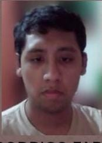
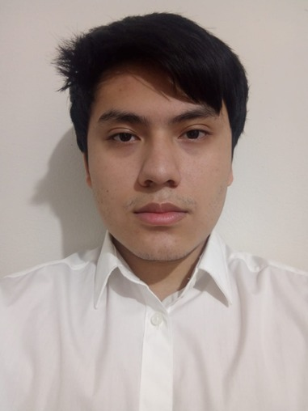

# Chapter I: Introduction

## 1.1. Startup Profile

NovaTech es una startup dedicada a transformar la vida de nuestros clientes mediante soluciones tecnológicas, eficientes y escalables en distintos sectores. Actualmente, tras detectar los desafíos críticos en el sector agricola, hemos creado TerraTech : una solución web que conectará la tecnología con la tierra. Mediante sensores de humedad y nutrientes, ofrecemos un control total a los sembríos en tiempo real. Asimismo, la aplicación analizará los datos entregados para generar recomendaciones y obtención de las zonas más fertiles para asegurar la obtención de las mejores cosechas en el futuro.

**Misión:**

Buscamos el desarrollo de tecnológia innovadora y eficiente que transformen la calidad de trabajo en diversos sectores laborales, optimizando el uso de recursos y máximizando utilidades para mejorar la calidad de vida de nuestros clientes.

**Visión:**

Ser la líder en la integración tecnológica multisectorial, reconocida por soluciones efectivas sostenibles y de alta eficiencia a nivel internacional.

### 1.1.1 Descripción de la Startup

### 1.1.2 Perfiles de integrantes del equipo

| Foto                           | Apellido y nombre       | Carrera              | Acerca de                                           |
|--------------------------------|-------------------------|----------------------|-----------------------------------------------------|
|  | Acuña de la Cruz, Luis Alfredo | Ingeniería de Software | Mi nombre es Luis Alfredo Acuña de la Cruz (u202417228), tengo 19 años y estoy cursando el 5to ciclo de la carrera de Ingeniería de Software en la Universidad Peruana de Ciencias Aplicadas. Me apasiona el desarrollo de software, el aprendizaje continuo y la resolución de problemas mediante soluciones innovadoras y eficientes. Busco aplicar buenas prácticas y tecnologías modernas para crear sistemas robustos, escalables y de alta calidad en cada proyecto. |
|  | Aguilar Untiveros, Rodrigo Fabrizio | Ingeniería de Software | Mi nombre es Rodrigo, estudiante de Ingeniería de Software comprometido con el aprendizaje de nuevas metodologías de desarrollo. Me motiva el análisis de retos técnicos para diseñar soluciones que sean tanto funcionales como innovadoras. Mi enfoque está orientado a la creación de herramientas digitales robustas, priorizando siempre la optimización de procesos y la implementación de estándares de calidad que permitan un crecimiento constante en cada desarrollo. |
|  | Howard Robles, Guillermo Arturo | Ingeniería de Software | Mi nombre es Guillermo Arturo Howard Robles (u202222275) tengo 20 años, Soy estudiante de Ingeniería de Software, enfocado y en constante aprendizaje. Me apasiona investigar y analizar problemas para proponer soluciones innovadoras. Busco desarrollar software integral, aplicando las buenas prácticas y tecnologías modernas que aseguren eficiencia, escalabilidad, calidad y mejora continua en cada proyecto. |
|  | Perez Encarnacion, Breithner Rodolfo | Ingeniería de Software | Mi nombre es Breithner Rodolfo Perez Encarnacion, tengo 19 años y soy estudiante de la carrera de Ingeniería de Software. Cuento con conocimientos y habilidades sólidas en el lenguaje C++ y en el diseño de modelos relacionales. Asimismo, poseo un manejo intermedio de bases de datos tanto SQL como NoSQL (MongoDB), incluyendo validación de reglas y pipelines de agregación. Me haré responsable del diseño del modelo relacional, la normalización de bases de datos y de asegurar la integridad técnica del proyecto junto a mi equipo. |
|  | Retuerto Rodríguez, Jorge Manuel | Ingeniería de Software | Mi nombre es Jorge Manuel Retuerto Rodríguez, tengo 20 años y estoy cursando el 6to ciclo de la carrera de Ingeniería de Software en la Universidad Peruana de Ciencias Aplicadas. Mi conocimiento y habilidades de programación son intermedias en C++, C#, HTML y CSS. Sin embargo, básicas en Python y Java. Me haré responsable de la comunicación del grupo, planificación y desarrollo junto a mi equipo. |