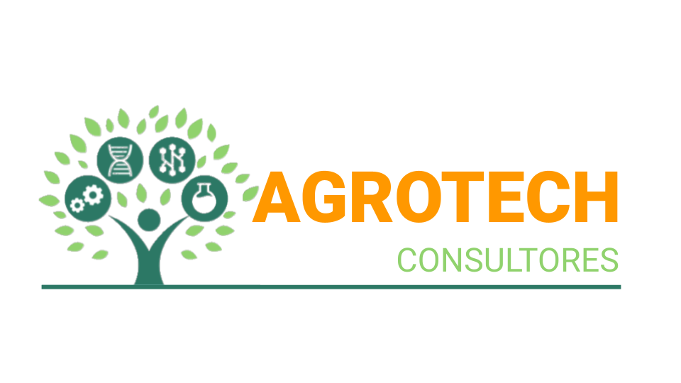
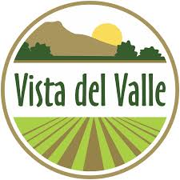

# Chapter II: Requirements Elicitation & Analysis

## 2.1. Competidores

* **Agrotech (competidor directo):** Es una empresa enfocada en la implementación de tecnología agrícola que ofrece soluciones como drones, sensores y asesoría técnica especializada para mejorar la productividad del campo. Está orientada a agricultores y empresas agroindustriales que buscan optimizar sus procesos mediante el uso de herramientas tecnológicas.

* **AgroVista del Valle (competidor directo):** Es una empresa de servicios agrícolas que utiliza análisis multiespectral para el monitoreo de cultivos, permitiendo evaluar la salud de las plantas y detectar problemas en el terreno. Está dirigida a agricultores y empresas agroexportadoras que buscan tomar decisiones basadas en datos para mejorar la eficiencia y productividad.

* **Phytech (competidor directo):** Es una plataforma digital de agricultura de precisión que integra sensores IoT, análisis de datos e inteligencia artificial para optimizar el riego y mejorar el rendimiento de los cultivos. Está orientada principalmente a empresas agroindustriales y grandes productores que buscan maximizar la eficiencia en el uso del agua y recursos.

### 2.1.1. Análisis competitivo

  <table>
  <tr>
    <th colspan="6" valign="top">Competitive Analysis Landscape</th>
  </tr>
  <tr>
    <td colspan="2" valign="top">¿Por qué llevar a cabo este análisis?</td>
    <td colspan="4" valign="top">El objetivo de este análisis es identificar las características de los competidores y encontrar maneras de diferenciarnos.</td>
  </tr>
  <tr>
    <td colspan="2" rowspan="2" valign="top">Startup y Competidores</td>
    <td valign="top">Nuestra Startup</td>
    <td valign="top">Agrotech</td>
    <td valign="top">Agrovista del Valle</td>
    <td valign="top">Phytech</td>
  </tr>
  <tr>
    <td valign="top"></td>
    <td valign="top"></td>
    <td valign="top"></td>
    <td valign="top"></td>
   </tr>
  <tr>
    <td rowspan="2" valign="top">Perfil</td>
    <td valign="top">Overview</td>
    <td valign="top">Nuestro Startup es una solución web basada en sensores IoT que permite monitorear en tiempo real la humedad y los nutrientes del suelo, generando análisis predictivo para optimizar la productividad agrícola y mejorar la gestión de los cultivos.</td>
    <td valign="top">Agrotech es una empresa que implementa tecnología agrícola mediante el uso de drones, sensores y asesoría técnica especializada para mejorar la productividad de los cultivos.</td>
    <td valign="top">AgroVista del Valle es una empresa agrícola que utiliza análisis multiespectral para monitorear la salud de los cultivos y evaluar las condiciones del terreno.</td>
    <td valign="top">Phytech es una plataforma digital de agricultura de precisión que integra sensores IoT e inteligencia artificial para optimizar el riego y mejorar el rendimiento de los cultivos.</td>
  </tr>
  <tr>
    <td valign="top">Ventaja competitiva ¿Qué valor ofrece a los clientes?</td>
    <td valign="top">Ofrece monitoreo continuo del suelo, recomendaciones inteligentes y predicción de zonas fértiles, con una solución accesible y adaptada al agricultor peruano que optimiza recursos y aumenta la rentabilidad.</td>
    <td valign="top">Destaca por ofrecer soluciones integrales con drones y asesoría técnica profesional que permiten un monitoreo detallado del campo.</td>
    <td valign="top">Su principal valor es el análisis avanzado de imágenes que permite detectar problemas en los cultivos con alta precisión.</td>
    <td valign="top">Su ventaja principal es el uso de inteligencia artificial para generar recomendaciones avanzadas y automatizar decisiones agrícolas.</td>
  </tr>
  <tr>
    <td rowspan="2" valign="top">Perfil de Marketing</td>
    <td valign="top">Mercado objetivo</td>
    <td valign="top">Está dirigido principalmente a agricultores peruanos, así como a proveedores de insumos agrícolas y compradores interesados en la trazabilidad de los productos.</td>
    <td valign="top">Está orientada a agricultores medianos, grandes productores y empresas agroindustriales que buscan optimizar sus procesos.</td>
    <td valign="top">Está dirigida a agricultores medianos, empresas agroexportadoras y productores que buscan decisiones basadas en datos.</td>
    <td valign="top">Está orientada a grandes productores y empresas agroindustriales que buscan maximizar la eficiencia de recursos.</td>
  </tr>
  <tr>
    <td valign="top">Estrategias de marketing</td>
    <td valign="top">Se basa en alianzas con empresas agrarias, demostraciones en campo y marketing digital enfocado en sostenibilidad y optimización de recursos.</td>
    <td valign="top">Utiliza ventas directas, demostraciones tecnológicas y participación en eventos agrícolas para atraer clientes empresariales.</td>
    <td valign="top">Se enfoca en servicios especializados, relaciones B2B y promoción basada en análisis técnico.</td>
    <td valign="top">Utiliza marketing B2B, posicionamiento tecnológico premium y casos de éxito internacionales.</td>
  </tr>
  <tr>
    <td rowspan="3" valign="top">Perfil de Producto</td>
    <td valign="top">Productos & Servicios</td>
    <td valign="top">Incluye sensores IoT, plataforma web de monitoreo, alertas inteligentes y análisis predictivo para la toma de decisiones agrícolas.</td>
    <td valign="top">Ofrece drones agrícolas, sensores de monitoreo y servicios de asesoría técnica para la implementación tecnológica.</td>
    <td valign="top">Ofrece monitoreo multiespectral, análisis de salud vegetal y reportes técnicos para la toma de decisiones.</td>
    <td valign="top">Ofrece sensores IoT, análisis con inteligencia artificial y dashboards avanzados de monitoreo.</td>
  </tr>
  <tr>
    <td valign="top">Precios & Costos</td>
    <td valign="top">Combina la venta de sensores con una suscripción accesible para el uso de la plataforma y análisis de datos.</td>
    <td valign="top">Maneja precios elevados debido al uso de drones y servicios especializados de consultoría.</td>
    <td valign="top">Presenta costos medios a altos por servicios de análisis especializados.</td>
    <td valign="top">Maneja costos elevados con modelo de suscripción empresarial.</td>
  </tr>
  <tr>
    <td valign="top">Canales de distribución (Web y/o Móvil)</td>
    <td valign="top">Distribución mediante plataforma web accesible desde computadora y dispositivos móviles, con venta directa y alianzas estratégicas.</td>
    <td valign="top">Distribución mediante página web corporativa y contacto directo con el equipo comercial.</td>
    <td valign="top">Distribución mediante plataforma web y entrega digital de reportes técnicos.</td>
    <td valign="top">Distribución mediante plataforma web, aplicación móvil y ventas corporativas.</td>
  </tr>
  <tr>
    <td rowspan="4" valign="top">Análisis SWOT</td>
    <td valign="top">Fortalezas</td>
    <td valign="top">Solución accesible, adaptada al mercado local e integración de IoT con análisis predictivo.</td>
    <td valign="top">Tecnología avanzada, asesoría especializada y soluciones integrales.</td>
    <td valign="top">Alta precisión en análisis y enfoque científico.</td>
    <td valign="top">Uso de inteligencia artificial y alta precisión tecnológica.</td>
  </tr>
  <tr>
    <td valign="top">Debilidades</td>
    <td valign="top">Dependencia de conectividad rural y falta de posicionamiento inicial en el mercado.</td>
    <td valign="top">Altos costos y menor accesibilidad para pequeños agricultores.</td>
    <td valign="top">No ofrece monitoreo continuo en tiempo real y depende de imágenes periódicas.</td>
    <td valign="top">Costos altos y menor adaptación al mercado local.</td>
  </tr>
  <tr>
    <td valign="top">Oportunidades</td>
    <td valign="top">Crecimiento de la agricultura 4.0 y mayor interés en soluciones sostenibles.</td>
    <td valign="top">Crecimiento del uso de drones y agricultura digital.</td>
    <td valign="top">Mayor demanda de agricultura de precisión.</td>
    <td valign="top">Expansión de la agricultura inteligente a nivel global.</td>
  </tr>
  <tr>
    <td valign="top">Amenazas</td>
    <td valign="top">Competidores internacionales y resistencia al cambio tecnológico.</td>
    <td valign="top">Soluciones IoT más económicas y automatizadas.</td>
    <td valign="top">Soluciones IoT con monitoreo constante y análisis predictivo.</td>
    <td valign="top">Competidores locales con soluciones más accesibles.</td>
  </tr>
</table>

### 2.1.2. Estrategias y tácticas frente a competidores

**Estrategias**

- Diferenciación mediante una solución accesible adaptada al agricultor peruano.
- Competencia basada en costos frente a plataformas tecnológicas premium.
- Enfoque en monitoreo en tiempo real como propuesta de valor principal.
- Desarrollo de alianzas estratégicas con proveedores e instituciones agrícolas.
- Posicionamiento como herramienta de sostenibilidad y optimización de recursos.
-
---

**Tácticas**

- Ofrecer paquetes iniciales de sensores IoT a bajo costo.
- Implementar dashboards simples con alertas visuales fáciles de entender.
- Realizar pruebas piloto y demostraciones en campo con agricultores locales.
- Utilizar tecnología de conectividad rural (LoRaWAN) para garantizar funcionamiento.
- Aplicar modelo de suscripción flexible según el tamaño del cultivo.