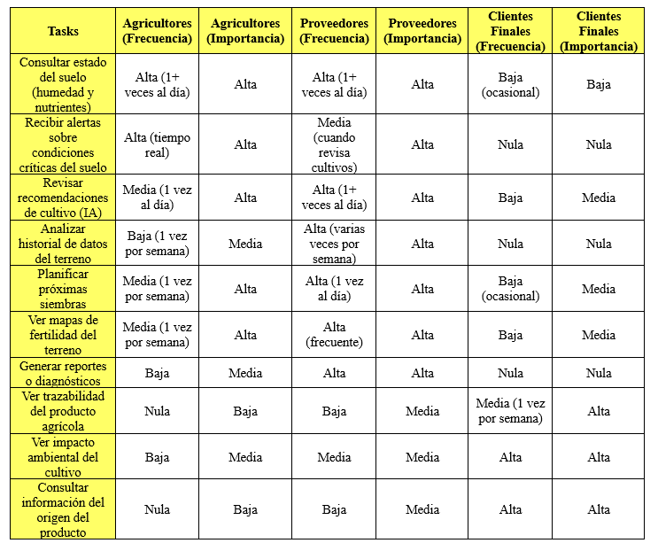

## 2.3. Needfinding

### 2.3.1. User Personas

* **Segmento 1: Agricultor**

* **Segmento 2: **

* **Segmento 3: **

### 2.3.2. User Task Matrix

En este cuadro tendremos a nuestros segmentos objetivos: Agricultor, Asesos y Usuario Final. Consideraremos tareas que haran para obtener un producto o hallar ofertas para planificar futuras compras.

Los agricultores presentan una alta frecuencia e importancia en tareas operativas como el monitoreo del suelo y la recepción de alertas en tiempo real, ya que dependen directamente de esta información para tomar decisiones inmediatas en sus cultivos.

Por su parte, los proveedores o asesores destacan en tareas de análisis, como la revisión de datos históricos, generación de reportes y planificación, lo que refleja un uso más técnico y estratégico de la plataforma.

Finalmente, los clientes finales tienen una menor frecuencia de uso, pero otorgan alta importancia a funcionalidades relacionadas con la trazabilidad, el origen del producto y el impacto ambiental, buscando principalmente transparencia y confianza en su consumo.

### 2.3.3. User Journey Mapping

### 2.3.4. Empathy Mapping