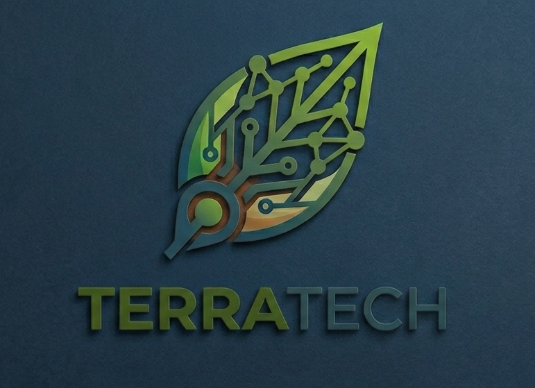

# Chapter IV: Product Design

## 4.1. Style Guidelines

Un "Style Guideline" es un conjunto de directrices y normas que establecen los estándares y criterios a seguir en la redacción, diseño y presentación de documentos, contenido web, software y otros productos creativos. A continuación, se presentan las especificaciones detalladas de los parámetros implementados en la estructura de TerraTech.

### 4.1.1. General Style Guidelines

**Branding**

Para el desarrollo del logo de TerraTech, hemos elegido un diseño que encapsula la esencia de la aplicación y sus funcionalidades en el campo. El logotipo presenta una tipografía sólida y clara, que aporta modernidad y máxima legibilidad. El ícono fusiona la naturaleza con la tecnología, simbolizando una hoja integrada con las conexiones de un circuito digital para representar la eficiencia y el monitoreo inteligente. La elección de colores, en una combinación de azul marino profundo, verdes vibrantes y tonos tierra, transmite una sensación de crecimiento orgánico respaldado por precisión analítica y estabilidad técnica. La integración de estos elementos busca comunicar visualmente el compromiso de TerraTech con la innovación, la sostenibilidad y la excelencia en la gestión agrícola.

**Typography**

Para el diseño tipográfico de TerraTech, se ha seleccionado una combinación de fuentes que refleja modernidad y funcionalidad, priorizando la legibilidad en entornos al aire libre. La tipografía principal, Montserrat, fue elegida por su estructura geométrica y claridad en pantallas digitales, otorgando al diseño un aire profesional y tecnológico en nuestros encabezados. Para los párrafos y la visualización de datos de los sensores, hemos optado por Roboto, una fuente destacada por su alta legibilidad en dispositivos móviles, favoreciendo una experiencia visual atractiva e intuitiva para el agricultor.

A continuación, se detallan las tipografías adoptadas para TerraTech:

**Colors**

La paleta de colores de TerraTech fue seleccionada para reflejar los valores de sostenibilidad, innovación y prevención que definen a nuestro sistema agrícola. Los tonos predominantes, azul marino profundo y verdes vibrantes, junto con acentos en tonos tierra, evocan sensaciones de naturaleza, solidez y alta tecnología, elementos esenciales para una herramienta orientada al control y optimización de recursos hídricos. Esta combinación de colores refuerza la identidad visual del producto como una solución robusta, confiable y amigable para el usuario.

A continuación, se detallan los colores seleccionados para TerraTech:

**Spacing**

El espaciado en TerraTech está cuidadosamente definido para garantizar una interfaz limpia, organizada y altamente táctil. Se emplea una separación uniforme y amplia entre elementos, lo que mejora la legibilidad de las métricas, evita errores de navegación en dispositivos móviles durante el trabajo de campo y aporta equilibrio visual al diseño.

### 4.1.2. Web Style Guidelines

**TerraTech** cuenta con un diseño web adaptable para garantizar una experiencia fluida en cualquier dispositivo, permitiendo su uso tanto en oficinas de gestión como en dispositivos móviles directamente en el campo. Utilizamos el patrón de diseño en forma de Z, ideal para destacar funciones clave como el monitoreo IoT en tiempo real y el análisis predictivo de cultivos. El logotipo se ubica en la esquina superior izquierda para fortalecer la identidad de marca, mientras que la barra de navegación y el llamado a la acción para solicitar una demostración se sitúan a la derecha, guiando al agricultor de forma intuitiva hacia la adopción de nuestra tecnología.
