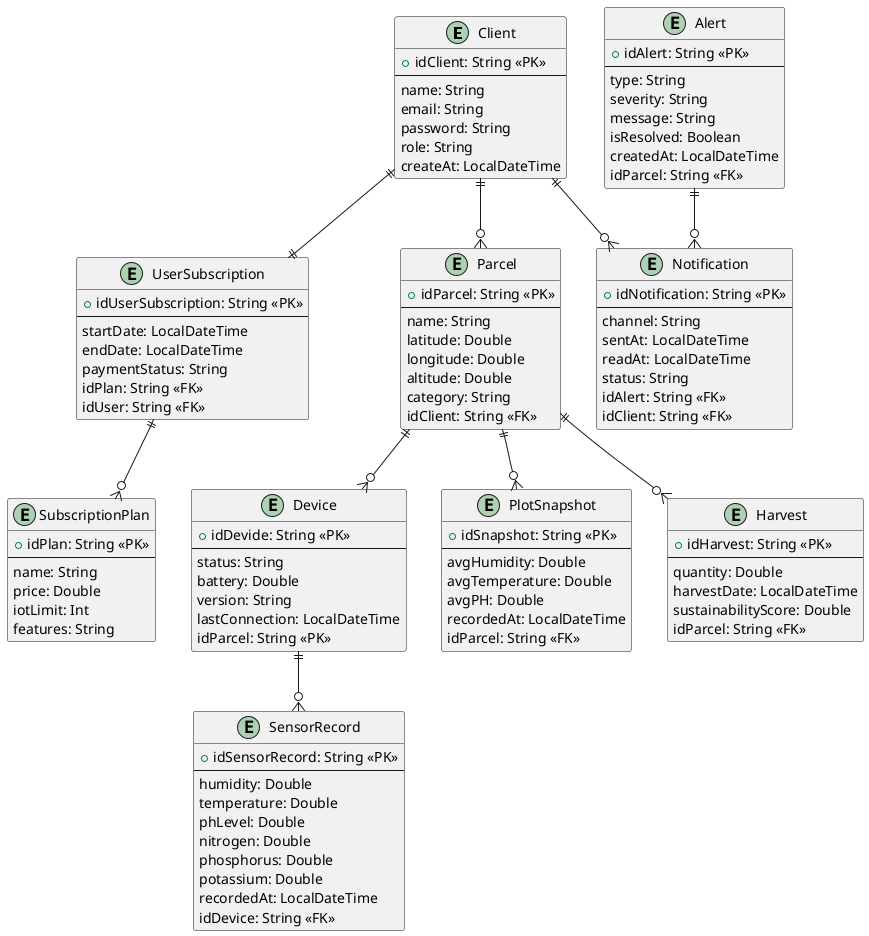

## 4.8. Database Design

### 4.8.1. Database Diagram

```plantuml
@startuml
'||--For business--||
entity Client{
+idClient: String <<PK>>
---
name: String
email: String
password: String
role: String
createAt: LocalDateTime
}

entity SubscriptionPlan{
+idPlan: String <<PK>>
---
name: String
price: Double
iotLimit: Int
features: String
}

entity UserSubscription{
+idUserSubscription: String <<PK>>
---
startDate: LocalDateTime
endDate: LocalDateTime
paymentStatus: String
idPlan: String <<FK>>
idUser: String <<FK>>
}


'||---This is phisic---||
entity Parcel
{
+idParcel: String <<PK>>
---
name: String
latitude: Double
longitude: Double
altitude: Double
category: String
idClient: String <<FK>>
}

entity Device{
+idDevide: String <<PK>>
---
status: String
battery: Double
version: String
lastConnection: LocalDateTime
idParcel: String <<PK>>
}


'||---Data to Analytics---||
entity SensorRecord{
+idSensorRecord: String <<PK>>
---
humidity: Double
temperature: Double
phLevel: Double
nitrogen: Double
phosphorus: Double
potassium: Double
recordedAt: LocalDateTime
idDevice: String <<FK>>
}

entity PlotSnapshot{
+idSnapshot: String <<PK>>
---
avgHumidity: Double
avgTemperature: Double
avgPH: Double
recordedAt: LocalDateTime
idParcel: String <<FK>>
}


'||---Operation Outcomes---||
entity Harvest{
+idHarvest: String <<PK>>
---
quantity: Double
harvestDate: LocalDateTime
sustainabilityScore: Double
idParcel: String <<FK>>
}


' --- Alerts & Notifications ---
entity Alert {
+idAlert: String <<PK>>
---
type: String
severity: String
message: String
isResolved: Boolean
createdAt: LocalDateTime
idParcel: String <<FK>>
}

entity Notification {
+idNotification: String <<PK>>
---
channel: String
sentAt: LocalDateTime
readAt: LocalDateTime
status: String
idAlert: String <<FK>>
idClient: String <<FK>>
}


'||---Relations---||
Client ||--o{ Parcel
Client ||--|| UserSubscription

Parcel ||--o{ Device
Parcel ||--o{ PlotSnapshot

Device ||--o{ SensorRecord
UserSubscription ||--o{ SubscriptionPlan

Alert ||--o{ Notification
Client ||--o{ Notification
Parcel ||--o{ Harvest
@enduml
```