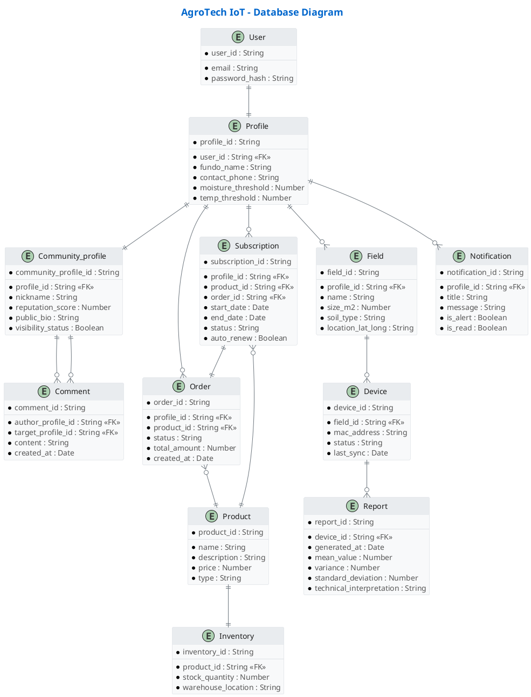

## 4.8. Database Design

### 4.8.1. Database Diagram

### 4.8.2. Class Dictionary
<table border="1">
<thead>
<tr>
<th>Entity</th>
<th>Definition</th>
</tr>
</thead>
<tbody>
<tr>
<td><code>user</code></td>
<td>Almacena las credenciales principales de acceso al sistema, incluyendo correo electrónico y contraseña cifrada de cada usuario registrado.</td>
</tr>

<tr>
<td><code>profile</code></td>
<td>Contiene la información del perfil agrícola asociado a cada usuario, como nombre del fundo, teléfono de contacto y los umbrales configurados de humedad y temperatura.</td>
</tr>

<tr>
<td><code>community_profile</code></td>
<td>Representa el perfil público del agricultor dentro de la comunidad, incluyendo apodo, biografía, puntuación de reputación y configuración de visibilidad.</td>
</tr>

<tr>
<td><code>comment</code></td>
<td>Registra los comentarios realizados entre perfiles de la comunidad, almacenando autor, destinatario, contenido y fecha de creación.</td>
</tr>

<tr>
<td><code>product</code></td>
<td>Define los productos y servicios ofrecidos por la plataforma, incluyendo nombre, descripción, precio y tipo de producto.</td>
</tr>

<tr>
<td><code>order</code></td>
<td>Registra las órdenes de compra realizadas por los perfiles, incluyendo producto adquirido, estado del pedido, monto total y fecha de creación.</td>
</tr>

<tr>
<td><code>subscription</code></td>
<td>Gestiona las suscripciones de los perfiles a productos o servicios, incluyendo fechas de inicio y fin, estado y configuración de renovación automática.</td>
</tr>

<tr>
<td><code>field</code></td>
<td>Almacena los terrenos o parcelas agrícolas administradas por cada perfil, incluyendo nombre, tamaño en metros cuadrados, tipo de suelo y ubicación geográfica.</td>
</tr>

<tr>
<td><code>device</code></td>
<td>Registra los dispositivos IoT instalados en cada parcela, con dirección MAC, estado operativo y fecha de última sincronización.</td>
</tr>

<tr>
<td><code>report</code></td>
<td>Almacena los reportes estadísticos generados a partir de los datos de los dispositivos IoT, incluyendo promedio, varianza, desviación estándar e interpretación técnica.</td>
</tr>

<tr>
<td><code>inventory</code></td>
<td>Gestiona el inventario disponible de cada producto, incluyendo cantidad en stock y ubicación del almacén.</td>
</tr>

<tr>
<td><code>notification</code></td>
<td>Registra las notificaciones y alertas enviadas a los perfiles, incluyendo título, mensaje, indicador de alerta y estado de lectura.</td>
</tr>
</tbody>
</table>