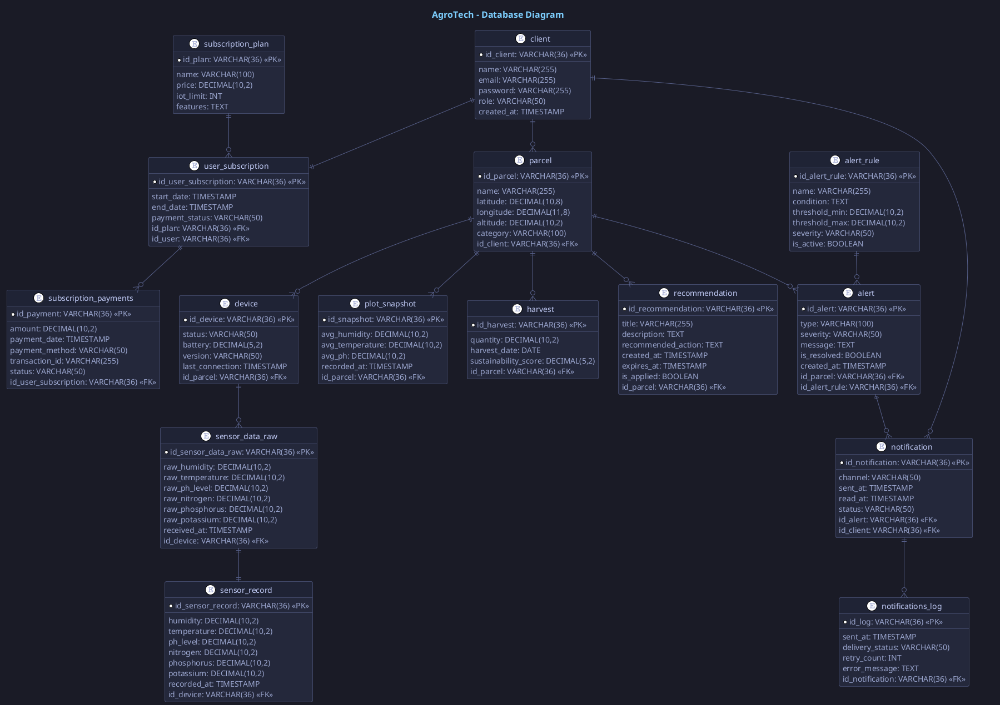

## 4.8. Database Design

### 4.8.1. Database Diagram

### 4.8.2. Class Dictionary
<table border="1">
<thead>
<tr>
<th>Entity</th>
<th>Definition</th>
</tr>
</thead>
<tbody>
<tr>
<td><code>client</code></td>
<td>Almacena la información de los clientes del sistema, incluyendo nombre, email, contraseña cifrada, rol y fecha de registro.</td>
</tr>
<tr>
<td><code>subscription_plan</code></td>
<td>Define los planes de suscripción disponibles, con nombre, precio, límite de dispositivos IoT y características incluidas.</td>
</tr>
<tr>
<td><code>user_subscription</code></td>
<td>Registra la suscripción activa o histórica de cada cliente a un plan, incluyendo fechas de inicio/fin y estado de pago.</td>
</tr>
<tr>
<td><code>subscription_payments</code></td>
<td>Registra el historial de pagos realizados por cada suscripción, incluyendo monto, método de pago, ID de transacción y estado.</td>
</tr>
<tr>
<td><code>parcel</code></td>
<td>Almacena las parcelas agrícolas de los clientes, con datos de ubicación geográfica (latitud, longitud, altitud), nombre y categoría.</td>
</tr>
<tr>
<td><code>device</code></td>
<td>Registra los dispositivos IoT instalados en parcelas, con estado operativo, nivel de batería, versión de firmware y última conexión.</td>
</tr>
<tr>
<td><code>sensor_data_raw</code></td>
<td>Almacena los datos crudos recibidos directamente de los sensores IoT antes de cualquier limpieza o procesamiento.</td>
</tr>
<tr>
<td><code>sensor_record</code></td>
<td>Almacena las lecturas de sensores ya procesadas y validadas, incluyendo humedad, temperatura, pH, nitrógeno, fósforo y potasio.</td>
</tr>
<tr>
<td><code>plot_snapshot</code></td>
<td>Guarda resúmenes analíticos periódicos de cada parcela, con valores promedio de humedad, temperatura y pH en un momento dado.</td>
</tr>
<tr>
<td><code>harvest</code></td>
<td>Registra las cosechas obtenidas de cada parcela, con cantidad producida, fecha y puntuación de sostenibilidad calculada.</td>
</tr>
<tr>
<td><code>alert_rule</code></td>
<td>Define las reglas de negocio para generar alertas, incluyendo condiciones, umbrales mínimo/máximo, severidad y estado activo.</td>
</tr>
<tr>
<td><code>alert</code></td>
<td>Registra las alertas generadas cuando se detectan condiciones anormales en una parcela, con tipo, severidad, mensaje y estado de resolución.</td>
</tr>
<tr>
<td><code>notification</code></td>
<td>Gestiona el envío de notificaciones a clientes basadas en alertas, incluyendo canal, fechas de envío/lectura y estado de entrega.</td>
</tr>
<tr>
<td><code>notifications_log</code></td>
<td>Registra el historial detallado de envío de notificaciones, incluyendo estado de entrega, reintentos y mensajes de error.</td>
</tr>
<tr>
<td><code>recommendation</code></td>
<td>Almacena las recomendaciones generadas automáticamente para parcelas, incluyendo título, descripción, acción sugerida y estado de aplicación.</td>
</tr>
</tbody>
</table>